# Volt XA — Architecture Diagram

> Complete system architecture in Mermaid (ELK layout).
> Covers all 11 layers (0-10), data flow, and internal component relationships.

```mermaid
%%{init: {"flowchart": {"defaultRenderer": "elk"}} }%%
flowchart TB

    %% ── Layer 0: External World ──────────────────────────
    subgraph L0["<b>Layer 0 — External World</b>"]
        direction LR
        users(["Users"])
        apis(["APIs / Sensors"])
        p2p_ext(["P2P Mesh"])
        os_env(["OS / File System"])
    end

    %% ── Layer 1: Input Translators ───────────────────────
    subgraph L1["<b>Layer 1 — Input Translators</b>"]
        direction LR
        subgraph text_t["Text Translator (Reference)"]
            llm_backbone["Frozen LLM Backbone<br/>~1-7B params<br/>(knowledge dictionary)"]
            proj_head["Frame Projection Head<br/>~50M params<br/>(role detect → slot assign → R₀/R₁ fill)"]
            vqvae_q["VQ-VAE Quantizer<br/>(snap to codebook)"]
            llm_backbone --> proj_head --> vqvae_q
        end
        vision_t["Vision<br/>Translator"]
        audio_t["Audio<br/>Translator"]
        data_t["Data<br/>Translator"]
        sensor_t["Sensor / OS<br/>Translator"]
    end

    %% ── Layer 2: LLL Tensor Frame Bus ────────────────────
    subgraph L2["<b>Layer 2 — LLL Tensor Frame Bus</b>"]
        direction LR
        bus{{"Tensor Frame Bus<br/><i>F ∈ ℝ<sup>[16 slots × 4 res × 256 dim]</sup></i><br/>Max 64 KB per frame"}}
        codebook[("VQ-VAE Codebook<br/>65,536 entries × 256-dim<br/>u16 addressing<br/>~67 MB resident")]
        hdc_ops["HDC Algebra<br/>Binding ⊗ · Superposition + · Permutation ρ<br/>Unbinding ⊗⁻¹ · Role-Filler"]
        certainty_prop["Certainty γ Propagation<br/>Min-rule: γ(A→C) = min(γ(A→B), γ(B→C))<br/>Frame γ = min(all filled slots)"]
    end

    %% ── Layer 3: GPU Soft Core ───────────────────────────
    subgraph L3["<b>Layer 3 — GPU Soft Core</b> (System 1: fast, parallel, associative)"]
        subgraph rar["RAR Loop — Root-Attend-Refine"]
            direction TB
            root["<b>Root</b> (parallel per slot)<br/>VFN f_θ: [256]→[256]<br/>Diffusion noise σ_φ (adaptive)<br/>All 16 slots embarrassingly parallel"]
            attend["<b>Attend</b> (cross-slot)<br/>Scaled dot-product attention<br/>Q_i·K_j / √64 → softmax → weighted V<br/>+ Ghost frame attention (α weight)<br/>Cost: 65,536 multiply-adds"]
            refine["<b>Refine</b> (update + check)<br/>S(t+1) = normalize(S(t) + dt·(ΔS + β·context))<br/>Convergence: ‖ΔS‖ &lt; ε → freeze slot, compute γ<br/>Frozen slots still serve as K/V"]
            root --> attend --> refine
            refine -->|"unconverged<br/>slots loop"| root
        end
        vfn["Vector Field Network (VFN)<br/>Shared weights across all slots<br/>f_θ = −∇E (energy landscape)<br/>100M (Edge) · 500M (Standard) · 2B (Research)"]
        diffusion_ctrl["Diffusion Controller σ_φ<br/>Converged → σ≈0 (frozen)<br/>Stuck → high σ (explore)<br/>Creative → higher baseline"]
        bleed_buf[("Ghost Bleed Buffer<br/>~1,000 R₀ ghosts<br/>~1 MB in VRAM<br/>Energy landscape dips")]

        vfn -.->|"drift<br/>vectors"| root
        diffusion_ctrl -.->|"noise<br/>magnitude"| root
        bleed_buf -.->|"ghost K/V<br/>for attention"| attend
    end

    %% ── Layer 4: CPU Hard Core ───────────────────────────
    subgraph L4["<b>Layer 4 — CPU Hard Core</b> (System 2: sequential, deterministic, verifiable)"]
        intent_router["<b>Intent Router</b><br/>Cosine sim of R₀ gist vs capability vectors<br/>Pure vector geometry — no JSON, no string matching"]

        subgraph hard_strands["Hard Strands (HardStrand trait)"]
            direction LR
            math_e["MathEngine<br/>Arbitrary-precision<br/>arithmetic"]
            code_r["CodeRunner<br/>Sandboxed<br/>Rust/Python/WASM"]
            api_d["APIDispatch<br/>Tokio async<br/>50+ concurrent"]
            hdc_a["HDCAlgebra<br/>FFT bind/unbind<br/>superposition"]
            cert_e["CertaintyEngine<br/>Min-rule γ<br/>+ proof validation"]
            proof_c["ProofConstructor<br/>Full reasoning<br/>trace"]
            causal_s["CausalSimulator<br/>Pearl's do-calculus<br/>consequence preview"]
            mirror_m["MirrorModule<br/>Self-monitoring<br/>loop detection"]
            sleep_l["SleepLearner<br/>FF consolidation<br/>coordinator"]
            ledger_s["LedgerStrand<br/>Commons<br/>interface"]
        end

        subgraph safety["Safety Layer"]
            direction TB
            axiom_guard["<b>Axiomatic Guard</b><br/>K₁ No physical harm<br/>K₂ No CSAM<br/>K₃ No WMD<br/>K₄ No identity fraud<br/>K₅ Acknowledge AI<br/>(cryptographically signed, immune to training)"]
            trans_monitor["<b>Transition Monitor</b><br/>Every F(t)→F(t+1)<br/>violation = ⟨frame, invariant⟩<br/>Warning → ↑diffusion<br/>Critical → Omega Veto"]
            omega_veto["<b>Omega Veto</b><br/>⚠ Hardware Interrupt<br/>No software bypass<br/>Halt → Freeze → Log<br/>→ Human approval required"]
            axiom_guard --> trans_monitor --> omega_veto
        end

        intent_router --> hard_strands
        hard_strands -->|"frame transitions<br/>checked"| safety
        mirror_m -.->|"mirror signal<br/>→ diffusion ctrl"| diffusion_ctrl
    end

    %% ── Layer 5: VoltDB ─────────────────────────────────
    subgraph L5["<b>Layer 5 — VoltDB</b> (embedded Rust library, shared memory space)"]
        subgraph tiers["Three-Tier Memory"]
            direction LR
            t0[("T0: GPU VRAM<br/>64 full frames (~4 MB)<br/>+ weights + ghosts<br/>Instant access")]
            t1[("T1: System RAM<br/>8-32 GB<br/>~500K full frames<br/>~2ms indexed retrieval")]
            t2[("T2: RAM + NVMe SSD<br/>64-160+ GB<br/>Millions compressed<br/>~10-50ms access")]
            t0 <-->|"eviction at 80%<br/>(R₀ ghost retained)"| t1
            t1 <-->|"sleep archival<br/>compress → R₀ only"| t2
        end

        subgraph idx["Indexing (total O(log N), ~2.3ms for 10M frames)"]
            direction LR
            strand_rt["Strand Routing<br/>HashMap O(1)"]
            hnsw_idx["HNSW<br/>(semantic cosine)<br/>O(log N)"]
            btree_idx["B-Tree<br/>(temporal range)<br/>O(log N)"]
            inv_idx["Inverted Index<br/>(concept → frames)<br/>O(1)"]
            bloom["Bloom Filters<br/>O(1) negative check<br/>99.9% accuracy"]
        end

        bleed_engine["<b>Bleed Engine</b> (CPU background threads)<br/>Predictive Prefetch: T1→T0 HNSW (~2ms)<br/>On-Demand Recall: ghost page fault (~10-50ms)<br/>Background Consolidation: T0→T1 (non-blocking)<br/>Sleep Archival: T1→T2 at 80% T1"]

        gc_pipe["<b>Garbage Collector</b><br/>Full (64KB) → Compressed (8KB, R₀+R₁)<br/>→ Gist (1KB, R₀) → Tombstone (32B)<br/>Immortal: γ=1.0, high refs, or user-pinned"]

        storage_eng["Storage Engine<br/>LSM-Tree (memtable → sorted runs → compaction)<br/>MVCC via crossbeam-epoch RCU<br/>WAL per strand (crash recovery)<br/>rkyv zero-copy deserialization"]

        bleed_engine -->|"ghost<br/>prefetch"| bleed_buf
        t1 --> bleed_engine
        t2 --> bleed_engine
    end

    %% ── Layer 6: Output Action Cores ─────────────────────
    subgraph L6["<b>Layer 6 — Output Action Cores</b> (parallel slot decode: 5-slot = 1-slot wall-clock)"]
        direction LR
        text_out["TextOutput<br/>Per-slot decode<br/>+ proof annotation"]
        speech_out["SpeechOutput<br/>Text → TTS"]
        image_out["ImageOutput<br/>PATIENT/MANNER<br/>→ diffusion"]
        motor_out["MotorOutput<br/>ACTION/INSTRUMENT<br/>→ motor primitives"]
        n8n_out["n8nOutput<br/>PREDICATE<br/>→ webhook"]
        ledger_out["LedgerOutput<br/>Frame → signed<br/>P2P publish"]
    end

    %% ── Layer 7: Continual Learning ──────────────────────
    subgraph L7["<b>Layer 7 — Continual Learning</b> (inference IS learning)"]
        direction TB
        instant_learn["<b>Instant</b> (ms-min)<br/>RAM strand writes<br/>Zero forgetting, instant effect<br/>No weight changes"]
        sleep_consol["<b>Sleep Consolidation</b> (hours, idle)<br/>Cluster → Distill (50 → 3-5 wisdom frames)<br/>Forward-Forward VFN updates<br/>(one layer at a time, ~1× inference VRAM)<br/>Energy landscape reshapes"]
        dev_growth["<b>Developmental</b> (days-months)<br/>Strand graduation (topic → dedicated strand)<br/>Module hot-plug at runtime<br/>Auto-discovered via trait introspection"]
    end

    %% ── Layer 8: Intelligence Commons ────────────────────
    subgraph L8["<b>Layer 8 — Intelligence Commons</b> (post-blockchain ledger)"]
        direction TB
        commons_l0["<b>L0: Local Instance</b><br/>Append-only Merkle log<br/>Ed25519 keypair (self-sovereign)<br/>ZK proofs for strand export<br/>Fully offline"]
        commons_l1["<b>L1: P2P Gossip Mesh</b><br/>libp2p · CRDT sync<br/>IPFS module registry (CIDs)<br/>Encrypted strand marketplace"]
        commons_l2["<b>L2: Settlement</b><br/>DAG micropayments<br/>High-γ fact anchoring<br/>Provenance registry<br/>Quadratic governance"]
        commons_l0 --> commons_l1 --> commons_l2
    end

    %% ── Layer 9: UI / Test Bench ─────────────────────────
    subgraph L9["<b>Layer 9 — UI / Test Bench</b>"]
        direction LR
        n8n_ui["<b>Phase 1: n8n</b><br/>Chat Trigger → HTTP<br/>localhost:8080/api/think<br/>Switch → Reply (γ, strand, proof)"]
        debug_panel["Debug Panel<br/>RAR iterations · ghost activations<br/>slot convergence · timing · γ scores"]
        future_ui["Future: Tauri desktop<br/>→ Mobile → IDE integration"]
    end

    %% ── Layer 10: Socket Standard ────────────────────────
    subgraph L10["<b>Layer 10 — Socket Standard</b> (AM5 Socket for AI)"]
        direction LR
        trait_translator["<b>Translator</b> trait<br/>fn encode(&[u8], Modality) → TensorFrame<br/>fn supported_modalities()"]
        trait_hardstrand["<b>HardStrand</b> trait<br/>fn execute(TensorFrame) → StrandResult<br/>fn capability_vector() → [f32; 256]"]
        trait_actioncore["<b>ActionCore</b> trait<br/>fn decode(TensorFrame) → Output<br/>fn supported_outputs()"]
    end

    %% ═══════════════════════════════════════════════════
    %% PRIMARY DATA FLOW
    %% ═══════════════════════════════════════════════════

    L0 ==>|"raw input<br/>(text, image, audio,<br/>data, events)"| L1
    L1 ==>|"encoded<br/>Tensor Frames"| bus
    bus ==>|"candidate<br/>frames"| L3
    L3 ==>|"refined<br/>frames"| bus
    bus ==>|"frames for<br/>verification"| intent_router
    L4 ==>|"verified frames<br/>+ proof chains"| bus
    bus ==>|"frames for<br/>recall/store"| L5
    L5 ==>|"recalled<br/>frames"| bus
    bus ==>|"verified output<br/>frames"| L6
    L6 ==>|"human-readable<br/>output"| L0

    %% ═══════════════════════════════════════════════════
    %% SUPPORTING FLOWS
    %% ═══════════════════════════════════════════════════

    %% Learning
    bus -.->|"every inference<br/>→ stored frame"| instant_learn
    instant_learn -.-> t1
    t1 -.->|"distilled<br/>frames"| sleep_consol
    sleep_consol -.->|"FF weight<br/>updates"| vfn
    dev_growth -.->|"strand<br/>graduation"| L5

    %% Commons
    L8 <-.->|"knowledge/modules<br/>verification/trading"| p2p_ext
    ledger_s -.-> L8

    %% UI
    users -.-> L9
    L9 -.->|"webhook"| bus

    %% Traits govern modules
    trait_translator -.->|"implements"| L1
    trait_hardstrand -.->|"implements"| hard_strands
    trait_actioncore -.->|"implements"| L6

    %% ═══════════════════════════════════════════════════
    %% STYLING
    %% ═══════════════════════════════════════════════════

    classDef gpuStyle fill:#1a1a2e,stroke:#e94560,stroke-width:2px,color:#eee
    classDef cpuStyle fill:#16213e,stroke:#0f3460,stroke-width:2px,color:#eee
    classDef ramStyle fill:#1a2a1a,stroke:#4ecca3,stroke-width:2px,color:#eee
    classDef busStyle fill:#2d2d3d,stroke:#f0c040,stroke-width:3px,color:#fff
    classDef safetyStyle fill:#3d1a1a,stroke:#ff4444,stroke-width:2px,color:#eee
    classDef ioStyle fill:#2a1a2e,stroke:#a855f7,stroke-width:2px,color:#eee
    classDef learnStyle fill:#1a2a2e,stroke:#38bdf8,stroke-width:2px,color:#eee
    classDef traitStyle fill:#2e2a1a,stroke:#fbbf24,stroke-width:2px,color:#eee

    class L3,rar,root,attend,refine,vfn,diffusion_ctrl,bleed_buf gpuStyle
    class L4,intent_router,hard_strands,math_e,code_r,api_d,hdc_a,cert_e,proof_c,causal_s,mirror_m,sleep_l,ledger_s cpuStyle
    class L5,tiers,t0,t1,t2,idx,hnsw_idx,btree_idx,inv_idx,strand_rt,bloom,bleed_engine,gc_pipe,storage_eng ramStyle
    class L2,bus,codebook,hdc_ops,certainty_prop busStyle
    class safety,axiom_guard,trans_monitor,omega_veto safetyStyle
    class L1,L6,text_t,llm_backbone,proj_head,vqvae_q,vision_t,audio_t,data_t,sensor_t,text_out,speech_out,image_out,motor_out,n8n_out,ledger_out ioStyle
    class L7,instant_learn,sleep_consol,dev_growth learnStyle
    class L10,trait_translator,trait_hardstrand,trait_actioncore traitStyle
```

## Color Legend

| Color | Subsystem |
|---|---|
| Red border (#e94560) | GPU Soft Core — neural computation |
| Blue border (#0f3460) | CPU Hard Core — deterministic logic |
| Green border (#4ecca3) | VoltDB / RAM — memory tiers |
| Yellow border (#f0c040) | LLL Tensor Frame Bus — data protocol |
| Red fill (#3d1a1a) | Safety Layer — constraints & veto |
| Purple border (#a855f7) | I/O — translators & action cores |
| Sky border (#38bdf8) | Continual Learning |
| Gold border (#fbbf24) | Socket Standard — trait interfaces |

## Key Data Flows

**Primary loop (thick arrows):**
External World → Input Translators → Tensor Frame Bus ↔ GPU Soft Core ↔ CPU Hard Core ↔ VoltDB → Output Action Cores → External World

**Memory flow:**
T0 (VRAM, instant) ↔ T1 (RAM, ~2ms) ↔ T2 (NVMe, ~10-50ms). Ghost R₀ gists bleed from T1/T2 into GPU Bleed Buffer.

**Learning flow:**
Every inference → instant RAM write → sleep consolidation distills wisdom → Forward-Forward updates VFN weights → energy landscape reshapes.

**Safety flow:**
Every frame transition F(t)→F(t+1) checked by Transition Monitor against Axiomatic Guard invariants. Critical violation → Omega Veto (hardware interrupt, no bypass).
