# Volt XA — 아키텍처 다이어그램

> Mermaid (ELK 레이아웃)으로 작성된 전체 시스템 아키텍처.
> 11개 레이어(0-10), 데이터 흐름, 내부 컴포넌트 관계를 모두 포함.

```mermaid
%%{init: {"flowchart": {"defaultRenderer": "elk"}} }%%
flowchart TB

    %% ── 레이어 0: 외부 세계 ──────────────────────────
    subgraph L0["<b>레이어 0 — 외부 세계</b>"]
        direction LR
        users(["사용자"])
        apis(["API / 센서"])
        p2p_ext(["P2P 메시"])
        os_env(["OS / 파일 시스템"])
    end

    %% ── 레이어 1: 입력 변환기 ───────────────────────
    subgraph L1["<b>레이어 1 — 입력 변환기</b>"]
        direction LR
        subgraph text_t["텍스트 변환기 (레퍼런스)"]
            llm_backbone["동결된 LLM 백본<br/>~1-7B 파라미터<br/>(지식 사전)"]
            proj_head["Frame Projection Head<br/>~50M 파라미터<br/>(역할 탐지 → 슬롯 할당 → R₀/R₁ 채우기)"]
            vqvae_q["VQ-VAE 양자화기<br/>(코드북에 스냅)"]
            llm_backbone --> proj_head --> vqvae_q
        end
        vision_t["비전<br/>변환기"]
        audio_t["오디오<br/>변환기"]
        data_t["데이터<br/>변환기"]
        sensor_t["센서 / OS<br/>변환기"]
    end

    %% ── 레이어 2: LLL Tensor Frame 버스 ────────────────────
    subgraph L2["<b>레이어 2 — LLL Tensor Frame 버스</b>"]
        direction LR
        bus{{"Tensor Frame 버스<br/><i>F ∈ ℝ<sup>[16 슬롯 × 4 해상도 × 256 차원]</sup></i><br/>프레임당 최대 64 KB"}}
        codebook[("VQ-VAE 코드북<br/>65,536 항목 × 256차원<br/>u16 주소 지정<br/>~67 MB 상주")]
        hdc_ops["HDC 대수<br/>바인딩 ⊗ · 중첩 + · 순열 ρ<br/>언바인딩 ⊗⁻¹ · 역할-필러"]
        certainty_prop["확신 γ 전파<br/>최솟값 규칙: γ(A→C) = min(γ(A→B), γ(B→C))<br/>프레임 γ = min(모든 채워진 슬롯)"]
    end

    %% ── 레이어 3: GPU Soft Core ───────────────────────────
    subgraph L3["<b>레이어 3 — GPU Soft Core</b> (시스템 1: 빠름, 병렬, 연상적)"]
        subgraph rar["RAR 루프 — Root-Attend-Refine"]
            direction TB
            root["<b>Root</b> (슬롯별 병렬)<br/>VFN f_θ: [256]→[256]<br/>확산 노이즈 σ_φ (적응적)<br/>16개 슬롯 모두 완전 병렬"]
            attend["<b>Attend</b> (슬롯 간)<br/>스케일드 내적 어텐션<br/>Q_i·K_j / √64 → softmax → 가중 V<br/>+ 고스트 프레임 어텐션 (α 가중치)<br/>비용: 65,536 곱셈-덧셈"]
            refine["<b>Refine</b> (갱신 + 검사)<br/>S(t+1) = normalize(S(t) + dt·(ΔS + β·context))<br/>수렴: ‖ΔS‖ &lt; ε → 슬롯 동결, γ 계산<br/>동결된 슬롯은 여전히 K/V로 기능"]
            root --> attend --> refine
            refine -->|"미수렴<br/>슬롯 루프"| root
        end
        vfn["벡터장 네트워크 (VFN)<br/>모든 슬롯에 걸쳐 공유 가중치<br/>f_θ = −∇E (에너지 지형)<br/>100M (Edge) · 500M (Standard) · 2B (Research)"]
        diffusion_ctrl["확산 컨트롤러 σ_φ<br/>수렴됨 → σ≈0 (동결)<br/>정체됨 → 높은 σ (탐색)<br/>창의적 → 더 높은 기준선"]
        bleed_buf[("고스트 블리드 버퍼<br/>~1,000개 R₀ 고스트<br/>VRAM ~1 MB<br/>에너지 지형 골")]

        vfn -.->|"드리프트<br/>벡터"| root
        diffusion_ctrl -.->|"노이즈<br/>크기"| root
        bleed_buf -.->|"고스트 K/V<br/>(어텐션용)"| attend
    end

    %% ── 레이어 4: CPU Hard Core ───────────────────────────
    subgraph L4["<b>레이어 4 — CPU Hard Core</b> (시스템 2: 순차적, 결정론적, 검증 가능)"]
        intent_router["<b>의도 라우터</b><br/>R₀ 요지 vs 능력 벡터의 코사인 유사도<br/>순수 벡터 기하 — JSON 없음, 문자열 매칭 없음"]

        subgraph hard_strands["하드 스트랜드 (HardStrand 트레이트)"]
            direction LR
            math_e["MathEngine<br/>임의 정밀도<br/>산술"]
            code_r["CodeRunner<br/>샌드박스<br/>Rust/Python/WASM"]
            api_d["APIDispatch<br/>Tokio 비동기<br/>50+ 동시"]
            hdc_a["HDCAlgebra<br/>FFT 바인딩/언바인딩<br/>중첩"]
            cert_e["CertaintyEngine<br/>최솟값 규칙 γ<br/>+ 증명 검증"]
            proof_c["ProofConstructor<br/>전체 추론<br/>흔적"]
            causal_s["CausalSimulator<br/>Pearl의 do-미적분<br/>결과 미리보기"]
            mirror_m["MirrorModule<br/>자기 모니터링<br/>루프 탐지"]
            sleep_l["SleepLearner<br/>FF 통합<br/>코디네이터"]
            ledger_s["LedgerStrand<br/>Commons<br/>인터페이스"]
        end

        subgraph safety["안전 레이어"]
            direction TB
            axiom_guard["<b>공리적 가드</b><br/>K₁ 물리적 위해 금지<br/>K₂ CSAM 금지<br/>K₃ WMD 금지<br/>K₄ 신원 사기 금지<br/>K₅ AI 인정<br/>(암호학적 서명, 학습에 면역)"]
            trans_monitor["<b>전이 모니터</b><br/>모든 F(t)→F(t+1)<br/>위반 = ⟨프레임, 불변식⟩<br/>경고 → ↑확산<br/>치명적 → Omega Veto"]
            omega_veto["<b>Omega Veto</b><br/>⚠ 하드웨어 인터럽트<br/>소프트웨어 우회 불가<br/>중단 → 동결 → 로깅<br/>→ 인간 승인 필요"]
            axiom_guard --> trans_monitor --> omega_veto
        end

        intent_router --> hard_strands
        hard_strands -->|"프레임 전이<br/>검사됨"| safety
        mirror_m -.->|"미러 신호<br/>→ 확산 컨트롤러"| diffusion_ctrl
    end

    %% ── 레이어 5: VoltDB ─────────────────────────────────
    subgraph L5["<b>레이어 5 — VoltDB</b> (임베디드 Rust 라이브러리, 공유 메모리 공간)"]
        subgraph tiers["3계층 메모리"]
            direction LR
            t0[("T0: GPU VRAM<br/>64 전체 프레임 (~4 MB)<br/>+ 가중치 + 고스트<br/>즉시 접근")]
            t1[("T1: 시스템 RAM<br/>8-32 GB<br/>~500K 전체 프레임<br/>~2ms 인덱스 검색")]
            t2[("T2: RAM + NVMe SSD<br/>64-160+ GB<br/>수백만 압축<br/>~10-50ms 접근")]
            t0 <-->|"80%에서 퇴거<br/>(R₀ 고스트 유지)"| t1
            t1 <-->|"수면 아카이빙<br/>압축 → R₀만"| t2
        end

        subgraph idx["인덱싱 (총 O(log N), 10M 프레임 시 ~2.3ms)"]
            direction LR
            strand_rt["스트랜드 라우팅<br/>HashMap O(1)"]
            hnsw_idx["HNSW<br/>(의미 코사인)<br/>O(log N)"]
            btree_idx["B-Tree<br/>(시간 범위)<br/>O(log N)"]
            inv_idx["역인덱스<br/>(개념 → 프레임)<br/>O(1)"]
            bloom["블룸 필터<br/>O(1) 음성 검사<br/>99.9% 정확도"]
        end

        bleed_engine["<b>블리드 엔진</b> (CPU 백그라운드 스레드)<br/>예측적 프리페치: T1→T0 HNSW (~2ms)<br/>온디맨드 회상: 고스트 페이지 폴트 (~10-50ms)<br/>백그라운드 통합: T0→T1 (논블로킹)<br/>수면 아카이빙: T1 80% 시 T1→T2"]

        gc_pipe["<b>가비지 컬렉터</b><br/>Full (64KB) → Compressed (8KB, R₀+R₁)<br/>→ Gist (1KB, R₀) → Tombstone (32B)<br/>불멸: γ=1.0, 높은 참조수, 또는 사용자 고정"]

        storage_eng["스토리지 엔진<br/>LSM-Tree (memtable → 정렬된 런 → 컴팩션)<br/>crossbeam-epoch RCU를 통한 MVCC<br/>스트랜드별 WAL (충돌 복구)<br/>rkyv 제로카피 역직렬화"]

        bleed_engine -->|"고스트<br/>프리페치"| bleed_buf
        t1 --> bleed_engine
        t2 --> bleed_engine
    end

    %% ── 레이어 6: 출력 액션 코어 ─────────────────────
    subgraph L6["<b>레이어 6 — 출력 액션 코어</b> (병렬 슬롯 디코드: 5슬롯 = 1슬롯 벽시계 시간)"]
        direction LR
        text_out["TextOutput<br/>슬롯별 디코드<br/>+ 증명 주석"]
        speech_out["SpeechOutput<br/>텍스트 → TTS"]
        image_out["ImageOutput<br/>PATIENT/MANNER<br/>→ 확산"]
        motor_out["MotorOutput<br/>ACTION/INSTRUMENT<br/>→ 모터 프리미티브"]
        n8n_out["n8nOutput<br/>PREDICATE<br/>→ 웹훅"]
        ledger_out["LedgerOutput<br/>프레임 → 서명된<br/>P2P 게시"]
    end

    %% ── 레이어 7: 지속 학습 ──────────────────────
    subgraph L7["<b>레이어 7 — 지속 학습</b> (추론이 곧 학습)"]
        direction TB
        instant_learn["<b>즉시</b> (ms-분)<br/>RAM 스트랜드 쓰기<br/>망각 제로, 즉시 효과<br/>가중치 변경 없음"]
        sleep_consol["<b>수면 통합</b> (시간, 유휴)<br/>클러스터링 → 증류 (50 → 3-5 지혜 프레임)<br/>Forward-Forward VFN 갱신<br/>(한 번에 한 레이어, ~1× 추론 VRAM)<br/>에너지 지형 재형성"]
        dev_growth["<b>발달적</b> (일-월)<br/>스트랜드 졸업 (토픽 → 전용 스트랜드)<br/>런타임 모듈 핫플러그<br/>트레이트 인트로스펙션 자동 발견"]
    end

    %% ── 레이어 8: Intelligence Commons ────────────────────
    subgraph L8["<b>레이어 8 — Intelligence Commons</b> (탈블록체인 원장)"]
        direction TB
        commons_l0["<b>L0: 로컬 인스턴스</b><br/>추가 전용 머클 로그<br/>Ed25519 키쌍 (자기 주권)<br/>스트랜드 내보내기용 ZK 증명<br/>완전 오프라인"]
        commons_l1["<b>L1: P2P 가십 메시</b><br/>libp2p · CRDT 동기화<br/>IPFS 모듈 레지스트리 (CID)<br/>암호화된 스트랜드 마켓플레이스"]
        commons_l2["<b>L2: 결제</b><br/>DAG 마이크로페이먼트<br/>고γ 사실 앵커링<br/>출처 레지스트리<br/>이차 거버넌스"]
        commons_l0 --> commons_l1 --> commons_l2
    end

    %% ── 레이어 9: UI / 테스트 벤치 ─────────────────────────
    subgraph L9["<b>레이어 9 — UI / 테스트 벤치</b>"]
        direction LR
        n8n_ui["<b>Phase 1: n8n</b><br/>Chat Trigger → HTTP<br/>localhost:8080/api/think<br/>Switch → Reply (γ, strand, proof)"]
        debug_panel["디버그 패널<br/>RAR 반복 · 고스트 활성화<br/>슬롯 수렴 · 타이밍 · γ 점수"]
        future_ui["미래: Tauri 데스크톱<br/>→ 모바일 → IDE 통합"]
    end

    %% ── 레이어 10: 소켓 표준 ────────────────────────
    subgraph L10["<b>레이어 10 — 소켓 표준</b> (AI를 위한 AM5 소켓)"]
        direction LR
        trait_translator["<b>Translator</b> 트레이트<br/>fn encode(&[u8], Modality) → TensorFrame<br/>fn supported_modalities()"]
        trait_hardstrand["<b>HardStrand</b> 트레이트<br/>fn execute(TensorFrame) → StrandResult<br/>fn capability_vector() → [f32; 256]"]
        trait_actioncore["<b>ActionCore</b> 트레이트<br/>fn decode(TensorFrame) → Output<br/>fn supported_outputs()"]
    end

    %% ═══════════════════════════════════════════════════
    %% 주요 데이터 흐름
    %% ═══════════════════════════════════════════════════

    L0 ==>|"원시 입력<br/>(텍스트, 이미지, 오디오,<br/>데이터, 이벤트)"| L1
    L1 ==>|"인코딩된<br/>Tensor Frame"| bus
    bus ==>|"후보<br/>프레임"| L3
    L3 ==>|"정제된<br/>프레임"| bus
    bus ==>|"검증 대상<br/>프레임"| intent_router
    L4 ==>|"검증된 프레임<br/>+ 증명 체인"| bus
    bus ==>|"회상/저장 대상<br/>프레임"| L5
    L5 ==>|"회상된<br/>프레임"| bus
    bus ==>|"검증된 출력<br/>프레임"| L6
    L6 ==>|"사람이 읽을 수 있는<br/>출력"| L0

    %% ═══════════════════════════════════════════════════
    %% 보조 흐름
    %% ═══════════════════════════════════════════════════

    %% 학습
    bus -.->|"모든 추론<br/>→ 저장된 프레임"| instant_learn
    instant_learn -.-> t1
    t1 -.->|"증류된<br/>프레임"| sleep_consol
    sleep_consol -.->|"FF 가중치<br/>갱신"| vfn
    dev_growth -.->|"스트랜드<br/>졸업"| L5

    %% Commons
    L8 <-.->|"지식/모듈<br/>검증/거래"| p2p_ext
    ledger_s -.-> L8

    %% UI
    users -.-> L9
    L9 -.->|"웹훅"| bus

    %% 트레이트가 모듈을 관장
    trait_translator -.->|"구현"| L1
    trait_hardstrand -.->|"구현"| hard_strands
    trait_actioncore -.->|"구현"| L6

    %% ═══════════════════════════════════════════════════
    %% 스타일링
    %% ═══════════════════════════════════════════════════

    classDef gpuStyle fill:#1a1a2e,stroke:#e94560,stroke-width:2px,color:#eee
    classDef cpuStyle fill:#16213e,stroke:#0f3460,stroke-width:2px,color:#eee
    classDef ramStyle fill:#1a2a1a,stroke:#4ecca3,stroke-width:2px,color:#eee
    classDef busStyle fill:#2d2d3d,stroke:#f0c040,stroke-width:3px,color:#fff
    classDef safetyStyle fill:#3d1a1a,stroke:#ff4444,stroke-width:2px,color:#eee
    classDef ioStyle fill:#2a1a2e,stroke:#a855f7,stroke-width:2px,color:#eee
    classDef learnStyle fill:#1a2a2e,stroke:#38bdf8,stroke-width:2px,color:#eee
    classDef traitStyle fill:#2e2a1a,stroke:#fbbf24,stroke-width:2px,color:#eee

    class L3,rar,root,attend,refine,vfn,diffusion_ctrl,bleed_buf gpuStyle
    class L4,intent_router,hard_strands,math_e,code_r,api_d,hdc_a,cert_e,proof_c,causal_s,mirror_m,sleep_l,ledger_s cpuStyle
    class L5,tiers,t0,t1,t2,idx,hnsw_idx,btree_idx,inv_idx,strand_rt,bloom,bleed_engine,gc_pipe,storage_eng ramStyle
    class L2,bus,codebook,hdc_ops,certainty_prop busStyle
    class safety,axiom_guard,trans_monitor,omega_veto safetyStyle
    class L1,L6,text_t,llm_backbone,proj_head,vqvae_q,vision_t,audio_t,data_t,sensor_t,text_out,speech_out,image_out,motor_out,n8n_out,ledger_out ioStyle
    class L7,instant_learn,sleep_consol,dev_growth learnStyle
    class L10,trait_translator,trait_hardstrand,trait_actioncore traitStyle
```

## 색상 범례

| 색상 | 서브시스템 |
|---|---|
| 빨간 테두리 (#e94560) | GPU Soft Core — 신경 연산 |
| 파란 테두리 (#0f3460) | CPU Hard Core — 결정론적 논리 |
| 초록 테두리 (#4ecca3) | VoltDB / RAM — 메모리 계층 |
| 노란 테두리 (#f0c040) | LLL Tensor Frame 버스 — 데이터 프로토콜 |
| 빨간 배경 (#3d1a1a) | 안전 레이어 — 제약 및 비토 |
| 보라 테두리 (#a855f7) | I/O — 변환기 및 액션 코어 |
| 하늘 테두리 (#38bdf8) | 지속 학습 |
| 금색 테두리 (#fbbf24) | 소켓 표준 — 트레이트 인터페이스 |

## 주요 데이터 흐름

**주요 루프 (굵은 화살표):**
외부 세계 → 입력 변환기 → Tensor Frame 버스 ↔ GPU Soft Core ↔ CPU Hard Core ↔ VoltDB → 출력 액션 코어 → 외부 세계

**메모리 흐름:**
T0 (VRAM, 즉시) ↔ T1 (RAM, ~2ms) ↔ T2 (NVMe, ~10-50ms). 고스트 R₀ 요지가 T1/T2에서 GPU 블리드 버퍼로 흘러들어감.

**학습 흐름:**
모든 추론 → 즉시 RAM 쓰기 → 수면 통합이 지혜를 증류 → Forward-Forward가 VFN 가중치 갱신 → 에너지 지형 재형성.

**안전 흐름:**
모든 프레임 전이 F(t)→F(t+1)이 공리적 가드 불변식에 대해 전이 모니터에 의해 검사됨. 치명적 위반 → Omega Veto (하드웨어 인터럽트, 우회 불가).
