# Layer 0 — External World (Detailed)

> All external entities, protocols, and data types that interface with Volt XA.

```mermaid
%%{init: {"flowchart": {"defaultRenderer": "elk"}} }%%
flowchart TB

    subgraph L0["<b>Layer 0 — External World</b>"]

        %% ── Human Users ────────────────────────────────
        subgraph users_group["<b>Human Users</b>"]
            direction TB
            chat_user(["Chat User<br/>(text input via UI)"])
            voice_user(["Voice User<br/>(microphone stream)"])
            file_user(["File Upload User<br/>(drag & drop / CLI)"])
            gesture_user(["Gesture / Touch User<br/>(future: camera / touchscreen)"])
        end

        %% ── APIs & Services ────────────────────────────
        subgraph api_group["<b>APIs & Services</b>"]
            direction TB
            rest_api(["REST APIs<br/>HTTP/HTTPS GET/POST<br/>JSON / XML payloads"])
            ws_api(["WebSocket APIs<br/>Persistent bidirectional<br/>Real-time streaming"])
            graphql_api(["GraphQL APIs<br/>Structured queries<br/>Schema-typed responses"])
            webhook_inbound(["Inbound Webhooks<br/>Event-driven push<br/>n8n / Zapier triggers"])
        end

        %% ── Sensors & Hardware ─────────────────────────
        subgraph sensor_group["<b>Sensors & Hardware</b>"]
            direction TB
            camera_sensor(["Camera<br/>Video / image frames<br/>RGB / depth"])
            mic_sensor(["Microphone<br/>PCM audio stream<br/>16kHz+ sample rate"])
            iot_sensor(["IoT Sensors<br/>MQTT / CoAP<br/>Temperature, motion,<br/>humidity, pressure"])
            gpio_sensor(["GPIO / Serial<br/>Embedded devices<br/>Raw byte streams"])
        end

        %% ── P2P Mesh Network ──────────────────────────
        subgraph p2p_group["<b>P2P Mesh Network</b>"]
            direction TB
            p2p_node_a(["Peer Node A<br/>libp2p identity<br/>Ed25519 keypair"])
            p2p_node_b(["Peer Node B<br/>libp2p identity<br/>Ed25519 keypair"])
            p2p_node_n(["Peer Node N<br/>libp2p identity<br/>Ed25519 keypair"])
            gossip_proto["Gossip Protocol<br/>Pub/Sub topics<br/>CRDT state sync"]
            ipfs_gateway["IPFS Gateway<br/>Content-addressed<br/>Module CIDs"]
            p2p_node_a <--> gossip_proto
            p2p_node_b <--> gossip_proto
            p2p_node_n <--> gossip_proto
            gossip_proto <--> ipfs_gateway
        end

        %% ── OS / File System ──────────────────────────
        subgraph os_group["<b>OS / File System</b>"]
            direction TB
            fs_events(["File System Events<br/>inotify / FSEvents / ReadDirectoryChanges<br/>Create, modify, delete, rename"])
            proc_events(["Process Events<br/>Spawn, exit, signal<br/>PID tracking"])
            clipboard(["Clipboard<br/>Text / image / rich content<br/>OS clipboard API"])
            env_vars(["Environment<br/>PATH, config vars<br/>OS metadata"])
            stdin_pipe(["stdin / Pipes<br/>CLI piped input<br/>Raw byte stream"])
        end

        %% ── Data Streams ──────────────────────────────
        subgraph data_group["<b>Structured Data Streams</b>"]
            direction TB
            csv_data(["CSV / TSV<br/>Tabular data<br/>Row-columnar"])
            json_data(["JSON / JSONL<br/>Nested objects<br/>Streaming lines"])
            db_stream(["Database Feeds<br/>CDC / polling<br/>SQL result sets"])
            log_stream(["Log Streams<br/>syslog / journald<br/>Structured / unstructured"])
        end
    end

    %% ── Output to Layer 1 ─────────────────────────────
    subgraph L1_boundary["→ <b>Layer 1: Input Translators</b>"]
        direction LR
        text_t["Text Translator"]
        vision_t["Vision Translator"]
        audio_t["Audio Translator"]
        data_t["Data Translator"]
        sensor_t["Sensor / OS Translator"]
    end

    %% ── Connections: Users → Translators ──────────────
    chat_user -->|"UTF-8 text<br/>keystrokes"| text_t
    voice_user -->|"PCM audio<br/>16kHz stream"| audio_t
    file_user -->|"file bytes<br/>+ MIME type"| data_t
    gesture_user -->|"coordinate<br/>events"| sensor_t

    %% ── Connections: APIs → Translators ───────────────
    rest_api -->|"JSON body<br/>+ headers"| data_t
    ws_api -->|"streaming<br/>messages"| data_t
    graphql_api -->|"typed<br/>response"| data_t
    webhook_inbound -->|"event<br/>payload"| data_t

    %% ── Connections: Sensors → Translators ────────────
    camera_sensor -->|"image frames<br/>RGB tensor"| vision_t
    mic_sensor -->|"PCM samples<br/>audio buffer"| audio_t
    iot_sensor -->|"sensor readings<br/>MQTT payload"| sensor_t
    gpio_sensor -->|"raw bytes<br/>serial data"| sensor_t

    %% ── Connections: P2P → Translators ────────────────
    gossip_proto -->|"CRDT deltas<br/>signed frames"| data_t
    ipfs_gateway -->|"module blobs<br/>CID-addressed"| data_t

    %% ── Connections: OS → Translators ─────────────────
    fs_events -->|"path + event type<br/>(create/modify/delete)"| sensor_t
    proc_events -->|"PID + signal<br/>+ exit code"| sensor_t
    clipboard -->|"text/image<br/>content"| text_t
    env_vars -->|"key=value<br/>pairs"| sensor_t
    stdin_pipe -->|"raw bytes<br/>line-buffered"| text_t

    %% ── Return path from Output Cores ─────────────────
    subgraph L6_boundary["← <b>Layer 6: Output Action Cores</b>"]
        direction LR
        text_out_ret["TextOutput → chat response"]
        speech_out_ret["SpeechOutput → speaker"]
        image_out_ret["ImageOutput → display"]
        motor_out_ret["MotorOutput → actuators"]
        n8n_out_ret["n8nOutput → webhooks"]
        ledger_out_ret["LedgerOutput → P2P publish"]
    end

    text_out_ret -->|"natural language<br/>+ proof annotations"| chat_user
    speech_out_ret -->|"audio PCM<br/>synthesized"| voice_user
    image_out_ret -->|"PNG / rendered<br/>visual"| file_user
    motor_out_ret -->|"motor primitives<br/>control signals"| gpio_sensor
    n8n_out_ret -->|"HTTP POST<br/>webhook payload"| webhook_inbound
    ledger_out_ret -->|"signed frame<br/>P2P broadcast"| gossip_proto

    %% ── Styling ───────────────────────────────────────
    classDef userStyle fill:#2e1a3e,stroke:#c084fc,stroke-width:2px,color:#eee
    classDef apiStyle fill:#1a2e3e,stroke:#60a5fa,stroke-width:2px,color:#eee
    classDef sensorStyle fill:#1a3e2e,stroke:#34d399,stroke-width:2px,color:#eee
    classDef p2pStyle fill:#3e2e1a,stroke:#fbbf24,stroke-width:2px,color:#eee
    classDef osStyle fill:#2e2e2e,stroke:#94a3b8,stroke-width:2px,color:#eee
    classDef dataStyle fill:#1a2e2e,stroke:#38bdf8,stroke-width:2px,color:#eee
    classDef translatorStyle fill:#2a1a2e,stroke:#a855f7,stroke-width:2px,color:#eee
    classDef outputStyle fill:#1a2a1a,stroke:#4ecca3,stroke-width:2px,color:#eee

    class chat_user,voice_user,file_user,gesture_user userStyle
    class rest_api,ws_api,graphql_api,webhook_inbound apiStyle
    class camera_sensor,mic_sensor,iot_sensor,gpio_sensor sensorStyle
    class p2p_node_a,p2p_node_b,p2p_node_n,gossip_proto,ipfs_gateway p2pStyle
    class fs_events,proc_events,clipboard,env_vars,stdin_pipe osStyle
    class csv_data,json_data,db_stream,log_stream dataStyle
    class text_t,vision_t,audio_t,data_t,sensor_t translatorStyle
    class text_out_ret,speech_out_ret,image_out_ret,motor_out_ret,n8n_out_ret,ledger_out_ret outputStyle
```

## Data Format Summary

| Source Category | Raw Format | Target Translator | Transport |
|---|---|---|---|
| Chat User | UTF-8 text | Text Translator | Direct / WebSocket |
| Voice User | PCM 16kHz+ | Audio Translator | Stream buffer |
| File Upload | bytes + MIME | Data Translator | OS file handle |
| Camera | RGB/depth frames | Vision Translator | Frame buffer |
| Microphone | PCM samples | Audio Translator | Ring buffer |
| IoT Sensors | MQTT payload | Sensor Translator | MQTT broker |
| REST/GraphQL | JSON/XML | Data Translator | HTTP(S) |
| WebSocket | Streaming msgs | Data Translator | WS connection |
| Webhooks | Event payload | Data Translator | HTTP POST |
| P2P Gossip | CRDT deltas | Data Translator | libp2p |
| IPFS | CID-addressed blobs | Data Translator | IPFS gateway |
| File System | path + event | Sensor Translator | OS notify API |
| Processes | PID + signals | Sensor Translator | OS proc API |
| Clipboard | text/image | Text Translator | OS clipboard |
| stdin | raw bytes | Text Translator | Pipe/TTY |
