# Layer 0 — 외부 세계 (상세)

> Volt XA와 인터페이스하는 모든 외부 엔티티, 프로토콜 및 데이터 유형.

```mermaid
%%{init: {"flowchart": {"defaultRenderer": "elk"}} }%%
flowchart TB

    subgraph L0["<b>Layer 0 — 외부 세계</b>"]

        %% ── 인간 사용자 ────────────────────────────────
        subgraph users_group["<b>인간 사용자</b>"]
            direction TB
            chat_user(["채팅 사용자<br/>(UI를 통한 텍스트 입력)"])
            voice_user(["음성 사용자<br/>(마이크 스트림)"])
            file_user(["파일 업로드 사용자<br/>(드래그 앤 드롭 / CLI)"])
            gesture_user(["제스처 / 터치 사용자<br/>(미래: 카메라 / 터치스크린)"])
        end

        %% ── API 및 서비스 ────────────────────────────
        subgraph api_group["<b>API 및 서비스</b>"]
            direction TB
            rest_api(["REST API<br/>HTTP/HTTPS GET/POST<br/>JSON / XML 페이로드"])
            ws_api(["WebSocket API<br/>영구 양방향 연결<br/>실시간 스트리밍"])
            graphql_api(["GraphQL API<br/>구조화된 쿼리<br/>스키마 타입 응답"])
            webhook_inbound(["인바운드 Webhook<br/>이벤트 기반 푸시<br/>n8n / Zapier 트리거"])
        end

        %% ── 센서 및 하드웨어 ─────────────────────────
        subgraph sensor_group["<b>센서 및 하드웨어</b>"]
            direction TB
            camera_sensor(["카메라<br/>비디오 / 이미지 프레임<br/>RGB / 깊이"])
            mic_sensor(["마이크<br/>PCM 오디오 스트림<br/>16kHz+ 샘플레이트"])
            iot_sensor(["IoT 센서<br/>MQTT / CoAP<br/>온도, 동작,<br/>습도, 압력"])
            gpio_sensor(["GPIO / 시리얼<br/>임베디드 디바이스<br/>원시 바이트 스트림"])
        end

        %% ── P2P 메시 네트워크 ──────────────────────────
        subgraph p2p_group["<b>P2P 메시 네트워크</b>"]
            direction TB
            p2p_node_a(["피어 노드 A<br/>libp2p 신원<br/>Ed25519 키쌍"])
            p2p_node_b(["피어 노드 B<br/>libp2p 신원<br/>Ed25519 키쌍"])
            p2p_node_n(["피어 노드 N<br/>libp2p 신원<br/>Ed25519 키쌍"])
            gossip_proto["Gossip 프로토콜<br/>Pub/Sub 토픽<br/>CRDT 상태 동기화"]
            ipfs_gateway["IPFS 게이트웨이<br/>콘텐츠 주소 지정<br/>모듈 CID"]
            p2p_node_a <--> gossip_proto
            p2p_node_b <--> gossip_proto
            p2p_node_n <--> gossip_proto
            gossip_proto <--> ipfs_gateway
        end

        %% ── OS / 파일 시스템 ──────────────────────────
        subgraph os_group["<b>OS / 파일 시스템</b>"]
            direction TB
            fs_events(["파일 시스템 이벤트<br/>inotify / FSEvents / ReadDirectoryChanges<br/>생성, 수정, 삭제, 이름변경"])
            proc_events(["프로세스 이벤트<br/>생성, 종료, 시그널<br/>PID 추적"])
            clipboard(["클립보드<br/>텍스트 / 이미지 / 리치 콘텐츠<br/>OS 클립보드 API"])
            env_vars(["환경 변수<br/>PATH, 설정 변수<br/>OS 메타데이터"])
            stdin_pipe(["stdin / 파이프<br/>CLI 파이프 입력<br/>원시 바이트 스트림"])
        end

        %% ── 데이터 스트림 ──────────────────────────
        subgraph data_group["<b>구조화된 데이터 스트림</b>"]
            direction TB
            csv_data(["CSV / TSV<br/>테이블 데이터<br/>행-열 구조"])
            json_data(["JSON / JSONL<br/>중첩 객체<br/>스트리밍 라인"])
            db_stream(["데이터베이스 피드<br/>CDC / 폴링<br/>SQL 결과 집합"])
            log_stream(["로그 스트림<br/>syslog / journald<br/>구조화 / 비구조화"])
        end
    end

    %% ── Layer 1로의 출력 ─────────────────────────────
    subgraph L1_boundary["→ <b>Layer 1: 입력 변환기</b>"]
        direction LR
        text_t["텍스트 변환기"]
        vision_t["비전 변환기"]
        audio_t["오디오 변환기"]
        data_t["데이터 변환기"]
        sensor_t["센서 / OS 변환기"]
    end

    %% ── 연결: 사용자 → 변환기 ──────────────
    chat_user -->|"UTF-8 텍스트<br/>키스트로크"| text_t
    voice_user -->|"PCM 오디오<br/>16kHz 스트림"| audio_t
    file_user -->|"파일 바이트<br/>+ MIME 타입"| data_t
    gesture_user -->|"좌표<br/>이벤트"| sensor_t

    %% ── 연결: API → 변환기 ───────────────
    rest_api -->|"JSON 본문<br/>+ 헤더"| data_t
    ws_api -->|"스트리밍<br/>메시지"| data_t
    graphql_api -->|"타입 지정<br/>응답"| data_t
    webhook_inbound -->|"이벤트<br/>페이로드"| data_t

    %% ── 연결: 센서 → 변환기 ────────────
    camera_sensor -->|"이미지 프레임<br/>RGB 텐서"| vision_t
    mic_sensor -->|"PCM 샘플<br/>오디오 버퍼"| audio_t
    iot_sensor -->|"센서 판독값<br/>MQTT 페이로드"| sensor_t
    gpio_sensor -->|"원시 바이트<br/>시리얼 데이터"| sensor_t

    %% ── 연결: P2P → 변환기 ────────────────
    gossip_proto -->|"CRDT 델타<br/>서명된 프레임"| data_t
    ipfs_gateway -->|"모듈 블롭<br/>CID 주소 지정"| data_t

    %% ── 연결: OS → 변환기 ─────────────────
    fs_events -->|"경로 + 이벤트 유형<br/>(생성/수정/삭제)"| sensor_t
    proc_events -->|"PID + 시그널<br/>+ 종료 코드"| sensor_t
    clipboard -->|"텍스트/이미지<br/>콘텐츠"| text_t
    env_vars -->|"키=값<br/>쌍"| sensor_t
    stdin_pipe -->|"원시 바이트<br/>라인 버퍼"| text_t

    %% ── 출력 코어로부터의 반환 경로 ─────────────────
    subgraph L6_boundary["← <b>Layer 6: 출력 액션 코어</b>"]
        direction LR
        text_out_ret["TextOutput → 채팅 응답"]
        speech_out_ret["SpeechOutput → 스피커"]
        image_out_ret["ImageOutput → 디스플레이"]
        motor_out_ret["MotorOutput → 액추에이터"]
        n8n_out_ret["n8nOutput → 웹훅"]
        ledger_out_ret["LedgerOutput → P2P 발행"]
    end

    text_out_ret -->|"자연어<br/>+ 증명 주석"| chat_user
    speech_out_ret -->|"오디오 PCM<br/>합성됨"| voice_user
    image_out_ret -->|"PNG / 렌더링된<br/>시각물"| file_user
    motor_out_ret -->|"모터 프리미티브<br/>제어 신호"| gpio_sensor
    n8n_out_ret -->|"HTTP POST<br/>웹훅 페이로드"| webhook_inbound
    ledger_out_ret -->|"서명된 프레임<br/>P2P 브로드캐스트"| gossip_proto

    %% ── 스타일 ───────────────────────────────────────
    classDef userStyle fill:#2e1a3e,stroke:#c084fc,stroke-width:2px,color:#eee
    classDef apiStyle fill:#1a2e3e,stroke:#60a5fa,stroke-width:2px,color:#eee
    classDef sensorStyle fill:#1a3e2e,stroke:#34d399,stroke-width:2px,color:#eee
    classDef p2pStyle fill:#3e2e1a,stroke:#fbbf24,stroke-width:2px,color:#eee
    classDef osStyle fill:#2e2e2e,stroke:#94a3b8,stroke-width:2px,color:#eee
    classDef dataStyle fill:#1a2e2e,stroke:#38bdf8,stroke-width:2px,color:#eee
    classDef translatorStyle fill:#2a1a2e,stroke:#a855f7,stroke-width:2px,color:#eee
    classDef outputStyle fill:#1a2a1a,stroke:#4ecca3,stroke-width:2px,color:#eee

    class chat_user,voice_user,file_user,gesture_user userStyle
    class rest_api,ws_api,graphql_api,webhook_inbound apiStyle
    class camera_sensor,mic_sensor,iot_sensor,gpio_sensor sensorStyle
    class p2p_node_a,p2p_node_b,p2p_node_n,gossip_proto,ipfs_gateway p2pStyle
    class fs_events,proc_events,clipboard,env_vars,stdin_pipe osStyle
    class csv_data,json_data,db_stream,log_stream dataStyle
    class text_t,vision_t,audio_t,data_t,sensor_t translatorStyle
    class text_out_ret,speech_out_ret,image_out_ret,motor_out_ret,n8n_out_ret,ledger_out_ret outputStyle
```

## 데이터 형식 요약

| 소스 범주 | 원시 형식 | 대상 변환기 | 전송 방식 |
|---|---|---|---|
| 채팅 사용자 | UTF-8 텍스트 | 텍스트 변환기 | 직접 / WebSocket |
| 음성 사용자 | PCM 16kHz+ | 오디오 변환기 | 스트림 버퍼 |
| 파일 업로드 | 바이트 + MIME | 데이터 변환기 | OS 파일 핸들 |
| 카메라 | RGB/깊이 프레임 | 비전 변환기 | 프레임 버퍼 |
| 마이크 | PCM 샘플 | 오디오 변환기 | 링 버퍼 |
| IoT 센서 | MQTT 페이로드 | 센서 변환기 | MQTT 브로커 |
| REST/GraphQL | JSON/XML | 데이터 변환기 | HTTP(S) |
| WebSocket | 스트리밍 메시지 | 데이터 변환기 | WS 연결 |
| Webhook | 이벤트 페이로드 | 데이터 변환기 | HTTP POST |
| P2P Gossip | CRDT 델타 | 데이터 변환기 | libp2p |
| IPFS | CID 주소 지정 블롭 | 데이터 변환기 | IPFS 게이트웨이 |
| 파일 시스템 | 경로 + 이벤트 | 센서 변환기 | OS 알림 API |
| 프로세스 | PID + 시그널 | 센서 변환기 | OS 프로세스 API |
| 클립보드 | 텍스트/이미지 | 텍스트 변환기 | OS 클립보드 |
| stdin | 원시 바이트 | 텍스트 변환기 | 파이프/TTY |
