# Layer 1 — Input Translators (Detailed)

> Every translator pipeline, internal stages, slot mappings, and output frame encoding.

```mermaid
%%{init: {"flowchart": {"defaultRenderer": "elk"}} }%%
flowchart TB

    subgraph L1["<b>Layer 1 — Input Translators</b>"]

        %% ═══════════════════════════════════════════════
        %% TEXT TRANSLATOR (Reference Implementation)
        %% ═══════════════════════════════════════════════
        subgraph text_translator["<b>Text Translator</b> (reference implementation)"]
            direction TB

            raw_text["Raw Text Input<br/><i>UTF-8 string</i>"]

            subgraph llm_stage["<b>Stage 1: Frozen LLM Backbone</b><br/><i>~1-7B params (Llama / Mistral / Qwen)</i><br/>Parameters NEVER modified — knowledge dictionary"]
                direction TB
                tokenizer["Tokenizer<br/>BPE / SentencePiece<br/>text → token IDs"]
                embed_layer["Embedding Layer<br/>token IDs → dense vectors<br/>[seq_len × hidden_dim]"]
                transformer_layers["Transformer Layers<br/>Self-attention + FFN<br/>Contextual embeddings<br/>[seq_len × hidden_dim]"]
                pooled_output["Pooled Hidden States<br/>Last-layer representations<br/>per-token contextual vectors"]

                tokenizer --> embed_layer --> transformer_layers --> pooled_output
            end

            subgraph proj_stage["<b>Stage 2: Frame Projection Head</b><br/><i>~50M trainable params</i>"]
                direction TB

                subgraph role_detect["<b>Step 2a: Semantic Role Detection</b>"]
                    direction LR
                    srl_classifier["SRL Classifier<br/>MLP + softmax<br/>per-token role probabilities"]
                    role_labels["Detected Roles:<br/>AGENT · PREDICATE · PATIENT<br/>LOCATION · TIME · MANNER<br/>INSTRUMENT · CAUSE · RESULT<br/>FREE₁-FREE₇"]
                    srl_classifier --> role_labels
                end

                subgraph slot_assign["<b>Step 2b: Slot Assignment</b>"]
                    direction LR
                    span_grouper["Span Grouper<br/>BIO tagging<br/>merge multi-token spans"]
                    slot_router["Slot Router<br/>role → slot index<br/>conflict: γ-priority"]
                    span_grouper --> slot_router
                end

                subgraph res_fill["<b>Step 2c: Resolution Filling</b>"]
                    direction LR
                    r0_proj["R₀ Projection<br/>Discourse-level<br/>topic / mood / intent<br/>Linear: hidden→256"]
                    r1_proj["R₁ Projection<br/>Proposition-level<br/>sentence semantics<br/>Linear: hidden→256"]
                    r2_proj["R₂ Projection<br/>Phrase-level<br/>entities / values / modifiers<br/>Linear: hidden→256"]
                    r3_proj["R₃ Projection<br/>Token-level<br/>subword detail<br/>Linear: hidden→256"]
                end

                role_detect --> slot_assign --> res_fill
            end

            subgraph quant_stage["<b>Stage 3: VQ-VAE Quantizer</b>"]
                direction TB
                continuous_vec["Continuous Vector<br/>[256-dim per slot×res]"]
                hnsw_lookup["HNSW Codebook Lookup<br/>Find nearest code vector<br/>cosine distance"]
                commitment_loss["Commitment Loss<br/>‖z - sg(e)‖² + β‖sg(z) - e‖²<br/>+ EMA centroid update"]
                quantized_vec["Quantized Vector<br/>u16 code index<br/>→ codebook[idx] ∈ ℝ²⁵⁶"]
                continuous_vec --> hnsw_lookup --> commitment_loss --> quantized_vec
            end

            raw_text --> llm_stage
            pooled_output --> proj_stage
            res_fill --> quant_stage
        end

        %% ═══════════════════════════════════════════════
        %% VISION TRANSLATOR
        %% ═══════════════════════════════════════════════
        subgraph vision_translator["<b>Vision Translator</b>"]
            direction TB

            raw_image["Raw Image / Video Frame<br/><i>RGB tensor [H × W × 3]</i>"]

            subgraph vision_backbone["<b>Vision Backbone</b><br/><i>Frozen ViT / CLIP visual encoder</i>"]
                direction TB
                patch_embed["Patch Embedding<br/>Image → 16×16 patches<br/>→ patch tokens"]
                vit_layers["ViT Layers<br/>Self-attention over patches<br/>Spatial features"]
                cls_token["CLS + Patch Features<br/>[num_patches × hidden_dim]"]
                patch_embed --> vit_layers --> cls_token
            end

            subgraph vision_slot_map["<b>Vision Slot Mapping</b>"]
                direction LR
                obj_detect["Object Detection<br/>Detected objects<br/>→ AGENT / PATIENT"]
                scene_class["Scene Classification<br/>Scene context<br/>→ LOCATION"]
                action_recog["Action Recognition<br/>Detected actions<br/>→ PREDICATE"]
                attr_extract["Attribute Extraction<br/>Color, size, texture<br/>→ MANNER"]
                spatial_rel["Spatial Relations<br/>Above, beside, inside<br/>→ FREE slots"]
            end

            vision_vqvae["VQ-VAE Quantize<br/>→ Tensor Frame"]

            raw_image --> vision_backbone
            cls_token --> vision_slot_map
            vision_slot_map --> vision_vqvae
        end

        %% ═══════════════════════════════════════════════
        %% AUDIO TRANSLATOR
        %% ═══════════════════════════════════════════════
        subgraph audio_translator["<b>Audio Translator</b>"]
            direction TB

            raw_audio["Raw Audio<br/><i>PCM stream, 16kHz+</i>"]

            subgraph audio_branch["<b>Dual Branch</b>"]
                direction LR

                subgraph speech_branch["<b>Speech Branch</b>"]
                    direction TB
                    vad["Voice Activity Detection<br/>Silero VAD<br/>speech / non-speech"]
                    asr["ASR Engine<br/>Whisper / Canary<br/>speech → text"]
                    text_pipe["→ Text Translator<br/>Pipeline reuse"]
                    vad --> asr --> text_pipe
                end

                subgraph nonspeech_branch["<b>Non-Speech Branch</b>"]
                    direction TB
                    mel_spec["Mel Spectrogram<br/>FFT → mel filterbank<br/>[frames × n_mels]"]
                    audio_encoder["Audio Encoder<br/>Frozen audio model<br/>Feature extraction"]
                    audio_slot_map["Slot Mapping:<br/>Tone → MANNER<br/>Instrument → INSTRUMENT<br/>Ambient → LOCATION<br/>Rhythm → TIME"]
                    mel_spec --> audio_encoder --> audio_slot_map
                end
            end

            audio_vqvae["VQ-VAE Quantize<br/>→ Tensor Frame"]

            raw_audio --> audio_branch
            text_pipe --> audio_vqvae
            audio_slot_map --> audio_vqvae
        end

        %% ═══════════════════════════════════════════════
        %% DATA TRANSLATOR
        %% ═══════════════════════════════════════════════
        subgraph data_translator["<b>Data Translator</b>"]
            direction TB

            raw_data["Structured Data<br/><i>JSON / CSV / SQL / XML</i>"]

            subgraph data_pipeline["<b>Data Pipeline</b>"]
                direction TB
                schema_detect["Schema Detection<br/>Infer column types<br/>+ relationships"]
                field_map["Field → Slot Mapping<br/>subject → AGENT<br/>action → PREDICATE<br/>object → PATIENT<br/>where → LOCATION<br/>when → TIME"]
                agg_r0["Aggregate → R₀<br/>Summary statistics<br/>→ discourse gist"]
                row_r1["Row-level → R₁<br/>Individual records<br/>→ proposition"]
                cell_r2["Cell-level → R₂<br/>Specific values<br/>→ phrase detail"]
                schema_detect --> field_map
                field_map --> agg_r0
                field_map --> row_r1
                field_map --> cell_r2
            end

            data_vqvae["VQ-VAE Quantize<br/>→ Tensor Frame"]

            raw_data --> data_pipeline --> data_vqvae
        end

        %% ═══════════════════════════════════════════════
        %% SENSOR / OS TRANSLATOR
        %% ═══════════════════════════════════════════════
        subgraph sensor_translator["<b>Sensor / OS Translator</b>"]
            direction TB

            raw_sensor["Sensor / OS Events<br/><i>MQTT, inotify, proc signals</i>"]

            subgraph sensor_pipeline["<b>Sensor Pipeline</b>"]
                direction TB
                event_parse["Event Parser<br/>Protocol-specific decode<br/>MQTT / CoAP / serial / OS API"]
                sensor_slot_map["Slot Mapping:<br/>reading value → PATIENT<br/>sensor source → AGENT<br/>timestamp → TIME<br/>event type → PREDICATE<br/>threshold breach → CAUSE<br/>device ID → INSTRUMENT"]
                normalize["Value Normalization<br/>Unit conversion<br/>Range scaling [0,1]"]
                event_parse --> sensor_slot_map --> normalize
            end

            sensor_vqvae["VQ-VAE Quantize<br/>→ Tensor Frame"]

            raw_sensor --> sensor_pipeline --> sensor_vqvae
        end
    end

    %% ═══════════════════════════════════════════════════
    %% OUTPUT: Tensor Frame Bus
    %% ═══════════════════════════════════════════════════
    subgraph output_frame["<b>→ Layer 2: LLL Tensor Frame Bus</b>"]
        direction LR
        frame_out{{"Tensor Frame<br/>F ∈ ℝ<sup>[16 × 4 × 256]</sup><br/>Quantized to codebook<br/>Max 64 KB"}}
    end

    quantized_vec ==>|"encoded<br/>text frame"| frame_out
    vision_vqvae ==>|"encoded<br/>vision frame"| frame_out
    audio_vqvae ==>|"encoded<br/>audio frame"| frame_out
    data_vqvae ==>|"encoded<br/>data frame"| frame_out
    sensor_vqvae ==>|"encoded<br/>sensor frame"| frame_out

    %% ═══════════════════════════════════════════════════
    %% Trait Interface (Layer 10)
    %% ═══════════════════════════════════════════════════
    subgraph trait_iface["<b>Translator Trait (Layer 10)</b>"]
        direction LR
        trait_sig["<b>pub trait Translator: Send + Sync</b><br/>fn name(&self) → &str<br/>fn encode(&self, raw: &[u8], modality: Modality) → TensorFrame<br/>fn supported_modalities(&self) → Vec&lt;Modality&gt;"]
    end

    trait_iface -.->|"all translators<br/>implement"| text_translator
    trait_iface -.->|"implements"| vision_translator
    trait_iface -.->|"implements"| audio_translator
    trait_iface -.->|"implements"| data_translator
    trait_iface -.->|"implements"| sensor_translator

    %% ═══════════════════════════════════════════════════
    %% STYLING
    %% ═══════════════════════════════════════════════════
    classDef textStyle fill:#2a1a2e,stroke:#a855f7,stroke-width:2px,color:#eee
    classDef visionStyle fill:#1a2e2a,stroke:#34d399,stroke-width:2px,color:#eee
    classDef audioStyle fill:#2e2a1a,stroke:#fbbf24,stroke-width:2px,color:#eee
    classDef dataStyle fill:#1a2a3e,stroke:#60a5fa,stroke-width:2px,color:#eee
    classDef sensorStyle fill:#2e1a1a,stroke:#f87171,stroke-width:2px,color:#eee
    classDef busStyle fill:#2d2d3d,stroke:#f0c040,stroke-width:3px,color:#fff
    classDef traitStyle fill:#2e2a1a,stroke:#fbbf24,stroke-width:2px,color:#eee
    classDef stageStyle fill:#1a1a2e,stroke:#818cf8,stroke-width:1px,color:#eee

    class raw_text,llm_stage,tokenizer,embed_layer,transformer_layers,pooled_output,proj_stage,role_detect,srl_classifier,role_labels,slot_assign,span_grouper,slot_router,res_fill,r0_proj,r1_proj,r2_proj,r3_proj,quant_stage,continuous_vec,hnsw_lookup,commitment_loss,quantized_vec textStyle
    class raw_image,vision_backbone,patch_embed,vit_layers,cls_token,vision_slot_map,obj_detect,scene_class,action_recog,attr_extract,spatial_rel,vision_vqvae visionStyle
    class raw_audio,audio_branch,speech_branch,vad,asr,text_pipe,nonspeech_branch,mel_spec,audio_encoder,audio_slot_map,audio_vqvae audioStyle
    class raw_data,data_pipeline,schema_detect,field_map,agg_r0,row_r1,cell_r2,data_vqvae dataStyle
    class raw_sensor,sensor_pipeline,event_parse,sensor_slot_map,normalize,sensor_vqvae sensorStyle
    class frame_out busStyle
    class trait_sig traitStyle
```

## Slot Assignment Rules by Translator

| Translator | AGENT | PREDICATE | PATIENT | LOCATION | TIME | MANNER | INSTRUMENT | CAUSE | RESULT | FREE |
|---|---|---|---|---|---|---|---|---|---|---|
| Text | Subject NP | Main verb | Object NP | Prep phrase | Temporal | Adverb | "with" PP | "because" | "therefore" | Overflow |
| Vision | Detected obj | Action class | Acted-on obj | Scene | Frame ts | Attributes | Tool in scene | — | — | Spatial rels |
| Audio | Speaker | Speech act | Topic | Ambient ctx | Timestamp | Tone/pitch | Instrument | — | — | Rhythm |
| Data | Subject col | Action col | Object col | Where col | When col | — | — | — | — | Extra cols |
| Sensor | Source dev | Event type | Reading val | — | Timestamp | — | Device ID | Threshold | — | Meta |
