# Layer 1 — 입력 변환기 (상세)

> 모든 변환기 파이프라인, 내부 단계, 슬롯 매핑 및 출력 프레임 인코딩.

```mermaid
%%{init: {"flowchart": {"defaultRenderer": "elk"}} }%%
flowchart TB

    subgraph L1["<b>Layer 1 — 입력 변환기</b>"]

        %% ═══════════════════════════════════════════════
        %% 텍스트 변환기 (참조 구현)
        %% ═══════════════════════════════════════════════
        subgraph text_translator["<b>텍스트 변환기</b> (참조 구현)"]
            direction TB

            raw_text["원시 텍스트 입력<br/><i>UTF-8 문자열</i>"]

            subgraph llm_stage["<b>단계 1: 동결 LLM 백본</b><br/><i>~1-7B 파라미터 (Llama / Mistral / Qwen)</i><br/>파라미터 절대 수정 안 함 — 지식 사전"]
                direction TB
                tokenizer["토크나이저<br/>BPE / SentencePiece<br/>텍스트 → 토큰 ID"]
                embed_layer["임베딩 레이어<br/>토큰 ID → 밀집 벡터<br/>[seq_len × hidden_dim]"]
                transformer_layers["Transformer 레이어<br/>Self-attention + FFN<br/>문맥적 임베딩<br/>[seq_len × hidden_dim]"]
                pooled_output["풀링된 은닉 상태<br/>마지막 레이어 표현<br/>토큰별 문맥 벡터"]

                tokenizer --> embed_layer --> transformer_layers --> pooled_output
            end

            subgraph proj_stage["<b>단계 2: 프레임 투영 헤드</b><br/><i>~50M 훈련 가능 파라미터</i>"]
                direction TB

                subgraph role_detect["<b>단계 2a: 의미역 감지</b>"]
                    direction LR
                    srl_classifier["SRL 분류기<br/>MLP + softmax<br/>토큰별 역할 확률"]
                    role_labels["감지된 역할:<br/>AGENT · PREDICATE · PATIENT<br/>LOCATION · TIME · MANNER<br/>INSTRUMENT · CAUSE · RESULT<br/>FREE₁-FREE₇"]
                    srl_classifier --> role_labels
                end

                subgraph slot_assign["<b>단계 2b: 슬롯 할당</b>"]
                    direction LR
                    span_grouper["스팬 그루퍼<br/>BIO 태깅<br/>다중 토큰 스팬 병합"]
                    slot_router["슬롯 라우터<br/>역할 → 슬롯 인덱스<br/>충돌 시: γ 우선순위"]
                    span_grouper --> slot_router
                end

                subgraph res_fill["<b>단계 2c: 해상도 채움</b>"]
                    direction LR
                    r0_proj["R₀ 투영<br/>담화 수준<br/>주제 / 분위기 / 의도<br/>Linear: hidden→256"]
                    r1_proj["R₁ 투영<br/>명제 수준<br/>문장 의미론<br/>Linear: hidden→256"]
                    r2_proj["R₂ 투영<br/>구문 수준<br/>개체 / 값 / 수식어<br/>Linear: hidden→256"]
                    r3_proj["R₃ 투영<br/>토큰 수준<br/>서브워드 세부사항<br/>Linear: hidden→256"]
                end

                role_detect --> slot_assign --> res_fill
            end

            subgraph quant_stage["<b>단계 3: VQ-VAE 양자화기</b>"]
                direction TB
                continuous_vec["연속 벡터<br/>[슬롯×해상도 당 256차원]"]
                hnsw_lookup["HNSW 코드북 조회<br/>가장 가까운 코드 벡터 탐색<br/>코사인 거리"]
                commitment_loss["Commitment 손실<br/>‖z - sg(e)‖² + β‖sg(z) - e‖²<br/>+ EMA 중심점 업데이트"]
                quantized_vec["양자화된 벡터<br/>u16 코드 인덱스<br/>→ codebook[idx] ∈ ℝ²⁵⁶"]
                continuous_vec --> hnsw_lookup --> commitment_loss --> quantized_vec
            end

            raw_text --> llm_stage
            pooled_output --> proj_stage
            res_fill --> quant_stage
        end

        %% ═══════════════════════════════════════════════
        %% 비전 변환기
        %% ═══════════════════════════════════════════════
        subgraph vision_translator["<b>비전 변환기</b>"]
            direction TB

            raw_image["원시 이미지 / 비디오 프레임<br/><i>RGB 텐서 [H × W × 3]</i>"]

            subgraph vision_backbone["<b>비전 백본</b><br/><i>동결 ViT / CLIP 시각 인코더</i>"]
                direction TB
                patch_embed["패치 임베딩<br/>이미지 → 16×16 패치<br/>→ 패치 토큰"]
                vit_layers["ViT 레이어<br/>패치 간 Self-attention<br/>공간적 특징"]
                cls_token["CLS + 패치 특징<br/>[num_patches × hidden_dim]"]
                patch_embed --> vit_layers --> cls_token
            end

            subgraph vision_slot_map["<b>비전 슬롯 매핑</b>"]
                direction LR
                obj_detect["객체 감지<br/>감지된 객체<br/>→ AGENT / PATIENT"]
                scene_class["장면 분류<br/>장면 컨텍스트<br/>→ LOCATION"]
                action_recog["행동 인식<br/>감지된 행동<br/>→ PREDICATE"]
                attr_extract["속성 추출<br/>색상, 크기, 질감<br/>→ MANNER"]
                spatial_rel["공간 관계<br/>위, 옆, 안<br/>→ FREE 슬롯"]
            end

            vision_vqvae["VQ-VAE 양자화<br/>→ Tensor Frame"]

            raw_image --> vision_backbone
            cls_token --> vision_slot_map
            vision_slot_map --> vision_vqvae
        end

        %% ═══════════════════════════════════════════════
        %% 오디오 변환기
        %% ═══════════════════════════════════════════════
        subgraph audio_translator["<b>오디오 변환기</b>"]
            direction TB

            raw_audio["원시 오디오<br/><i>PCM 스트림, 16kHz+</i>"]

            subgraph audio_branch["<b>이중 분기</b>"]
                direction LR

                subgraph speech_branch["<b>음성 분기</b>"]
                    direction TB
                    vad["음성 활동 감지<br/>Silero VAD<br/>음성 / 비음성"]
                    asr["ASR 엔진<br/>Whisper / Canary<br/>음성 → 텍스트"]
                    text_pipe["→ 텍스트 변환기<br/>파이프라인 재사용"]
                    vad --> asr --> text_pipe
                end

                subgraph nonspeech_branch["<b>비음성 분기</b>"]
                    direction TB
                    mel_spec["Mel 스펙트로그램<br/>FFT → mel 필터뱅크<br/>[프레임 × n_mels]"]
                    audio_encoder["오디오 인코더<br/>동결 오디오 모델<br/>특징 추출"]
                    audio_slot_map["슬롯 매핑:<br/>음색 → MANNER<br/>악기 → INSTRUMENT<br/>배경음 → LOCATION<br/>리듬 → TIME"]
                    mel_spec --> audio_encoder --> audio_slot_map
                end
            end

            audio_vqvae["VQ-VAE 양자화<br/>→ Tensor Frame"]

            raw_audio --> audio_branch
            text_pipe --> audio_vqvae
            audio_slot_map --> audio_vqvae
        end

        %% ═══════════════════════════════════════════════
        %% 데이터 변환기
        %% ═══════════════════════════════════════════════
        subgraph data_translator["<b>데이터 변환기</b>"]
            direction TB

            raw_data["구조화된 데이터<br/><i>JSON / CSV / SQL / XML</i>"]

            subgraph data_pipeline["<b>데이터 파이프라인</b>"]
                direction TB
                schema_detect["스키마 감지<br/>열 유형 추론<br/>+ 관계"]
                field_map["필드 → 슬롯 매핑<br/>subject → AGENT<br/>action → PREDICATE<br/>object → PATIENT<br/>where → LOCATION<br/>when → TIME"]
                agg_r0["집계 → R₀<br/>요약 통계<br/>→ 담화 요지"]
                row_r1["행 수준 → R₁<br/>개별 레코드<br/>→ 명제"]
                cell_r2["셀 수준 → R₂<br/>특정 값<br/>→ 구문 세부사항"]
                schema_detect --> field_map
                field_map --> agg_r0
                field_map --> row_r1
                field_map --> cell_r2
            end

            data_vqvae["VQ-VAE 양자화<br/>→ Tensor Frame"]

            raw_data --> data_pipeline --> data_vqvae
        end

        %% ═══════════════════════════════════════════════
        %% 센서 / OS 변환기
        %% ═══════════════════════════════════════════════
        subgraph sensor_translator["<b>센서 / OS 변환기</b>"]
            direction TB

            raw_sensor["센서 / OS 이벤트<br/><i>MQTT, inotify, 프로세스 시그널</i>"]

            subgraph sensor_pipeline["<b>센서 파이프라인</b>"]
                direction TB
                event_parse["이벤트 파서<br/>프로토콜별 디코딩<br/>MQTT / CoAP / 시리얼 / OS API"]
                sensor_slot_map["슬롯 매핑:<br/>판독값 → PATIENT<br/>센서 소스 → AGENT<br/>타임스탬프 → TIME<br/>이벤트 유형 → PREDICATE<br/>임계값 초과 → CAUSE<br/>디바이스 ID → INSTRUMENT"]
                normalize["값 정규화<br/>단위 변환<br/>범위 스케일링 [0,1]"]
                event_parse --> sensor_slot_map --> normalize
            end

            sensor_vqvae["VQ-VAE 양자화<br/>→ Tensor Frame"]

            raw_sensor --> sensor_pipeline --> sensor_vqvae
        end
    end

    %% ═══════════════════════════════════════════════════
    %% 출력: Tensor Frame Bus
    %% ═══════════════════════════════════════════════════
    subgraph output_frame["<b>→ Layer 2: LLL Tensor Frame Bus</b>"]
        direction LR
        frame_out{{"Tensor Frame<br/>F ∈ ℝ<sup>[16 × 4 × 256]</sup><br/>코드북으로 양자화<br/>최대 64 KB"}}
    end

    quantized_vec ==>|"인코딩된<br/>텍스트 프레임"| frame_out
    vision_vqvae ==>|"인코딩된<br/>비전 프레임"| frame_out
    audio_vqvae ==>|"인코딩된<br/>오디오 프레임"| frame_out
    data_vqvae ==>|"인코딩된<br/>데이터 프레임"| frame_out
    sensor_vqvae ==>|"인코딩된<br/>센서 프레임"| frame_out

    %% ═══════════════════════════════════════════════════
    %% 트레이트 인터페이스 (Layer 10)
    %% ═══════════════════════════════════════════════════
    subgraph trait_iface["<b>Translator 트레이트 (Layer 10)</b>"]
        direction LR
        trait_sig["<b>pub trait Translator: Send + Sync</b><br/>fn name(&self) → &str<br/>fn encode(&self, raw: &[u8], modality: Modality) → TensorFrame<br/>fn supported_modalities(&self) → Vec&lt;Modality&gt;"]
    end

    trait_iface -.->|"모든 변환기가<br/>구현"| text_translator
    trait_iface -.->|"구현"| vision_translator
    trait_iface -.->|"구현"| audio_translator
    trait_iface -.->|"구현"| data_translator
    trait_iface -.->|"구현"| sensor_translator

    %% ═══════════════════════════════════════════════════
    %% 스타일
    %% ═══════════════════════════════════════════════════
    classDef textStyle fill:#2a1a2e,stroke:#a855f7,stroke-width:2px,color:#eee
    classDef visionStyle fill:#1a2e2a,stroke:#34d399,stroke-width:2px,color:#eee
    classDef audioStyle fill:#2e2a1a,stroke:#fbbf24,stroke-width:2px,color:#eee
    classDef dataStyle fill:#1a2a3e,stroke:#60a5fa,stroke-width:2px,color:#eee
    classDef sensorStyle fill:#2e1a1a,stroke:#f87171,stroke-width:2px,color:#eee
    classDef busStyle fill:#2d2d3d,stroke:#f0c040,stroke-width:3px,color:#fff
    classDef traitStyle fill:#2e2a1a,stroke:#fbbf24,stroke-width:2px,color:#eee
    classDef stageStyle fill:#1a1a2e,stroke:#818cf8,stroke-width:1px,color:#eee

    class raw_text,llm_stage,tokenizer,embed_layer,transformer_layers,pooled_output,proj_stage,role_detect,srl_classifier,role_labels,slot_assign,span_grouper,slot_router,res_fill,r0_proj,r1_proj,r2_proj,r3_proj,quant_stage,continuous_vec,hnsw_lookup,commitment_loss,quantized_vec textStyle
    class raw_image,vision_backbone,patch_embed,vit_layers,cls_token,vision_slot_map,obj_detect,scene_class,action_recog,attr_extract,spatial_rel,vision_vqvae visionStyle
    class raw_audio,audio_branch,speech_branch,vad,asr,text_pipe,nonspeech_branch,mel_spec,audio_encoder,audio_slot_map,audio_vqvae audioStyle
    class raw_data,data_pipeline,schema_detect,field_map,agg_r0,row_r1,cell_r2,data_vqvae dataStyle
    class raw_sensor,sensor_pipeline,event_parse,sensor_slot_map,normalize,sensor_vqvae sensorStyle
    class frame_out busStyle
    class trait_sig traitStyle
```

## 변환기별 슬롯 할당 규칙

| 변환기 | AGENT | PREDICATE | PATIENT | LOCATION | TIME | MANNER | INSTRUMENT | CAUSE | RESULT | FREE |
|---|---|---|---|---|---|---|---|---|---|---|
| 텍스트 | 주어 명사구 | 주동사 | 목적어 명사구 | 전치사구 | 시간 표현 | 부사 | "with" 전치사구 | "because" | "therefore" | 오버플로 |
| 비전 | 감지된 객체 | 행동 분류 | 행동 대상 객체 | 장면 | 프레임 타임스탬프 | 속성 | 장면 내 도구 | — | — | 공간 관계 |
| 오디오 | 화자 | 발화 행위 | 주제 | 배경 컨텍스트 | 타임스탬프 | 음색/음높이 | 악기 | — | — | 리듬 |
| 데이터 | 주체 열 | 행동 열 | 객체 열 | 장소 열 | 시간 열 | — | — | — | — | 추가 열 |
| 센서 | 소스 디바이스 | 이벤트 유형 | 판독값 | — | 타임스탬프 | — | 디바이스 ID | 임계값 | — | 메타 |
