# 레이어 10 — 소켓 표준 (상세)

> "AI를 위한 AM5 소켓" — 생태계 경계를 정의하는 세 가지 Rust 트레이트. 전체 트레이트 시그니처, 자동 탐색, 모듈 수명 주기.

```mermaid
%%{init: {"flowchart": {"defaultRenderer": "elk"}} }%%
flowchart TB

    subgraph L10["<b>레이어 10 — 소켓 표준</b><br/><i>'AI를 위한 AM5 소켓' — 하나의 인터페이스, 무한한 모듈</i><br/><i>O(N+M) 비용: N개 모듈 + M개 슬롯, N×M 통합이 아님</i>"]

        %% ═══════════════════════════════════════════════
        %% TRANSLATOR 트레이트
        %% ═══════════════════════════════════════════════
        subgraph translator_trait["<b>Translator 트레이트</b><br/><i>원시 입력 → Tensor Frame 변환</i>"]
            direction TB

            subgraph translator_sig["<b>전체 트레이트 시그니처</b>"]
                direction TB
                t_trait["<b>pub trait Translator: Send + Sync</b>"]
                t_name["fn name(&self) → &str<br/><i>사람이 읽을 수 있는 식별자</i><br/><i>예: 'text-llama-7b', 'vision-clip'</i>"]
                t_encode["fn encode(&self, raw: &[u8], modality: Modality) → TensorFrame<br/><i>핵심 메서드: 원시 바이트 → 구조화된 프레임</i><br/><i>모달리티에 따라 적절한 슬롯을 채워야 함</i><br/><i>VQ-VAE 코드북으로 양자화해야 함</i>"]
                t_modalities["fn supported_modalities(&self) → Vec&lt;Modality&gt;<br/><i>이 번역기가 처리하는 입력 유형 선언</i><br/><i>예: [Text, Markdown, Code] 또는 [Image, Video]</i>"]
                t_trait --> t_name --> t_encode --> t_modalities
            end

            subgraph translator_modality["<b>Modality 열거형</b>"]
                direction LR
                mod_text["Text"]
                mod_markdown["Markdown"]
                mod_code["Code"]
                mod_image["Image"]
                mod_video["Video"]
                mod_audio["Audio"]
                mod_speech["Speech"]
                mod_csv["CSV"]
                mod_json["JSON"]
                mod_sensor["Sensor"]
                mod_os_event["OSEvent"]
                mod_custom["Custom(String)"]
            end

            subgraph translator_impls["<b>알려진 구현체</b>"]
                direction LR
                impl_text["<b>TextTranslator</b><br/>동결된 LLM + 프로젝션 헤드<br/>+ VQ-VAE 양자화기<br/><i>참조 구현</i>"]
                impl_vision["<b>VisionTranslator</b><br/>동결된 ViT/CLIP<br/>+ 슬롯 매핑"]
                impl_audio["<b>AudioTranslator</b><br/>VAD + ASR + mel<br/>+ 이중 브랜치"]
                impl_data["<b>DataTranslator</b><br/>스키마 감지<br/>+ 필드 매핑"]
                impl_sensor["<b>SensorTranslator</b><br/>프로토콜 디코드<br/>+ 이벤트 매핑"]
            end

            subgraph translator_contract["<b>구현 계약</b>"]
                direction TB
                contract_t1["필수: 최소한 R₀ (담화 요약)를 채울 것"]
                contract_t2["필수: 모든 벡터를 코드북으로 양자화할 것"]
                contract_t3["필수: 슬롯 마스크와 해상도 마스크를 설정할 것"]
                contract_t4["필수: 채워진 슬롯별 초기 γ를 계산할 것"]
                contract_t5["권장: 명제 수준 상세를 위해 R₁을 채울 것"]
                contract_t6["선택: 세밀한 상세를 위해 R₂/R₃를 채울 수 있음"]
            end
        end

        %% ═══════════════════════════════════════════════
        %% HARDSTRAND 트레이트
        %% ═══════════════════════════════════════════════
        subgraph hardstrand_trait["<b>HardStrand 트레이트</b><br/><i>결정론적 계산 모듈</i>"]
            direction TB

            subgraph hardstrand_sig["<b>전체 트레이트 시그니처</b>"]
                direction TB
                h_trait["<b>pub trait HardStrand: Send + Sync</b>"]
                h_id["fn id(&self) → StrandId<br/><i>고유 스트랜드 식별자</i><br/><i>라우팅 및 저장에 사용</i>"]
                h_name["fn name(&self) → &str<br/><i>사람이 읽을 수 있는 이름</i><br/><i>예: 'math-engine', 'code-runner'</i>"]
                h_cap["fn capability_vector(&self) → &[f32; 256]<br/><i>이 스트랜드가 처리하는 것을 설명하는 256차원 벡터</i><br/><i>Intent Router가 코사인 유사도 디스패치에 사용</i><br/><i>대표 쿼리 임베딩으로 학습됨</i>"]
                h_execute["fn execute(&self, intent: &TensorFrame) → StrandResult<br/><i>핵심 계산 메서드</i><br/><i>입력 프레임을 받아 결과 생성</i><br/><i>필수: 결정론적 (동일 입력 → 동일 출력)</i>"]
                h_can_handle["fn can_handle(&self, intent: &TensorFrame) → f32<br/><i>이 입력에 대한 자가 보고 신뢰도 [0,1]</i><br/><i>capability_vector보다 세밀한 판단</i><br/><i>Intent Router 사전 필터 후 호출됨</i>"]
                h_learning["fn learning_signal(&self) → Option&lt;LearningEvent&gt;<br/><i>학습 시스템에 대한 선택적 피드백</i><br/><i>예: '이 쿼리 유형이 빈번해지고 있음'</i><br/><i>스트랜드 졸업 결정에 참고됨</i>"]
                h_trait --> h_id --> h_name --> h_cap --> h_execute --> h_can_handle --> h_learning
            end

            subgraph strand_result["<b>StrandResult 열거형</b>"]
                direction LR
                sr_resolved["<b>Resolved</b><br/>{ frame: TensorFrame,<br/>  proof: ProofChain }"]
                sr_needs["<b>NeedsMoreInfo</b><br/>{ missing: Vec&lt;SlotId&gt;,<br/>  question: TensorFrame }"]
                sr_delegated["<b>Delegated</b><br/>{ target: StrandId,<br/>  reason: String }"]
                sr_failed["<b>Failed</b><br/>{ error: StrandError,<br/>  partial: Option&lt;TensorFrame&gt; }"]
            end

            subgraph hardstrand_impls["<b>알려진 구현체</b>"]
                direction LR
                impl_math["<b>MathEngine</b><br/>임의 정밀도<br/>대수학, 미적분"]
                impl_code["<b>CodeRunner</b><br/>WASM 샌드박스<br/>Rust/Python"]
                impl_api["<b>APIDispatch</b><br/>Tokio 비동기<br/>HTTP 클라이언트"]
                impl_hdc["<b>HDCAlgebra</b><br/>FFT bind/unbind"]
                impl_cert["<b>CertaintyEngine</b><br/>최소 규칙 γ"]
                impl_proof["<b>ProofConstructor</b><br/>추적 빌더"]
                impl_causal["<b>CausalSimulator</b><br/>do-calculus"]
                impl_mirror["<b>MirrorModule</b><br/>자기 모니터"]
                impl_sleep_s["<b>SleepLearner</b><br/>FF 조정기"]
                impl_ledger["<b>LedgerStrand</b><br/>공유 자원 인터페이스"]
            end

            subgraph hardstrand_contract["<b>구현 계약</b>"]
                direction TB
                contract_h1["필수: 결정론적일 것 (동일 입력 → 동일 출력)"]
                contract_h2["필수: StrandResult를 반환할 것 (패닉 금지)"]
                contract_h3["필수: 정확한 capability_vector를 제공할 것"]
                contract_h4["필수: 모든 출력 프레임 슬롯에 γ를 설정할 것"]
                contract_h5["권장: Resolved 결과에 증명 단계를 포함할 것"]
                contract_h6["선택: 스트랜드 졸업을 위한 LearningEvent 발행 가능"]
            end
        end

        %% ═══════════════════════════════════════════════
        %% ACTIONCORE 트레이트
        %% ═══════════════════════════════════════════════
        subgraph actioncore_trait["<b>ActionCore 트레이트</b><br/><i>Tensor Frame → 사람이 읽을 수 있는 출력으로 변환</i>"]
            direction TB

            subgraph actioncore_sig["<b>전체 트레이트 시그니처</b>"]
                direction TB
                a_trait["<b>pub trait ActionCore: Send + Sync</b>"]
                a_name["fn name(&self) → &str<br/><i>사람이 읽을 수 있는 식별자</i><br/><i>예: 'text-output', 'speech-tts'</i>"]
                a_decode["fn decode(&self, frame: &TensorFrame) → Output<br/><i>핵심 메서드: 구조화된 프레임 → 출력</i><br/><i>내부적으로 병렬 슬롯 디코드</i><br/><i>역할 순서 조립</i>"]
                a_outputs["fn supported_outputs(&self) → Vec&lt;OutputModality&gt;<br/><i>이 코어가 생성하는 출력 유형 선언</i><br/><i>예: [PlainText, Markdown] 또는 [WAV, Opus]</i>"]
                a_trait --> a_name --> a_decode --> a_outputs
            end

            subgraph output_modality["<b>OutputModality 열거형</b>"]
                direction LR
                out_plaintext["PlainText"]
                out_markdown["Markdown"]
                out_html["HTML"]
                out_wav["WAV"]
                out_opus["Opus"]
                out_png["PNG"]
                out_svg["SVG"]
                out_motor_cmd["MotorCommand"]
                out_webhook["WebhookJSON"]
                out_signed_frame["SignedFrame"]
                out_custom["Custom(String)"]
            end

            subgraph actioncore_impls["<b>알려진 구현체</b>"]
                direction LR
                impl_text_out["<b>TextOutput</b><br/>슬롯 디코드 + 증명<br/>주석"]
                impl_speech_out["<b>SpeechOutput</b><br/>텍스트 → TTS<br/>SSML 운율"]
                impl_image_out["<b>ImageOutput</b><br/>디퓨전 모델<br/>슬롯 벡터로부터"]
                impl_motor_out["<b>MotorOutput</b><br/>동작 계획<br/>제어 신호"]
                impl_n8n_out["<b>n8nOutput</b><br/>Webhook 디스패치<br/>JSON 직렬화"]
                impl_ledger_out["<b>LedgerOutput</b><br/>서명 + 게시<br/>P2P 브로드캐스트"]
            end

            subgraph actioncore_contract["<b>구현 계약</b>"]
                direction TB
                contract_a1["필수: 모든 채워진 슬롯을 디코드할 것"]
                contract_a2["필수: 출력 메타데이터에 γ 점수를 보존할 것"]
                contract_a3["필수: 희소 프레임을 처리할 것 (빈 슬롯 = 건너뜀)"]
                contract_a4["권장: 슬롯을 병렬로 디코드할 것"]
                contract_a5["권장: 출력에 증명 참조를 포함할 것"]
                contract_a6["선택: 스트리밍 출력 지원 가능"]
            end
        end

        %% ═══════════════════════════════════════════════
        %% 자동 탐색
        %% ═══════════════════════════════════════════════
        subgraph auto_discovery["<b>자동 탐색 메커니즘</b><br/><i>재컴파일 불필요</i>"]
            direction TB

            subgraph discovery_process["<b>탐색 프로세스</b>"]
                direction TB
                scan_crates["모듈 디렉터리에서<br/>새 Rust 크레이트 / WASM 스캔"]
                trait_check["트레이트 인트로스펙션:<br/>크레이트가 Translator,<br/>HardStrand, 또는<br/>ActionCore를 구현하는가?"]
                load_dynamic["동적 로딩:<br/>dlopen / WASM 인스턴스화<br/>트레이트 vtable 로드"]
                register_module["모듈 등록:<br/>적절한 레지스트리에 추가<br/>(번역기 목록, 스트랜드 목록,<br/>또는 액션 코어 목록)"]
                cap_vector_extract["능력 벡터 추출<br/>(HardStrand의 경우) 또는<br/>모달리티 목록 (기타의 경우)"]
                intent_router_update["Intent Router 업데이트<br/>새 능력 벡터가<br/>디스패치에 사용 가능"]
                scan_crates --> trait_check --> load_dynamic --> register_module --> cap_vector_extract --> intent_router_update
            end

            subgraph discovery_sources["<b>모듈 소스</b>"]
                direction LR
                local_crate["로컬 크레이트:<br/>로컬에서 빌드<br/>즉시 로드"]
                ipfs_module["IPFS 모듈:<br/>CID를 통해 다운로드<br/>해시 검증됨"]
                p2p_shared["P2P 공유 모듈:<br/>피어 노드에서<br/>서명 검증됨"]
            end

            subgraph module_lifecycle["<b>모듈 수명 주기</b>"]
                direction TB
                lc_discover["탐색<br/>(트레이트 인트로스펙션)"]
                lc_load["로드<br/>(동적 링킹)"]
                lc_test["테스트<br/>(샌드박스 검증)"]
                lc_register["등록<br/>(레지스트리에 추가)"]
                lc_active["활성<br/>(디스패치 수신 중)"]
                lc_update["업데이트<br/>(새 버전 감지됨)"]
                lc_retire["퇴역<br/>(언로드, 설정 유지)"]
                lc_discover --> lc_load --> lc_test --> lc_register --> lc_active
                lc_active --> lc_update --> lc_load
                lc_active --> lc_retire
            end
        end

        %% ═══════════════════════════════════════════════
        %% 생태계 아키텍처
        %% ═══════════════════════════════════════════════
        subgraph ecosystem["<b>생태계 아키텍처</b><br/><i>세 개의 트레이트 = 전체 API 표면</i>"]
            direction TB

            subgraph composition["<b>구성 모델</b>"]
                direction TB
                n_modules["N개 입력 모듈 (Translators)<br/>+ M개 계산 모듈 (HardStrands)<br/>+ K개 출력 모듈 (ActionCores)"]
                cost_model["통합 비용: O(N + M + K)<br/>O(N × M × K)가 아님<br/>Bus가 범용 중개자"]
                add_module["새 모듈 1개 추가:<br/>트레이트 1개 구현<br/>→ 기존 모든 모듈과 호환<br/>→ 다른 것 변경 불필요"]
            end

            subgraph data_flow_guarantee["<b>데이터 흐름 보장</b>"]
                direction LR
                flow_in["임의의 Translator<br/>→ Tensor Frame"]
                flow_bus["Tensor Frame<br/>Bus 위에서"]
                flow_compute["임의의 HardStrand가<br/>처리 가능"]
                flow_out["임의의 ActionCore가<br/>출력 가능"]
                flow_in --> flow_bus --> flow_compute --> flow_bus
                flow_bus --> flow_out
            end
        end
    end

    %% ═══════════════════════════════════════════════════
    %% 레이어 연결
    %% ═══════════════════════════════════════════════════
    translator_trait -.->|"관할"| layer1["레이어 1: 입력 번역기"]
    hardstrand_trait -.->|"관할"| layer4["레이어 4: CPU 하드 코어 (스트랜드)"]
    actioncore_trait -.->|"관할"| layer6["레이어 6: 출력 액션 코어"]
    auto_discovery -.->|"공급"| layer7["레이어 7: 발달적 성장"]
    discovery_sources -.->|"모듈 출처"| layer8["레이어 8: 지능 공유 자원 (IPFS)"]

    %% ═══════════════════════════════════════════════════
    %% 스타일링
    %% ═══════════════════════════════════════════════════
    classDef traitStyle fill:#2e2a1a,stroke:#fbbf24,stroke-width:2px,color:#eee
    classDef translatorStyle fill:#2a1a2e,stroke:#a855f7,stroke-width:2px,color:#eee
    classDef strandStyle fill:#1a2a2e,stroke:#38bdf8,stroke-width:2px,color:#eee
    classDef coreStyle fill:#1a2e1a,stroke:#4ecca3,stroke-width:2px,color:#eee
    classDef discoveryStyle fill:#2e1a1a,stroke:#f87171,stroke-width:2px,color:#eee
    classDef ecoStyle fill:#1a1a2e,stroke:#818cf8,stroke-width:2px,color:#eee
    classDef extStyle fill:#2e2e2e,stroke:#94a3b8,stroke-width:1px,color:#aaa

    class L10 traitStyle
    class translator_trait,translator_sig,t_trait,t_name,t_encode,t_modalities translatorStyle
    class translator_modality,mod_text,mod_markdown,mod_code,mod_image,mod_video,mod_audio,mod_speech,mod_csv,mod_json,mod_sensor,mod_os_event,mod_custom translatorStyle
    class translator_impls,impl_text,impl_vision,impl_audio,impl_data,impl_sensor translatorStyle
    class translator_contract,contract_t1,contract_t2,contract_t3,contract_t4,contract_t5,contract_t6 translatorStyle
    class hardstrand_trait,hardstrand_sig,h_trait,h_id,h_name,h_cap,h_execute,h_can_handle,h_learning strandStyle
    class strand_result,sr_resolved,sr_needs,sr_delegated,sr_failed strandStyle
    class hardstrand_impls,impl_math,impl_code,impl_api,impl_hdc,impl_cert,impl_proof,impl_causal,impl_mirror,impl_sleep_s,impl_ledger strandStyle
    class hardstrand_contract,contract_h1,contract_h2,contract_h3,contract_h4,contract_h5,contract_h6 strandStyle
    class actioncore_trait,actioncore_sig,a_trait,a_name,a_decode,a_outputs coreStyle
    class output_modality,out_plaintext,out_markdown,out_html,out_wav,out_opus,out_png,out_svg,out_motor_cmd,out_webhook,out_signed_frame,out_custom coreStyle
    class actioncore_impls,impl_text_out,impl_speech_out,impl_image_out,impl_motor_out,impl_n8n_out,impl_ledger_out coreStyle
    class actioncore_contract,contract_a1,contract_a2,contract_a3,contract_a4,contract_a5,contract_a6 coreStyle
    class auto_discovery,discovery_process,scan_crates,trait_check,load_dynamic,register_module,cap_vector_extract,intent_router_update discoveryStyle
    class discovery_sources,local_crate,ipfs_module,p2p_shared discoveryStyle
    class module_lifecycle,lc_discover,lc_load,lc_test,lc_register,lc_active,lc_update,lc_retire discoveryStyle
    class ecosystem,composition,n_modules,cost_model,add_module ecoStyle
    class data_flow_guarantee,flow_in,flow_bus,flow_compute,flow_out ecoStyle
    class layer1,layer4,layer6,layer7,layer8 extStyle
```

## 트레이트 비교

| 속성 | Translator | HardStrand | ActionCore |
|---|---|---|---|
| 방향 | 입력 → Frame | Frame → Frame | Frame → 출력 |
| 핵심 메서드 | `encode()` | `execute()` | `decode()` |
| 탐색 방법 | `supported_modalities()` | `capability_vector()` | `supported_outputs()` |
| 결정론적? | 예 (동일 입력 = 동일 프레임) | 예 (필수) | 예 (동일 프레임 = 동일 출력) |
| Send + Sync | 필수 | 필수 | 필수 |
| 수량 (내장) | 5 | 10 | 6 |
| 확장 가능 | 커뮤니티 크레이트 | 커뮤니티 크레이트 | 커뮤니티 크레이트 |
