# Layer 2 — LLL Tensor Frame Bus (Detailed)

> The structured data protocol connecting all components. Frame structure, HDC algebra, codebook, and certainty propagation.

```mermaid
%%{init: {"flowchart": {"defaultRenderer": "elk"}} }%%
flowchart TB

    subgraph L2["<b>Layer 2 — LLL Tensor Frame Bus</b>"]

        %% ═══════════════════════════════════════════════
        %% TENSOR FRAME STRUCTURE
        %% ═══════════════════════════════════════════════
        subgraph frame_struct["<b>Tensor Frame Structure</b><br/><i>F ∈ ℝ<sup>[S × R × D]</sup> — three-dimensional sparse tensor</i>"]
            direction TB

            subgraph slots["<b>S = 16 Slots</b>"]
                direction LR
                s0["Slot 0<br/><b>AGENT</b><br/>Who/what acts"]
                s1["Slot 1<br/><b>PREDICATE</b><br/>Action/state"]
                s2["Slot 2<br/><b>PATIENT</b><br/>Acted upon"]
                s3["Slot 3<br/><b>LOCATION</b><br/>Where"]
                s4["Slot 4<br/><b>TIME</b><br/>When"]
                s5["Slot 5<br/><b>MANNER</b><br/>How"]
                s6["Slot 6<br/><b>INSTRUMENT</b><br/>With what"]
                s7["Slot 7<br/><b>CAUSE</b><br/>Why"]
                s8["Slot 8<br/><b>RESULT</b><br/>Outcome"]
                s9["Slot 9<br/><b>FREE₁</b>"]
                s10["Slot 10<br/><b>FREE₂</b>"]
                s11["Slot 11<br/><b>FREE₃</b>"]
                s12["Slot 12<br/><b>FREE₄</b>"]
                s13["Slot 13<br/><b>FREE₅</b>"]
                s14["Slot 14<br/><b>FREE₆</b>"]
                s15["Slot 15<br/><b>FREE₇</b>"]
            end

            subgraph resolutions["<b>R = 4 Resolutions (per slot)</b>"]
                direction LR
                r0["<b>R₀ Discourse</b><br/>Topic, mood, intent<br/>Consumers: GPU, Bleed Buffer<br/>256 dims"]
                r1["<b>R₁ Proposition</b><br/>Sentence-level semantics<br/>Consumers: GPU + CPU<br/>256 dims"]
                r2["<b>R₂ Phrase</b><br/>Entities, values, modifiers<br/>Consumers: CPU, Output Decoder<br/>256 dims"]
                r3["<b>R₃ Token</b><br/>Subword tokens<br/>Consumer: Output decode only<br/>256 dims"]
            end

            subgraph dimensions["<b>D = 256 Dimensions</b>"]
                direction LR
                dim_info["Each slot×resolution = 256-dim<br/>unit vector ∈ ℝ²⁵⁶<br/>Quantized to VQ-VAE codebook<br/><br/><b>Max frame: 64 KB</b><br/>(16 slots × 4 res × 256 × f32)<br/><br/><b>Typical sparse: ~8 KB</b><br/>(4 slots × 2 resolutions filled)"]
            end

            subgraph frame_meta["<b>Frame Metadata</b>"]
                direction LR
                frame_id["Frame ID<br/>u64 unique"]
                strand_id["Strand ID<br/>Topic partition"]
                timestamp_f["Timestamp<br/>u64 nanoseconds"]
                gamma_f["γ (certainty)<br/>f32 ∈ [0,1]"]
                slot_mask["Slot Mask<br/>u16 bitfield<br/>which slots filled"]
                res_mask["Resolution Mask<br/>u8 per slot<br/>which resolutions filled"]
                parent_ref["Parent Frame Ref<br/>Optional u64<br/>causal chain"]
            end
        end

        %% ═══════════════════════════════════════════════
        %% VQ-VAE CODEBOOK
        %% ═══════════════════════════════════════════════
        subgraph codebook["<b>VQ-VAE Codebook</b>"]
            direction TB

            subgraph cb_structure["<b>Structure</b>"]
                direction LR
                cb_entries["65,536 entries (2¹⁶)<br/>u16 addressing<br/>0x0000 – 0xFFFF"]
                cb_dims["256-dim unit vectors<br/>each entry ∈ ℝ²⁵⁶<br/>‖e_i‖ = 1"]
                cb_memory["~67 MB resident<br/>65,536 × 256 × f32<br/>Always in RAM"]
            end

            subgraph cb_index["<b>HNSW Index over Codebook</b>"]
                direction LR
                hnsw_params["M = 16, ef_construction = 200<br/>ef_search = 50<br/>Cosine distance metric"]
                hnsw_perf["Lookup: ~10μs<br/>Top-1 nearest code vector<br/>O(log 65536) ≈ O(16)"]
            end

            subgraph cb_init["<b>Initialization & Update</b>"]
                direction TB
                cluster_init["Initial: K-means cluster<br/>LLM hidden states<br/>→ 65,536 centroids"]
                vqvae_train["VQ-VAE Training:<br/>Commitment loss:<br/>‖z - sg(e)‖²<br/>+ β‖sg(z) - e‖²"]
                ema_update["EMA Centroid Updates:<br/>e_i ← λ·e_i + (1-λ)·z̄_i<br/>Continuous refinement"]
                cluster_init --> vqvae_train --> ema_update
            end
        end

        %% ═══════════════════════════════════════════════
        %% HDC ALGEBRA OPERATIONS
        %% ═══════════════════════════════════════════════
        subgraph hdc["<b>HDC / HRR Algebra</b><br/><i>Operates on 256-dim vectors within slots</i>"]
            direction TB

            subgraph bind_op["<b>Binding (⊗) — Conjunctive Association</b>"]
                direction LR
                bind_in_a["Vector a<br/>[256]"]
                bind_fft_a["FFT(a)<br/>O(D log D)"]
                bind_mult["Element-wise ⊙<br/>FFT(a) ⊙ FFT(b)"]
                bind_fft_b["FFT(b)<br/>O(D log D)"]
                bind_in_b["Vector b<br/>[256]"]
                bind_ifft["IFFT(result)<br/>O(D log D)"]
                bind_out["a ⊗ b<br/>[256]"]

                bind_in_a --> bind_fft_a --> bind_mult
                bind_in_b --> bind_fft_b --> bind_mult
                bind_mult --> bind_ifft --> bind_out
            end

            subgraph super_op["<b>Superposition (+) — Set Combination</b>"]
                direction LR
                super_inputs["Vectors a, b, c<br/>[256] each"]
                super_add["Element-wise sum<br/>a + b + c"]
                super_norm["normalize()<br/>÷ ‖sum‖"]
                super_out["Superposition<br/>[256] unit vector"]
                super_inputs --> super_add --> super_norm --> super_out
            end

            subgraph perm_op["<b>Permutation (ρ) — Sequence Encoding</b>"]
                direction LR
                perm_input["Sequence [a, b, c]"]
                perm_shift["Cyclic shift:<br/>a + ρ¹(b) + ρ²(c)<br/>ρᵏ = shift by k positions"]
                perm_out["Sequence-aware<br/>superposition [256]"]
                perm_input --> perm_shift --> perm_out
            end

            subgraph unbind_op["<b>Unbinding (⊗⁻¹) — Constituent Retrieval</b>"]
                direction LR
                unbind_bound["Bound vector<br/>a ⊗ b"]
                unbind_inv["Involution:<br/>x⁻¹_i = x_{(-i mod D)}<br/>Self-inverse property"]
                unbind_result["≈ b (recovered)<br/>cosine sim > 0.9<br/>with noise floor"]
                unbind_bound --> unbind_inv --> unbind_result
            end

            subgraph role_filler_op["<b>Role-Filler — Structured Knowledge</b>"]
                direction LR
                rf_roles["Roles: r₁, r₂, ..., rₙ<br/>(random unit vectors)"]
                rf_fillers["Fillers: f₁, f₂, ..., fₙ<br/>(content vectors)"]
                rf_bind["Σᵢ (rᵢ ⊗ fᵢ)<br/>Each role bound to filler"]
                rf_result["Composite vector<br/>All role-filler pairs<br/>retrievable via unbinding"]
                rf_roles --> rf_bind
                rf_fillers --> rf_bind
                rf_bind --> rf_result
            end
        end

        %% ═══════════════════════════════════════════════
        %% CERTAINTY PROPAGATION
        %% ═══════════════════════════════════════════════
        subgraph certainty["<b>Certainty (γ) Propagation</b>"]
            direction TB

            subgraph gamma_per_slot["<b>Per-Slot Certainty</b>"]
                direction LR
                slot_gamma["γ_slot ∈ [0, 1]<br/>Set at RAR convergence<br/>‖ΔS‖ < ε → compute γ"]
                gamma_sources["Sources:<br/>Convergence speed → higher γ<br/>Codebook distance → lower if far<br/>Slot fill completeness"]
            end

            subgraph gamma_chain["<b>Chain Rule (Min-Rule)</b>"]
                direction TB
                chain_premise["Premise A → B<br/>γ(A→B) = 0.95"]
                chain_step["Step B → C<br/>γ(B→C) = 0.80"]
                chain_result["Conclusion A → C<br/>γ(A→C) = min(0.95, 0.80) = <b>0.80</b>"]
                chain_premise --> chain_result
                chain_step --> chain_result
            end

            subgraph gamma_frame["<b>Frame-Level Certainty</b>"]
                direction LR
                frame_gamma_calc["γ(Frame) = min(γ of all filled slots)<br/><br/>One uncertain slot honestly<br/>reduces overall confidence<br/><br/>γ ≥ 0.90 → high confidence<br/>γ ∈ [0.50, 0.90) → medium<br/>γ < 0.50 → uncertain"]
            end

            gamma_per_slot --> gamma_chain --> gamma_frame
        end

        %% ═══════════════════════════════════════════════
        %% FRAME OPERATIONS
        %% ═══════════════════════════════════════════════
        subgraph frame_ops["<b>Frame-Level Operations</b>"]
            direction TB

            subgraph slot_write["<b>Slot Write</b> (random access)"]
                slot_write_ex["F[slot=2, res=1] = encode('lifetime bug')<br/>Direct addressing, O(1)"]
            end

            subgraph res_zoom["<b>Resolution Zoom</b>"]
                res_zoom_ex["Reason at R₀ (cheap)<br/>Drill to R₂/R₃ only when needed<br/>Progressive detail on demand"]
            end

            subgraph compose_op["<b>Frame Composition</b>"]
                compose_ex["Merge non-empty slots<br/>from multiple frames<br/>γ-priority conflict resolution<br/>No information loss"]
            end

            subgraph parallel_decode["<b>Parallel Decode</b>"]
                decode_ex["All slots decoded simultaneously<br/>5-slot = 1-slot wall-clock<br/>GPU parallel decode"]
            end

            subgraph sparse_attn["<b>Sparse Attention Cost</b>"]
                attn_ex["O(16² × 256) = 65,536 ops<br/>vs. 100K-context transformer<br/>~20M× cheaper"]
            end
        end
    end

    %% ═══════════════════════════════════════════════════
    %% BUS CONNECTIONS TO OTHER LAYERS
    %% ═══════════════════════════════════════════════════
    subgraph connections["<b>Bus Connections</b>"]
        direction LR
        from_L1["← Layer 1<br/>Encoded frames<br/>from translators"]
        to_L3["→ Layer 3<br/>Candidate frames<br/>for RAR processing"]
        from_L3["← Layer 3<br/>Refined frames<br/>after convergence"]
        to_L4["→ Layer 4<br/>Frames for<br/>verification"]
        from_L4["← Layer 4<br/>Verified frames<br/>+ proof chains"]
        to_L5["→ Layer 5<br/>Frames for<br/>recall/store"]
        from_L5["← Layer 5<br/>Recalled frames<br/>from memory"]
        to_L6["→ Layer 6<br/>Verified output<br/>frames for decode"]
    end

    from_L1 ==> frame_struct
    frame_struct ==> to_L3
    from_L3 ==> frame_struct
    frame_struct ==> to_L4
    from_L4 ==> frame_struct
    frame_struct ==> to_L5
    from_L5 ==> frame_struct
    frame_struct ==> to_L6

    %% ═══════════════════════════════════════════════════
    %% STYLING
    %% ═══════════════════════════════════════════════════
    classDef busStyle fill:#2d2d3d,stroke:#f0c040,stroke-width:3px,color:#fff
    classDef slotStyle fill:#3d3d2d,stroke:#f0c040,stroke-width:1px,color:#eee
    classDef resStyle fill:#2d3d3d,stroke:#38bdf8,stroke-width:1px,color:#eee
    classDef hdcStyle fill:#1a2e1a,stroke:#4ecca3,stroke-width:2px,color:#eee
    classDef gammaStyle fill:#2e1a1a,stroke:#f87171,stroke-width:2px,color:#eee
    classDef cbStyle fill:#1a1a2e,stroke:#818cf8,stroke-width:2px,color:#eee
    classDef connStyle fill:#2e2e2e,stroke:#94a3b8,stroke-width:1px,color:#eee

    class frame_struct,frame_ops,slot_write,slot_write_ex,res_zoom,res_zoom_ex,compose_op,compose_ex,parallel_decode,decode_ex,sparse_attn,attn_ex busStyle
    class s0,s1,s2,s3,s4,s5,s6,s7,s8,s9,s10,s11,s12,s13,s14,s15,slots slotStyle
    class r0,r1,r2,r3,resolutions,dim_info,dimensions resStyle
    class hdc,bind_op,super_op,perm_op,unbind_op,role_filler_op hdcStyle
    class bind_in_a,bind_fft_a,bind_mult,bind_fft_b,bind_in_b,bind_ifft,bind_out hdcStyle
    class super_inputs,super_add,super_norm,super_out hdcStyle
    class perm_input,perm_shift,perm_out hdcStyle
    class unbind_bound,unbind_inv,unbind_result hdcStyle
    class rf_roles,rf_fillers,rf_bind,rf_result hdcStyle
    class certainty,gamma_per_slot,slot_gamma,gamma_sources,gamma_chain,chain_premise,chain_step,chain_result,gamma_frame,gamma_frame_calc gammaStyle
    class codebook,cb_structure,cb_entries,cb_dims,cb_memory,cb_index,hnsw_params,hnsw_perf,cb_init,cluster_init,vqvae_train,ema_update cbStyle
    class connections,from_L1,to_L3,from_L3,to_L4,from_L4,to_L5,from_L5,to_L6 connStyle
    class frame_meta,frame_id,strand_id,timestamp_f,gamma_f,slot_mask,res_mask,parent_ref busStyle
```

## HDC Operation Complexity

| Operation | Formula | Complexity | Notes |
|---|---|---|---|
| Binding (⊗) | IFFT(FFT(a) ⊙ FFT(b)) | O(D log D) | D=256 → ~2,048 ops |
| Superposition (+) | normalize(a + b + c) | O(D) | 256 ops per vector |
| Permutation (ρ) | Cyclic shift by k | O(D) | Zero-copy index remap |
| Unbinding (⊗⁻¹) | x⁻¹_i = x_{(-i mod D)} | O(D) | Self-inverse |
| Role-Filler | Σᵢ(rᵢ ⊗ fᵢ) | O(N × D log D) | N roles |
