# Layer 2 — LLL Tensor Frame Bus (상세)

> 모든 구성 요소를 연결하는 구조화된 데이터 프로토콜. 프레임 구조, HDC 대수, 코드북 및 확신도 전파.

```mermaid
%%{init: {"flowchart": {"defaultRenderer": "elk"}} }%%
flowchart TB

    subgraph L2["<b>Layer 2 — LLL Tensor Frame Bus</b>"]

        %% ═══════════════════════════════════════════════
        %% TENSOR FRAME 구조
        %% ═══════════════════════════════════════════════
        subgraph frame_struct["<b>Tensor Frame 구조</b><br/><i>F ∈ ℝ<sup>[S × R × D]</sup> — 3차원 희소 텐서</i>"]
            direction TB

            subgraph slots["<b>S = 16 슬롯</b>"]
                direction LR
                s0["슬롯 0<br/><b>AGENT</b><br/>누가/무엇이 행동하는가"]
                s1["슬롯 1<br/><b>PREDICATE</b><br/>행동/상태"]
                s2["슬롯 2<br/><b>PATIENT</b><br/>행동의 대상"]
                s3["슬롯 3<br/><b>LOCATION</b><br/>어디서"]
                s4["슬롯 4<br/><b>TIME</b><br/>언제"]
                s5["슬롯 5<br/><b>MANNER</b><br/>어떻게"]
                s6["슬롯 6<br/><b>INSTRUMENT</b><br/>무엇으로"]
                s7["슬롯 7<br/><b>CAUSE</b><br/>왜"]
                s8["슬롯 8<br/><b>RESULT</b><br/>결과"]
                s9["슬롯 9<br/><b>FREE₁</b>"]
                s10["슬롯 10<br/><b>FREE₂</b>"]
                s11["슬롯 11<br/><b>FREE₃</b>"]
                s12["슬롯 12<br/><b>FREE₄</b>"]
                s13["슬롯 13<br/><b>FREE₅</b>"]
                s14["슬롯 14<br/><b>FREE₆</b>"]
                s15["슬롯 15<br/><b>FREE₇</b>"]
            end

            subgraph resolutions["<b>R = 4 해상도 (슬롯당)</b>"]
                direction LR
                r0["<b>R₀ 담화</b><br/>주제, 분위기, 의도<br/>소비자: GPU, Bleed Buffer<br/>256 차원"]
                r1["<b>R₁ 명제</b><br/>문장 수준 의미론<br/>소비자: GPU + CPU<br/>256 차원"]
                r2["<b>R₂ 구문</b><br/>개체, 값, 수식어<br/>소비자: CPU, 출력 디코더<br/>256 차원"]
                r3["<b>R₃ 토큰</b><br/>서브워드 토큰<br/>소비자: 출력 디코딩 전용<br/>256 차원"]
            end

            subgraph dimensions["<b>D = 256 차원</b>"]
                direction LR
                dim_info["각 슬롯×해상도 = 256차원<br/>단위 벡터 ∈ ℝ²⁵⁶<br/>VQ-VAE 코드북으로 양자화<br/><br/><b>최대 프레임: 64 KB</b><br/>(16 슬롯 × 4 해상도 × 256 × f32)<br/><br/><b>일반적 희소: ~8 KB</b><br/>(4 슬롯 × 2 해상도 채워짐)"]
            end

            subgraph frame_meta["<b>프레임 메타데이터</b>"]
                direction LR
                frame_id["Frame ID<br/>u64 고유값"]
                strand_id["Strand ID<br/>토픽 파티션"]
                timestamp_f["타임스탬프<br/>u64 나노초"]
                gamma_f["γ (확신도)<br/>f32 ∈ [0,1]"]
                slot_mask["슬롯 마스크<br/>u16 비트필드<br/>채워진 슬롯 표시"]
                res_mask["해상도 마스크<br/>슬롯당 u8<br/>채워진 해상도 표시"]
                parent_ref["부모 프레임 참조<br/>선택적 u64<br/>인과 체인"]
            end
        end

        %% ═══════════════════════════════════════════════
        %% VQ-VAE 코드북
        %% ═══════════════════════════════════════════════
        subgraph codebook["<b>VQ-VAE 코드북</b>"]
            direction TB

            subgraph cb_structure["<b>구조</b>"]
                direction LR
                cb_entries["65,536 항목 (2¹⁶)<br/>u16 주소 지정<br/>0x0000 – 0xFFFF"]
                cb_dims["256차원 단위 벡터<br/>각 항목 ∈ ℝ²⁵⁶<br/>‖e_i‖ = 1"]
                cb_memory["~67 MB 상주<br/>65,536 × 256 × f32<br/>항상 RAM에 유지"]
            end

            subgraph cb_index["<b>코드북 위의 HNSW 인덱스</b>"]
                direction LR
                hnsw_params["M = 16, ef_construction = 200<br/>ef_search = 50<br/>코사인 거리 메트릭"]
                hnsw_perf["조회: ~10μs<br/>Top-1 최근접 코드 벡터<br/>O(log 65536) ≈ O(16)"]
            end

            subgraph cb_init["<b>초기화 및 업데이트</b>"]
                direction TB
                cluster_init["초기: K-means 클러스터링<br/>LLM 은닉 상태<br/>→ 65,536 중심점"]
                vqvae_train["VQ-VAE 훈련:<br/>Commitment 손실:<br/>‖z - sg(e)‖²<br/>+ β‖sg(z) - e‖²"]
                ema_update["EMA 중심점 업데이트:<br/>e_i ← λ·e_i + (1-λ)·z̄_i<br/>지속적 정제"]
                cluster_init --> vqvae_train --> ema_update
            end
        end

        %% ═══════════════════════════════════════════════
        %% HDC 대수 연산
        %% ═══════════════════════════════════════════════
        subgraph hdc["<b>HDC / HRR 대수</b><br/><i>슬롯 내 256차원 벡터에 대해 연산</i>"]
            direction TB

            subgraph bind_op["<b>바인딩 (⊗) — 결합적 연관</b>"]
                direction LR
                bind_in_a["벡터 a<br/>[256]"]
                bind_fft_a["FFT(a)<br/>O(D log D)"]
                bind_mult["원소별 ⊙<br/>FFT(a) ⊙ FFT(b)"]
                bind_fft_b["FFT(b)<br/>O(D log D)"]
                bind_in_b["벡터 b<br/>[256]"]
                bind_ifft["IFFT(결과)<br/>O(D log D)"]
                bind_out["a ⊗ b<br/>[256]"]

                bind_in_a --> bind_fft_a --> bind_mult
                bind_in_b --> bind_fft_b --> bind_mult
                bind_mult --> bind_ifft --> bind_out
            end

            subgraph super_op["<b>중첩 (+) — 집합 결합</b>"]
                direction LR
                super_inputs["벡터 a, b, c<br/>각 [256]"]
                super_add["원소별 합<br/>a + b + c"]
                super_norm["normalize()<br/>÷ ‖sum‖"]
                super_out["중첩 결과<br/>[256] 단위 벡터"]
                super_inputs --> super_add --> super_norm --> super_out
            end

            subgraph perm_op["<b>순열 (ρ) — 시퀀스 인코딩</b>"]
                direction LR
                perm_input["시퀀스 [a, b, c]"]
                perm_shift["순환 시프트:<br/>a + ρ¹(b) + ρ²(c)<br/>ρᵏ = k 위치만큼 시프트"]
                perm_out["시퀀스 인식<br/>중첩 [256]"]
                perm_input --> perm_shift --> perm_out
            end

            subgraph unbind_op["<b>언바인딩 (⊗⁻¹) — 구성 요소 복원</b>"]
                direction LR
                unbind_bound["바인딩된 벡터<br/>a ⊗ b"]
                unbind_inv["인볼루션:<br/>x⁻¹_i = x_{(-i mod D)}<br/>자기역원 속성"]
                unbind_result["≈ b (복원됨)<br/>코사인 유사도 > 0.9<br/>노이즈 플로어 포함"]
                unbind_bound --> unbind_inv --> unbind_result
            end

            subgraph role_filler_op["<b>역할-채움 — 구조화된 지식</b>"]
                direction LR
                rf_roles["역할: r₁, r₂, ..., rₙ<br/>(랜덤 단위 벡터)"]
                rf_fillers["채움값: f₁, f₂, ..., fₙ<br/>(콘텐츠 벡터)"]
                rf_bind["Σᵢ (rᵢ ⊗ fᵢ)<br/>각 역할을 채움값에 바인딩"]
                rf_result["합성 벡터<br/>모든 역할-채움 쌍<br/>언바인딩으로 복원 가능"]
                rf_roles --> rf_bind
                rf_fillers --> rf_bind
                rf_bind --> rf_result
            end
        end

        %% ═══════════════════════════════════════════════
        %% 확신도 전파
        %% ═══════════════════════════════════════════════
        subgraph certainty["<b>확신도 (γ) 전파</b>"]
            direction TB

            subgraph gamma_per_slot["<b>슬롯별 확신도</b>"]
                direction LR
                slot_gamma["γ_slot ∈ [0, 1]<br/>RAR 수렴 시 설정<br/>‖ΔS‖ < ε → γ 계산"]
                gamma_sources["출처:<br/>수렴 속도 → 높은 γ<br/>코드북 거리 → 멀수록 낮음<br/>슬롯 채움 완성도"]
            end

            subgraph gamma_chain["<b>연쇄 규칙 (최솟값 규칙)</b>"]
                direction TB
                chain_premise["전제 A → B<br/>γ(A→B) = 0.95"]
                chain_step["단계 B → C<br/>γ(B→C) = 0.80"]
                chain_result["결론 A → C<br/>γ(A→C) = min(0.95, 0.80) = <b>0.80</b>"]
                chain_premise --> chain_result
                chain_step --> chain_result
            end

            subgraph gamma_frame["<b>프레임 수준 확신도</b>"]
                direction LR
                gamma_frame_calc["γ(Frame) = min(채워진 모든 슬롯의 γ)<br/><br/>불확실한 슬롯 하나가 정직하게<br/>전체 신뢰도를 낮춤<br/><br/>γ ≥ 0.90 → 높은 신뢰도<br/>γ ∈ [0.50, 0.90) → 중간<br/>γ < 0.50 → 불확실"]
            end

            gamma_per_slot --> gamma_chain --> gamma_frame
        end

        %% ═══════════════════════════════════════════════
        %% 프레임 연산
        %% ═══════════════════════════════════════════════
        subgraph frame_ops["<b>프레임 수준 연산</b>"]
            direction TB

            subgraph slot_write["<b>슬롯 쓰기</b> (임의 접근)"]
                slot_write_ex["F[slot=2, res=1] = encode('lifetime bug')<br/>직접 주소 지정, O(1)"]
            end

            subgraph res_zoom["<b>해상도 확대</b>"]
                res_zoom_ex["R₀에서 추론 (저비용)<br/>필요할 때만 R₂/R₃로 드릴다운<br/>요구에 따른 점진적 세부사항"]
            end

            subgraph compose_op["<b>프레임 합성</b>"]
                compose_ex["여러 프레임의 비어있지 않은<br/>슬롯 병합<br/>γ 우선순위 충돌 해결<br/>정보 손실 없음"]
            end

            subgraph parallel_decode["<b>병렬 디코딩</b>"]
                decode_ex["모든 슬롯 동시 디코딩<br/>5슬롯 = 1슬롯 실시간<br/>GPU 병렬 디코딩"]
            end

            subgraph sparse_attn["<b>희소 어텐션 비용</b>"]
                attn_ex["O(16² × 256) = 65,536 연산<br/>100K 컨텍스트 transformer 대비<br/>~20M× 더 저렴"]
            end
        end
    end

    %% ═══════════════════════════════════════════════════
    %% 다른 레이어와의 버스 연결
    %% ═══════════════════════════════════════════════════
    subgraph connections["<b>버스 연결</b>"]
        direction LR
        from_L1["← Layer 1<br/>인코딩된 프레임<br/>변환기로부터"]
        to_L3["→ Layer 3<br/>후보 프레임<br/>RAR 처리용"]
        from_L3["← Layer 3<br/>정제된 프레임<br/>수렴 후"]
        to_L4["→ Layer 4<br/>검증용<br/>프레임"]
        from_L4["← Layer 4<br/>검증된 프레임<br/>+ 증명 체인"]
        to_L5["→ Layer 5<br/>기억 회상/저장용<br/>프레임"]
        from_L5["← Layer 5<br/>회상된 프레임<br/>메모리로부터"]
        to_L6["→ Layer 6<br/>검증된 출력<br/>디코딩용 프레임"]
    end

    from_L1 ==> frame_struct
    frame_struct ==> to_L3
    from_L3 ==> frame_struct
    frame_struct ==> to_L4
    from_L4 ==> frame_struct
    frame_struct ==> to_L5
    from_L5 ==> frame_struct
    frame_struct ==> to_L6

    %% ═══════════════════════════════════════════════════
    %% 스타일
    %% ═══════════════════════════════════════════════════
    classDef busStyle fill:#2d2d3d,stroke:#f0c040,stroke-width:3px,color:#fff
    classDef slotStyle fill:#3d3d2d,stroke:#f0c040,stroke-width:1px,color:#eee
    classDef resStyle fill:#2d3d3d,stroke:#38bdf8,stroke-width:1px,color:#eee
    classDef hdcStyle fill:#1a2e1a,stroke:#4ecca3,stroke-width:2px,color:#eee
    classDef gammaStyle fill:#2e1a1a,stroke:#f87171,stroke-width:2px,color:#eee
    classDef cbStyle fill:#1a1a2e,stroke:#818cf8,stroke-width:2px,color:#eee
    classDef connStyle fill:#2e2e2e,stroke:#94a3b8,stroke-width:1px,color:#eee

    class frame_struct,frame_ops,slot_write,slot_write_ex,res_zoom,res_zoom_ex,compose_op,compose_ex,parallel_decode,decode_ex,sparse_attn,attn_ex busStyle
    class s0,s1,s2,s3,s4,s5,s6,s7,s8,s9,s10,s11,s12,s13,s14,s15,slots slotStyle
    class r0,r1,r2,r3,resolutions,dim_info,dimensions resStyle
    class hdc,bind_op,super_op,perm_op,unbind_op,role_filler_op hdcStyle
    class bind_in_a,bind_fft_a,bind_mult,bind_fft_b,bind_in_b,bind_ifft,bind_out hdcStyle
    class super_inputs,super_add,super_norm,super_out hdcStyle
    class perm_input,perm_shift,perm_out hdcStyle
    class unbind_bound,unbind_inv,unbind_result hdcStyle
    class rf_roles,rf_fillers,rf_bind,rf_result hdcStyle
    class certainty,gamma_per_slot,slot_gamma,gamma_sources,gamma_chain,chain_premise,chain_step,chain_result,gamma_frame,gamma_frame_calc gammaStyle
    class codebook,cb_structure,cb_entries,cb_dims,cb_memory,cb_index,hnsw_params,hnsw_perf,cb_init,cluster_init,vqvae_train,ema_update cbStyle
    class connections,from_L1,to_L3,from_L3,to_L4,from_L4,to_L5,from_L5,to_L6 connStyle
    class frame_meta,frame_id,strand_id,timestamp_f,gamma_f,slot_mask,res_mask,parent_ref busStyle
```

## HDC 연산 복잡도

| 연산 | 수식 | 복잡도 | 비고 |
|---|---|---|---|
| 바인딩 (⊗) | IFFT(FFT(a) ⊙ FFT(b)) | O(D log D) | D=256 → ~2,048 연산 |
| 중첩 (+) | normalize(a + b + c) | O(D) | 벡터당 256 연산 |
| 순열 (ρ) | k만큼 순환 시프트 | O(D) | 제로카피 인덱스 재매핑 |
| 언바인딩 (⊗⁻¹) | x⁻¹_i = x_{(-i mod D)} | O(D) | 자기역원 |
| 역할-채움 | Σᵢ(rᵢ ⊗ fᵢ) | O(N × D log D) | N개의 역할 |
