# Layer 3 — GPU Soft Core (Detailed)

> System 1: fast, parallel, associative, creative. Full RAR loop mechanics, VFN internals, diffusion control, and ghost bleed buffer.

```mermaid
%%{init: {"flowchart": {"defaultRenderer": "elk"}} }%%
flowchart TB

    subgraph L3["<b>Layer 3 — GPU Soft Core</b><br/><i>System 1: fast, parallel, associative, creative</i><br/><i>Continuous SDE dynamics on Tensor Frame slots</i>"]

        %% ═══════════════════════════════════════════════
        %% INPUT
        %% ═══════════════════════════════════════════════
        input_frame{{"Input: Candidate Tensor Frame<br/>from Bus (Layer 2)<br/>F ∈ ℝ<sup>[16 × 4 × 256]</sup>"}}

        %% ═══════════════════════════════════════════════
        %% RAR LOOP
        %% ═══════════════════════════════════════════════
        subgraph rar_loop["<b>RAR Loop — Root-Attend-Refine</b><br/><i>Iterates until all slots converge or budget exhausted</i>"]
            direction TB

            iteration_counter["Iteration Counter<br/>t = 0, 1, 2, ...<br/>Typical: 8-15 iterations<br/>Budget max: configurable"]

            %% ── ROOT PHASE ─────────────────────────────
            subgraph root_phase["<b>ROOT Phase</b> (parallel per slot)<br/><i>All 16 slots embarrassingly parallel on GPU</i>"]
                direction TB

                subgraph root_slot_0["Slot 0 (AGENT)"]
                    direction TB
                    root_vfn_0["VFN pass: f_θ(S₀[R₀])<br/>[256] → [256]<br/>Shared weights"]
                    root_noise_0["Diffusion noise:<br/>σ₀ × sample_orthogonal_to(drift₀)<br/>σ₀ = σ_φ(S₀, conv_rate₀, mirror)"]
                    root_delta_0["ΔS₀ = drift₀ + noise₀"]
                    root_vfn_0 --> root_noise_0 --> root_delta_0
                end

                subgraph root_slot_1["Slot 1 (PREDICATE)"]
                    direction TB
                    root_vfn_1["VFN pass: f_θ(S₁[R₀])<br/>[256] → [256]"]
                    root_noise_1["Diffusion noise:<br/>σ₁ × sample_orthogonal_to(drift₁)"]
                    root_delta_1["ΔS₁ = drift₁ + noise₁"]
                    root_vfn_1 --> root_noise_1 --> root_delta_1
                end

                subgraph root_slot_2["Slot 2 (PATIENT)"]
                    direction TB
                    root_vfn_2["VFN pass: f_θ(S₂[R₀])<br/>[256] → [256]"]
                    root_noise_2["Diffusion noise:<br/>σ₂ × sample_orthogonal_to(drift₂)"]
                    root_delta_2["ΔS₂ = drift₂ + noise₂"]
                    root_vfn_2 --> root_noise_2 --> root_delta_2
                end

                subgraph root_slot_n["Slots 3-15<br/>(LOCATION, TIME, MANNER,<br/>INSTRUMENT, CAUSE, RESULT,<br/>FREE₁-FREE₇)"]
                    direction TB
                    root_vfn_n["VFN pass: f_θ(Sₙ[R₀])<br/>[256] → [256]<br/>Same shared weights"]
                    root_noise_n["Diffusion noise:<br/>σₙ × sample_orthogonal_to(driftₙ)"]
                    root_delta_n["ΔSₙ = driftₙ + noiseₙ"]
                    root_vfn_n --> root_noise_n --> root_delta_n
                end
            end

            %% ── ATTEND PHASE ───────────────────────────
            subgraph attend_phase["<b>ATTEND Phase</b> (cross-slot interaction)<br/><i>All slots attend to all others + ghosts</i>"]
                direction TB

                subgraph qkv_compute["<b>Q/K/V Computation</b>"]
                    direction LR
                    q_proj["Q = W_Q · root_i<br/>[256] → [64]<br/>per query slot i"]
                    k_proj["K = W_K · root_j<br/>[256] → [64]<br/>per key slot j"]
                    v_proj["V = W_V · root_j<br/>[256] → [256]<br/>per value slot j"]
                end

                subgraph attn_compute["<b>Attention Scores</b>"]
                    direction TB
                    dot_prod["Dot product:<br/>Q_i · K_j for all j<br/>16 × 16 = 256 dot products"]
                    scale_div["Scale: ÷ √64 = ÷ 8<br/>Prevent gradient vanishing"]
                    softmax_op["Softmax over j:<br/>A_ij = exp(score_ij) / Σ_k exp(score_ik)<br/>Attention weights [16 × 16]"]
                    dot_prod --> scale_div --> softmax_op
                end

                subgraph context_compute["<b>Context Vectors</b>"]
                    direction TB
                    weighted_sum["Slot context:<br/>ctx_i = Σ_j (A_ij × V_j)<br/>[256] per slot"]
                    ghost_attn["Ghost attention:<br/>ghost_ctx_i = α × Σ_g (A_ig × V_g)<br/>α = ghost weight (tunable)<br/>g ∈ ghost buffer (~1000 R₀s)"]
                    total_ctx["Total context_i =<br/>ctx_i + ghost_ctx_i<br/>[256] per slot"]
                    weighted_sum --> total_ctx
                    ghost_attn --> total_ctx
                end

                subgraph attn_cost["<b>Cost</b>"]
                    cost_calc["16 slots × 16 keys × 256 dim<br/>= <b>65,536 multiply-adds</b><br/>+ ~1000 ghost keys<br/>≈ 321,536 total ops<br/><i>Negligible vs transformer</i>"]
                end

                qkv_compute --> attn_compute --> context_compute
            end

            %% ── REFINE PHASE ───────────────────────────
            subgraph refine_phase["<b>REFINE Phase</b> (update + convergence check)<br/><i>Per-slot: update state, check convergence</i>"]
                direction TB

                subgraph update_rule["<b>State Update</b>"]
                    direction TB
                    update_eq["S_i(t+1) = normalize(<br/>  S_i(t) + dt_i × (ΔS_i + β × context_i)<br/>)<br/><br/>dt_i = adaptive step size<br/>β = context mixing weight<br/>normalize = project to unit sphere"]
                end

                subgraph convergence["<b>Convergence Check</b>"]
                    direction TB
                    delta_norm["Compute ‖S_i(t+1) − S_i(t)‖<br/>(L2 norm of change)"]
                    epsilon_check{"‖ΔS‖ < ε ?"}
                    freeze_slot["<b>FREEZE slot</b><br/>Mark converged<br/>Compute γ_i<br/>Still serves as K/V in Attend"]
                    continue_slot["<b>CONTINUE</b><br/>Slot remains active<br/>→ next Root iteration"]
                    delta_norm --> epsilon_check
                    epsilon_check -->|"Yes: converged"| freeze_slot
                    epsilon_check -->|"No: still moving"| continue_slot
                end

                subgraph termination["<b>Termination Conditions</b>"]
                    direction LR
                    all_converged["All 16 slots frozen<br/>→ <b>Complete convergence</b><br/>γ = min(all slot γ)"]
                    budget_hit["Iteration budget exhausted<br/>→ <b>Partial convergence</b><br/>Honest partial γ reported"]
                end

                update_rule --> convergence --> termination
            end

            %% ── RAR LOOP FLOW ──────────────────────────
            iteration_counter --> root_phase
            root_phase --> attend_phase
            attend_phase --> refine_phase
            continue_slot -->|"unconverged slots<br/>loop back"| iteration_counter
        end

        %% ═══════════════════════════════════════════════
        %% VFN (Vector Field Network)
        %% ═══════════════════════════════════════════════
        subgraph vfn_block["<b>Vector Field Network (VFN)</b><br/><i>Shared weights across all slots — like conv filters</i><br/><i>f_θ = −∇E (gradient of energy landscape)</i>"]
            direction TB

            subgraph vfn_arch["<b>Architecture</b>"]
                direction LR
                vfn_input["Input: S_i[R₀]<br/>[256-dim]"]
                vfn_layers["Hidden layers<br/>(config-dependent)"]
                vfn_output["Output: drift vector<br/>[256-dim]<br/>Points toward<br/>energy minimum"]
                vfn_input --> vfn_layers --> vfn_output
            end

            subgraph vfn_configs["<b>VFN Configurations</b>"]
                direction LR
                vfn_edge["<b>Edge</b><br/>100M params<br/>Gated MLP (4 layers)<br/>Target: Mobile<br/>~6M FLOPs/iter"]
                vfn_standard["<b>Standard</b><br/>500M params<br/>FNO (8 layers)<br/>Target: Consumer PC<br/>~25M FLOPs/iter"]
                vfn_research["<b>Research</b><br/>2B params<br/>FNO + residual (16 layers)<br/>Target: Workstation<br/>~100M FLOPs/iter"]
            end

            subgraph energy_landscape["<b>Energy Landscape</b>"]
                direction TB
                energy_concept["E(S) = energy at state S<br/>f_θ = −∇E<br/>Drift pushes toward minima<br/><br/>Attractors = learned concepts<br/>Basins = concept neighborhoods<br/>Saddle points = ambiguity"]
                landscape_evolves["Landscape reshaped by:<br/>• Sleep consolidation (new attractors)<br/>• Forward-Forward updates<br/>• Unused attractors flatten"]
            end
        end

        %% ═══════════════════════════════════════════════
        %% DIFFUSION CONTROLLER
        %% ═══════════════════════════════════════════════
        subgraph diffusion_block["<b>Diffusion Controller σ_φ</b><br/><i>Adaptive noise magnitude per slot</i>"]
            direction TB

            subgraph diff_inputs["<b>Inputs</b>"]
                direction LR
                conv_rate_in["Convergence rate<br/>of each slot"]
                mirror_signal_in["Mirror signal<br/>from MirrorModule<br/>(Layer 4)"]
                mode_in["Operating mode<br/>(analytical / creative)"]
            end

            subgraph diff_rules["<b>Noise Rules</b>"]
                direction TB
                converged_rule["<b>Converged slot</b><br/>σ ≈ 0 (frozen)<br/>No exploration needed"]
                stuck_rule["<b>Stuck slot</b><br/>(low Δ, not converged)<br/>σ = HIGH<br/>Explore new basin"]
                creative_rule["<b>Creative mode</b><br/>Higher baseline σ<br/>More diverse exploration"]
                normal_rule["<b>Normal slot</b><br/>σ = moderate<br/>Balanced drift + noise"]
            end

            subgraph noise_geometry["<b>Noise Geometry</b>"]
                direction LR
                ortho_sample["sample_orthogonal_to(drift)<br/>Noise perpendicular to drift<br/>Explores WITHOUT opposing<br/>the energy gradient"]
            end

            diff_inputs --> diff_rules --> noise_geometry
        end

        %% ═══════════════════════════════════════════════
        %% GHOST BLEED BUFFER
        %% ═══════════════════════════════════════════════
        subgraph ghost_block["<b>Ghost Bleed Buffer</b><br/><i>~1,000 R₀ ghosts in VRAM (~1 MB)</i>"]
            direction TB

            subgraph ghost_content["<b>Contents</b>"]
                direction LR
                ghost_r0s["~1,000 R₀ gist vectors<br/>256-dim each<br/>From recently evicted<br/>+ semantically relevant frames"]
                ghost_meta["Per ghost:<br/>• Original frame ID<br/>• Strand ID<br/>• Cosine sim score<br/>• Last access time"]
            end

            subgraph ghost_mechanism["<b>Mechanism</b>"]
                direction TB
                energy_dips["Create energy landscape dips<br/>during Attend phase<br/>via ghost K/V pairs"]
                page_fault["Cosine sim > threshold<br/>→ <b>Ghost page fault</b><br/>→ Full frame load from RAM<br/>~10-50ms (on-demand recall)"]
                refresh["Bleed Engine (CPU) refreshes<br/>on significant R₀ change<br/>via HNSW query against T1"]
                energy_dips --> page_fault
                energy_dips --> refresh
            end
        end

        %% ═══════════════════════════════════════════════
        %% COMPUTE COST
        %% ═══════════════════════════════════════════════
        subgraph compute_cost["<b>Compute Cost</b>"]
            direction LR
            volt_cost["<b>Volt XA per query</b><br/>~25M FLOPs<br/>(12 iterations × ~2M per iter)"]
            gpt4_cost["<b>GPT-4 (500 tokens)</b><br/>~900T FLOPs"]
            ratio["<b>Ratio: ~36,000,000× less</b>"]
            volt_cost --- gpt4_cost --- ratio
        end

        %% ═══════════════════════════════════════════════
        %% OUTPUT
        %% ═══════════════════════════════════════════════
        output_frame{{"Output: Refined Tensor Frame<br/>All slots converged (or partial)<br/>γ computed per slot<br/>→ back to Bus (Layer 2)"}}
    end

    %% ═══════════════════════════════════════════════════
    %% INTERNAL CONNECTIONS
    %% ═══════════════════════════════════════════════════
    input_frame ==> rar_loop
    vfn_block -.->|"drift vectors<br/>f_θ(S_i[R₀])"| root_phase
    diffusion_block -.->|"noise magnitude<br/>σ per slot"| root_phase
    ghost_block -.->|"ghost K/V pairs<br/>for attention"| attend_phase
    all_converged ==> output_frame
    budget_hit ==> output_frame

    %% Mirror feedback from Layer 4
    mirror_feedback["← MirrorModule (Layer 4)<br/>Loop detection signal<br/>Uncertainty estimation"]
    mirror_feedback -.->|"mirror signal"| diff_inputs

    %% Bleed Engine from Layer 5
    bleed_refresh["← Bleed Engine (Layer 5)<br/>Predictive prefetch<br/>HNSW nearest neighbors"]
    bleed_refresh -.->|"ghost refresh<br/>T1 → VRAM"| ghost_block

    %% Sleep updates
    sleep_update["← Sleep Consolidation (Layer 7)<br/>Forward-Forward weight updates"]
    sleep_update -.->|"reshape energy<br/>landscape"| vfn_block

    %% ═══════════════════════════════════════════════════
    %% STYLING
    %% ═══════════════════════════════════════════════════
    classDef gpuStyle fill:#1a1a2e,stroke:#e94560,stroke-width:2px,color:#eee
    classDef rootStyle fill:#2e1a2e,stroke:#c084fc,stroke-width:2px,color:#eee
    classDef attendStyle fill:#1a2e2e,stroke:#38bdf8,stroke-width:2px,color:#eee
    classDef refineStyle fill:#1a2e1a,stroke:#4ecca3,stroke-width:2px,color:#eee
    classDef vfnStyle fill:#2e2a1a,stroke:#fbbf24,stroke-width:2px,color:#eee
    classDef diffStyle fill:#2e1a1a,stroke:#f87171,stroke-width:2px,color:#eee
    classDef ghostStyle fill:#1a1a2e,stroke:#818cf8,stroke-width:2px,color:#eee
    classDef busStyle fill:#2d2d3d,stroke:#f0c040,stroke-width:3px,color:#fff
    classDef extStyle fill:#2e2e2e,stroke:#94a3b8,stroke-width:1px,color:#aaa

    class input_frame,output_frame busStyle
    class rar_loop,iteration_counter gpuStyle
    class root_phase,root_slot_0,root_slot_1,root_slot_2,root_slot_n rootStyle
    class root_vfn_0,root_noise_0,root_delta_0,root_vfn_1,root_noise_1,root_delta_1,root_vfn_2,root_noise_2,root_delta_2,root_vfn_n,root_noise_n,root_delta_n rootStyle
    class attend_phase,qkv_compute,q_proj,k_proj,v_proj,attn_compute,dot_prod,scale_div,softmax_op,context_compute,weighted_sum,ghost_attn,total_ctx,attn_cost,cost_calc attendStyle
    class refine_phase,update_rule,update_eq,convergence,delta_norm,epsilon_check,freeze_slot,continue_slot,termination,all_converged,budget_hit refineStyle
    class vfn_block,vfn_arch,vfn_input,vfn_layers,vfn_output,vfn_configs,vfn_edge,vfn_standard,vfn_research,energy_landscape,energy_concept,landscape_evolves vfnStyle
    class diffusion_block,diff_inputs,conv_rate_in,mirror_signal_in,mode_in,diff_rules,converged_rule,stuck_rule,creative_rule,normal_rule,noise_geometry,ortho_sample diffStyle
    class ghost_block,ghost_content,ghost_r0s,ghost_meta,ghost_mechanism,energy_dips,page_fault,refresh ghostStyle
    class compute_cost,volt_cost,gpt4_cost,ratio gpuStyle
    class mirror_feedback,bleed_refresh,sleep_update extStyle
```

## RAR Iteration Timeline (Typical 12-iteration query)

| Iteration | Active Slots | Frozen Slots | Total FLOPs | Notes |
|---|---|---|---|---|
| 0 | 16 | 0 | ~2M | All slots active |
| 1-3 | 16 | 0 | ~2M each | Initial drift, high noise |
| 4-6 | 12 | 4 | ~1.5M each | Easy slots freeze (TIME, LOCATION) |
| 7-9 | 8 | 8 | ~1M each | Medium slots freeze |
| 10-11 | 4 | 12 | ~0.5M each | Hard slots still refining |
| 12 | 0-2 | 14-16 | ~0.25M | Final convergence or budget |
| **Total** | — | — | **~25M** | **Progressive GPU load drop** |
