# 레이어 3 — GPU Soft Core (상세)

> System 1: 빠르고, 병렬적이며, 연상적이고, 창의적. 전체 RAR 루프 메커니즘, VFN 내부 구조, 확산 제어, 고스트 블리드 버퍼.

```mermaid
%%{init: {"flowchart": {"defaultRenderer": "elk"}} }%%
flowchart TB

    subgraph L3["<b>레이어 3 — GPU Soft Core</b><br/><i>System 1: 빠르고, 병렬적이며, 연상적이고, 창의적</i><br/><i>Tensor Frame 슬롯 위의 연속 SDE 역학</i>"]

        %% ═══════════════════════════════════════════════
        %% 입력
        %% ═══════════════════════════════════════════════
        input_frame{{"입력: 후보 Tensor Frame<br/>Bus (레이어 2)에서 수신<br/>F ∈ ℝ<sup>[16 × 4 × 256]</sup>"}}

        %% ═══════════════════════════════════════════════
        %% RAR 루프
        %% ═══════════════════════════════════════════════
        subgraph rar_loop["<b>RAR 루프 — Root-Attend-Refine</b><br/><i>모든 슬롯이 수렴하거나 예산 소진 시까지 반복</i>"]
            direction TB

            iteration_counter["반복 카운터<br/>t = 0, 1, 2, ...<br/>일반적: 8-15회 반복<br/>최대 예산: 설정 가능"]

            %% ── ROOT 단계 ─────────────────────────────
            subgraph root_phase["<b>ROOT 단계</b> (슬롯별 병렬 처리)<br/><i>16개 슬롯 모두 GPU에서 완전 병렬 실행</i>"]
                direction TB

                subgraph root_slot_0["슬롯 0 (AGENT)"]
                    direction TB
                    root_vfn_0["VFN 패스: f_θ(S₀[R₀])<br/>[256] → [256]<br/>공유 가중치"]
                    root_noise_0["확산 노이즈:<br/>σ₀ × sample_orthogonal_to(drift₀)<br/>σ₀ = σ_φ(S₀, conv_rate₀, mirror)"]
                    root_delta_0["ΔS₀ = drift₀ + noise₀"]
                    root_vfn_0 --> root_noise_0 --> root_delta_0
                end

                subgraph root_slot_1["슬롯 1 (PREDICATE)"]
                    direction TB
                    root_vfn_1["VFN 패스: f_θ(S₁[R₀])<br/>[256] → [256]"]
                    root_noise_1["확산 노이즈:<br/>σ₁ × sample_orthogonal_to(drift₁)"]
                    root_delta_1["ΔS₁ = drift₁ + noise₁"]
                    root_vfn_1 --> root_noise_1 --> root_delta_1
                end

                subgraph root_slot_2["슬롯 2 (PATIENT)"]
                    direction TB
                    root_vfn_2["VFN 패스: f_θ(S₂[R₀])<br/>[256] → [256]"]
                    root_noise_2["확산 노이즈:<br/>σ₂ × sample_orthogonal_to(drift₂)"]
                    root_delta_2["ΔS₂ = drift₂ + noise₂"]
                    root_vfn_2 --> root_noise_2 --> root_delta_2
                end

                subgraph root_slot_n["슬롯 3-15<br/>(LOCATION, TIME, MANNER,<br/>INSTRUMENT, CAUSE, RESULT,<br/>FREE₁-FREE₇)"]
                    direction TB
                    root_vfn_n["VFN 패스: f_θ(Sₙ[R₀])<br/>[256] → [256]<br/>동일한 공유 가중치"]
                    root_noise_n["확산 노이즈:<br/>σₙ × sample_orthogonal_to(driftₙ)"]
                    root_delta_n["ΔSₙ = driftₙ + noiseₙ"]
                    root_vfn_n --> root_noise_n --> root_delta_n
                end
            end

            %% ── ATTEND 단계 ───────────────────────────
            subgraph attend_phase["<b>ATTEND 단계</b> (슬롯 간 상호작용)<br/><i>모든 슬롯이 다른 모든 슬롯 + 고스트에 어텐션</i>"]
                direction TB

                subgraph qkv_compute["<b>Q/K/V 계산</b>"]
                    direction LR
                    q_proj["Q = W_Q · root_i<br/>[256] → [64]<br/>쿼리 슬롯 i별"]
                    k_proj["K = W_K · root_j<br/>[256] → [64]<br/>키 슬롯 j별"]
                    v_proj["V = W_V · root_j<br/>[256] → [256]<br/>값 슬롯 j별"]
                end

                subgraph attn_compute["<b>어텐션 점수</b>"]
                    direction TB
                    dot_prod["내적:<br/>Q_i · K_j (모든 j에 대해)<br/>16 × 16 = 256개 내적"]
                    scale_div["스케일링: ÷ √64 = ÷ 8<br/>기울기 소실 방지"]
                    softmax_op["j에 대한 Softmax:<br/>A_ij = exp(score_ij) / Σ_k exp(score_ik)<br/>어텐션 가중치 [16 × 16]"]
                    dot_prod --> scale_div --> softmax_op
                end

                subgraph context_compute["<b>컨텍스트 벡터</b>"]
                    direction TB
                    weighted_sum["슬롯 컨텍스트:<br/>ctx_i = Σ_j (A_ij × V_j)<br/>슬롯당 [256]"]
                    ghost_attn["고스트 어텐션:<br/>ghost_ctx_i = α × Σ_g (A_ig × V_g)<br/>α = 고스트 가중치 (조정 가능)<br/>g ∈ 고스트 버퍼 (~1000개 R₀)"]
                    total_ctx["총 context_i =<br/>ctx_i + ghost_ctx_i<br/>슬롯당 [256]"]
                    weighted_sum --> total_ctx
                    ghost_attn --> total_ctx
                end

                subgraph attn_cost["<b>비용</b>"]
                    cost_calc["16 슬롯 × 16 키 × 256 차원<br/>= <b>65,536 곱셈-덧셈</b><br/>+ ~1000 고스트 키<br/>≈ 총 321,536 연산<br/><i>트랜스포머 대비 무시 가능</i>"]
                end

                qkv_compute --> attn_compute --> context_compute
            end

            %% ── REFINE 단계 ───────────────────────────
            subgraph refine_phase["<b>REFINE 단계</b> (업데이트 + 수렴 검사)<br/><i>슬롯별: 상태 업데이트, 수렴 확인</i>"]
                direction TB

                subgraph update_rule["<b>상태 업데이트</b>"]
                    direction TB
                    update_eq["S_i(t+1) = normalize(<br/>  S_i(t) + dt_i × (ΔS_i + β × context_i)<br/>)<br/><br/>dt_i = 적응형 스텝 크기<br/>β = 컨텍스트 혼합 가중치<br/>normalize = 단위 구에 투영"]
                end

                subgraph convergence["<b>수렴 검사</b>"]
                    direction TB
                    delta_norm["‖S_i(t+1) − S_i(t)‖ 계산<br/>(변화의 L2 노름)"]
                    epsilon_check{"‖ΔS‖ < ε ?"}
                    freeze_slot["<b>슬롯 동결</b><br/>수렴 완료 표시<br/>γ_i 계산<br/>Attend에서 K/V로 계속 제공"]
                    continue_slot["<b>계속</b><br/>슬롯 활성 상태 유지<br/>→ 다음 Root 반복"]
                    delta_norm --> epsilon_check
                    epsilon_check -->|"예: 수렴됨"| freeze_slot
                    epsilon_check -->|"아니오: 아직 변화 중"| continue_slot
                end

                subgraph termination["<b>종료 조건</b>"]
                    direction LR
                    all_converged["16개 슬롯 모두 동결<br/>→ <b>완전 수렴</b><br/>γ = min(모든 슬롯 γ)"]
                    budget_hit["반복 예산 소진<br/>→ <b>부분 수렴</b><br/>정직한 부분 γ 보고"]
                end

                update_rule --> convergence --> termination
            end

            %% ── RAR 루프 흐름 ──────────────────────────
            iteration_counter --> root_phase
            root_phase --> attend_phase
            attend_phase --> refine_phase
            continue_slot -->|"미수렴 슬롯<br/>루프백"| iteration_counter
        end

        %% ═══════════════════════════════════════════════
        %% VFN (벡터 필드 네트워크)
        %% ═══════════════════════════════════════════════
        subgraph vfn_block["<b>Vector Field Network (VFN)</b><br/><i>모든 슬롯에서 가중치 공유 — 합성곱 필터와 유사</i><br/><i>f_θ = −∇E (에너지 경관의 기울기)</i>"]
            direction TB

            subgraph vfn_arch["<b>아키텍처</b>"]
                direction LR
                vfn_input["입력: S_i[R₀]<br/>[256차원]"]
                vfn_layers["은닉층<br/>(설정에 따라 다름)"]
                vfn_output["출력: 드리프트 벡터<br/>[256차원]<br/>에너지 최소값을<br/>향해 가리킴"]
                vfn_input --> vfn_layers --> vfn_output
            end

            subgraph vfn_configs["<b>VFN 설정</b>"]
                direction LR
                vfn_edge["<b>Edge</b><br/>100M 파라미터<br/>Gated MLP (4 레이어)<br/>대상: 모바일<br/>~6M FLOPs/반복"]
                vfn_standard["<b>Standard</b><br/>500M 파라미터<br/>FNO (8 레이어)<br/>대상: 일반 PC<br/>~25M FLOPs/반복"]
                vfn_research["<b>Research</b><br/>2B 파라미터<br/>FNO + residual (16 레이어)<br/>대상: 워크스테이션<br/>~100M FLOPs/반복"]
            end

            subgraph energy_landscape["<b>에너지 경관</b>"]
                direction TB
                energy_concept["E(S) = 상태 S에서의 에너지<br/>f_θ = −∇E<br/>드리프트가 최솟값으로 밀어냄<br/><br/>어트랙터 = 학습된 개념<br/>분지 = 개념 이웃 영역<br/>안장점 = 모호성"]
                landscape_evolves["경관 재형성 요인:<br/>• 수면 통합 (새로운 어트랙터)<br/>• Forward-Forward 업데이트<br/>• 미사용 어트랙터 평탄화"]
            end
        end

        %% ═══════════════════════════════════════════════
        %% 확산 컨트롤러
        %% ═══════════════════════════════════════════════
        subgraph diffusion_block["<b>확산 컨트롤러 σ_φ</b><br/><i>슬롯별 적응형 노이즈 크기</i>"]
            direction TB

            subgraph diff_inputs["<b>입력</b>"]
                direction LR
                conv_rate_in["각 슬롯의<br/>수렴 속도"]
                mirror_signal_in["MirrorModule의<br/>미러 신호<br/>(레이어 4)"]
                mode_in["작동 모드<br/>(분석적 / 창의적)"]
            end

            subgraph diff_rules["<b>노이즈 규칙</b>"]
                direction TB
                converged_rule["<b>수렴된 슬롯</b><br/>σ ≈ 0 (동결됨)<br/>탐색 불필요"]
                stuck_rule["<b>정체된 슬롯</b><br/>(낮은 Δ, 미수렴)<br/>σ = 높음<br/>새로운 분지 탐색"]
                creative_rule["<b>창의 모드</b><br/>더 높은 기본 σ<br/>더 다양한 탐색"]
                normal_rule["<b>일반 슬롯</b><br/>σ = 보통<br/>드리프트와 노이즈 균형"]
            end

            subgraph noise_geometry["<b>노이즈 기하학</b>"]
                direction LR
                ortho_sample["sample_orthogonal_to(drift)<br/>드리프트에 직교하는 노이즈<br/>에너지 기울기에 대항하지 않으면서<br/>탐색"]
            end

            diff_inputs --> diff_rules --> noise_geometry
        end

        %% ═══════════════════════════════════════════════
        %% 고스트 블리드 버퍼
        %% ═══════════════════════════════════════════════
        subgraph ghost_block["<b>고스트 블리드 버퍼</b><br/><i>VRAM 내 ~1,000개 R₀ 고스트 (~1 MB)</i>"]
            direction TB

            subgraph ghost_content["<b>내용</b>"]
                direction LR
                ghost_r0s["~1,000개 R₀ 요약 벡터<br/>각 256차원<br/>최근 퇴거된 프레임<br/>+ 의미적으로 관련된 프레임"]
                ghost_meta["고스트별 메타데이터:<br/>• 원본 프레임 ID<br/>• Strand ID<br/>• 코사인 유사도 점수<br/>• 마지막 접근 시간"]
            end

            subgraph ghost_mechanism["<b>메커니즘</b>"]
                direction TB
                energy_dips["Attend 단계에서<br/>고스트 K/V 쌍을 통해<br/>에너지 경관 저하 생성"]
                page_fault["코사인 유사도 > 임계값<br/>→ <b>고스트 페이지 폴트</b><br/>→ RAM에서 전체 프레임 로드<br/>~10-50ms (주문형 회상)"]
                refresh["Bleed Engine (CPU)이<br/>유의미한 R₀ 변화 시 갱신<br/>T1에 대한 HNSW 쿼리를 통해"]
                energy_dips --> page_fault
                energy_dips --> refresh
            end
        end

        %% ═══════════════════════════════════════════════
        %% 연산 비용
        %% ═══════════════════════════════════════════════
        subgraph compute_cost["<b>연산 비용</b>"]
            direction LR
            volt_cost["<b>Volt XA 쿼리당</b><br/>~25M FLOPs<br/>(12회 반복 × ~2M/반복)"]
            gpt4_cost["<b>GPT-4 (500 토큰)</b><br/>~900T FLOPs"]
            ratio["<b>비율: ~36,000,000배 더 적음</b>"]
            volt_cost --- gpt4_cost --- ratio
        end

        %% ═══════════════════════════════════════════════
        %% 출력
        %% ═══════════════════════════════════════════════
        output_frame{{"출력: 정제된 Tensor Frame<br/>모든 슬롯 수렴 완료 (또는 부분)<br/>슬롯별 γ 계산됨<br/>→ Bus (레이어 2)로 반환"}}
    end

    %% ═══════════════════════════════════════════════════
    %% 내부 연결
    %% ═══════════════════════════════════════════════════
    input_frame ==> rar_loop
    vfn_block -.->|"드리프트 벡터<br/>f_θ(S_i[R₀])"| root_phase
    diffusion_block -.->|"노이즈 크기<br/>슬롯별 σ"| root_phase
    ghost_block -.->|"고스트 K/V 쌍<br/>어텐션용"| attend_phase
    all_converged ==> output_frame
    budget_hit ==> output_frame

    %% 레이어 4의 미러 피드백
    mirror_feedback["← MirrorModule (레이어 4)<br/>루프 감지 신호<br/>불확실성 추정"]
    mirror_feedback -.->|"미러 신호"| diff_inputs

    %% 레이어 5의 Bleed Engine
    bleed_refresh["← Bleed Engine (레이어 5)<br/>예측 프리페치<br/>HNSW 최근접 이웃"]
    bleed_refresh -.->|"고스트 갱신<br/>T1 → VRAM"| ghost_block

    %% 수면 업데이트
    sleep_update["← 수면 통합 (레이어 7)<br/>Forward-Forward 가중치 업데이트"]
    sleep_update -.->|"에너지 경관<br/>재형성"| vfn_block

    %% ═══════════════════════════════════════════════════
    %% 스타일링
    %% ═══════════════════════════════════════════════════
    classDef gpuStyle fill:#1a1a2e,stroke:#e94560,stroke-width:2px,color:#eee
    classDef rootStyle fill:#2e1a2e,stroke:#c084fc,stroke-width:2px,color:#eee
    classDef attendStyle fill:#1a2e2e,stroke:#38bdf8,stroke-width:2px,color:#eee
    classDef refineStyle fill:#1a2e1a,stroke:#4ecca3,stroke-width:2px,color:#eee
    classDef vfnStyle fill:#2e2a1a,stroke:#fbbf24,stroke-width:2px,color:#eee
    classDef diffStyle fill:#2e1a1a,stroke:#f87171,stroke-width:2px,color:#eee
    classDef ghostStyle fill:#1a1a2e,stroke:#818cf8,stroke-width:2px,color:#eee
    classDef busStyle fill:#2d2d3d,stroke:#f0c040,stroke-width:3px,color:#fff
    classDef extStyle fill:#2e2e2e,stroke:#94a3b8,stroke-width:1px,color:#aaa

    class input_frame,output_frame busStyle
    class rar_loop,iteration_counter gpuStyle
    class root_phase,root_slot_0,root_slot_1,root_slot_2,root_slot_n rootStyle
    class root_vfn_0,root_noise_0,root_delta_0,root_vfn_1,root_noise_1,root_delta_1,root_vfn_2,root_noise_2,root_delta_2,root_vfn_n,root_noise_n,root_delta_n rootStyle
    class attend_phase,qkv_compute,q_proj,k_proj,v_proj,attn_compute,dot_prod,scale_div,softmax_op,context_compute,weighted_sum,ghost_attn,total_ctx,attn_cost,cost_calc attendStyle
    class refine_phase,update_rule,update_eq,convergence,delta_norm,epsilon_check,freeze_slot,continue_slot,termination,all_converged,budget_hit refineStyle
    class vfn_block,vfn_arch,vfn_input,vfn_layers,vfn_output,vfn_configs,vfn_edge,vfn_standard,vfn_research,energy_landscape,energy_concept,landscape_evolves vfnStyle
    class diffusion_block,diff_inputs,conv_rate_in,mirror_signal_in,mode_in,diff_rules,converged_rule,stuck_rule,creative_rule,normal_rule,noise_geometry,ortho_sample diffStyle
    class ghost_block,ghost_content,ghost_r0s,ghost_meta,ghost_mechanism,energy_dips,page_fault,refresh ghostStyle
    class compute_cost,volt_cost,gpt4_cost,ratio gpuStyle
    class mirror_feedback,bleed_refresh,sleep_update extStyle
```

## RAR 반복 타임라인 (일반적인 12회 반복 쿼리)

| 반복 | 활성 슬롯 | 동결 슬롯 | 총 FLOPs | 비고 |
|---|---|---|---|---|
| 0 | 16 | 0 | ~2M | 모든 슬롯 활성 |
| 1-3 | 16 | 0 | 각 ~2M | 초기 드리프트, 높은 노이즈 |
| 4-6 | 12 | 4 | 각 ~1.5M | 쉬운 슬롯 동결 (TIME, LOCATION) |
| 7-9 | 8 | 8 | 각 ~1M | 중간 슬롯 동결 |
| 10-11 | 4 | 12 | 각 ~0.5M | 어려운 슬롯 아직 정제 중 |
| 12 | 0-2 | 14-16 | ~0.25M | 최종 수렴 또는 예산 |
| **합계** | — | — | **~25M** | **점진적 GPU 부하 감소** |
