# Layer 4 — CPU Hard Core (Detailed)

> System 2: sequential, deterministic, verifiable. Intent routing, all 10 hard strands, and the three-tier safety layer.

```mermaid
%%{init: {"flowchart": {"defaultRenderer": "elk"}} }%%
flowchart TB

    subgraph L4["<b>Layer 4 — CPU Hard Core</b><br/><i>System 2: sequential, logical, deterministic</i><br/><i>Same input → same output. No hallucination on computational tasks.</i>"]

        %% ═══════════════════════════════════════════════
        %% INPUT
        %% ═══════════════════════════════════════════════
        input_frame{{"Input: Refined Tensor Frame<br/>from Bus via Layer 3<br/>Contains R₀ gist for routing"}}

        %% ═══════════════════════════════════════════════
        %% INTENT ROUTER
        %% ═══════════════════════════════════════════════
        subgraph intent_router["<b>Intent Router</b><br/><i>Pure vector geometry — no JSON, no string matching, no tool name hallucination</i>"]
            direction TB

            subgraph routing_process["<b>Routing Process</b>"]
                direction TB
                extract_gist["Extract R₀ gist vector<br/>from frame [256-dim]"]
                compute_cos["Compute cosine similarity<br/>gist · capability_vector_k / (‖gist‖ · ‖cap_k‖)<br/>for each registered strand k"]
                rank_strands["Rank strands by similarity<br/>Top-1 or top-K dispatch<br/>Threshold: sim > τ_route"]
                no_match{"sim < τ_route<br/>for ALL strands?"}
                dispatch["Dispatch frame to<br/>best-matching strand(s)"]
                fallback["Return NeedsMoreInfo<br/>or Delegated(GPU)"]
                extract_gist --> compute_cos --> rank_strands --> no_match
                no_match -->|"match found"| dispatch
                no_match -->|"no match"| fallback
            end

            subgraph capability_registry["<b>Capability Vector Registry</b>"]
                direction LR
                cap_math["MathEngine cap<br/>[256-dim] trained on<br/>math query embeddings"]
                cap_code["CodeRunner cap<br/>[256-dim] trained on<br/>code query embeddings"]
                cap_api["APIDispatch cap<br/>[256-dim] trained on<br/>API query embeddings"]
                cap_hdc["HDCAlgebra cap<br/>[256-dim] trained on<br/>HDC query embeddings"]
                cap_cert["CertaintyEngine cap<br/>[256-dim] trained on<br/>certainty queries"]
                cap_proof["ProofConstructor cap<br/>[256-dim]"]
                cap_causal["CausalSimulator cap<br/>[256-dim]"]
                cap_mirror["MirrorModule cap<br/>[256-dim]"]
                cap_sleep["SleepLearner cap<br/>[256-dim]"]
                cap_ledger["LedgerStrand cap<br/>[256-dim]"]
            end
        end

        %% ═══════════════════════════════════════════════
        %% HARD STRANDS
        %% ═══════════════════════════════════════════════
        subgraph hard_strands["<b>Hard Strands</b><br/><i>All implement HardStrand trait</i><br/><i>Results: Resolved(frame + proof) | NeedsMoreInfo | Delegated | Failed</i>"]
            direction TB

            subgraph math_engine["<b>MathEngine</b>"]
                direction TB
                math_input["Input: frame with<br/>PREDICATE = math op<br/>PATIENT = operands"]
                math_arb["Arbitrary-precision arithmetic<br/>rug / num-bigint crate<br/>Integer, rational, float"]
                math_algebra["Symbolic algebra<br/>Simplification, factoring<br/>Equation solving"]
                math_calculus["Calculus operations<br/>Differentiation, integration<br/>Series expansion"]
                math_proof["Result: exact answer<br/>+ proof steps<br/>γ = 1.0 (deterministic)"]
                math_input --> math_arb --> math_algebra --> math_calculus --> math_proof
            end

            subgraph code_runner["<b>CodeRunner</b>"]
                direction TB
                code_input["Input: frame with<br/>PREDICATE = execute<br/>PATIENT = code"]
                sandbox_env["Sandboxed Environment<br/>wasmtime (WASM)<br/>Resource limits:<br/>Memory cap, CPU timeout"]
                lang_rust["Rust execution<br/>Compile → WASM → run"]
                lang_python["Python execution<br/>RustPython / Pyodide<br/>→ WASM sandbox"]
                lang_wasm["Direct WASM<br/>Pre-compiled modules"]
                code_result["Result: stdout/stderr<br/>+ exit code<br/>+ proof of execution"]
                code_input --> sandbox_env
                sandbox_env --> lang_rust
                sandbox_env --> lang_python
                sandbox_env --> lang_wasm
                lang_rust --> code_result
                lang_python --> code_result
                lang_wasm --> code_result
            end

            subgraph api_dispatch["<b>APIDispatch</b>"]
                direction TB
                api_input["Input: frame with<br/>PREDICATE = API call<br/>PATIENT = endpoint/params"]
                tokio_runtime["Tokio async runtime<br/>50+ concurrent requests<br/>Connection pooling"]
                http_methods["HTTP methods:<br/>GET / POST / PUT / DELETE<br/>Headers, auth tokens, body"]
                rate_limit["Rate limiting<br/>Per-endpoint throttle<br/>Retry with backoff"]
                api_result["Result: response frame<br/>+ status code<br/>+ timing metadata"]
                api_input --> tokio_runtime --> http_methods --> rate_limit --> api_result
            end

            subgraph hdc_algebra["<b>HDCAlgebra</b>"]
                direction TB
                hdc_input["Input: frame requiring<br/>HDC operations"]
                fft_bind["FFT Binding ⊗<br/>IFFT(FFT(a) ⊙ FFT(b))"]
                fft_unbind["FFT Unbinding ⊗⁻¹<br/>Involution recovery"]
                hdc_super["Superposition +<br/>normalize(a + b + c)"]
                hdc_perm["Permutation ρ<br/>Cyclic shift"]
                hdc_result["Result: computed vector<br/>+ operation proof"]
                hdc_input --> fft_bind
                hdc_input --> fft_unbind
                hdc_input --> hdc_super
                hdc_input --> hdc_perm
                fft_bind --> hdc_result
                fft_unbind --> hdc_result
                hdc_super --> hdc_result
                hdc_perm --> hdc_result
            end

            subgraph certainty_engine["<b>CertaintyEngine</b>"]
                direction TB
                cert_input["Input: frame chain<br/>for γ validation"]
                min_rule["Min-rule propagation:<br/>γ(A→C) = min(γ(A→B), γ(B→C))"]
                proof_valid["Proof validation:<br/>Verify each step's γ<br/>Chain integrity check"]
                cert_aggregate["Aggregate frame γ:<br/>γ(Frame) = min(all filled slots)"]
                cert_result["Result: validated γ<br/>+ proof chain<br/>+ confidence level"]
                cert_input --> min_rule --> proof_valid --> cert_aggregate --> cert_result
            end

            subgraph proof_constructor["<b>ProofConstructor</b>"]
                direction TB
                proof_input["Input: reasoning steps<br/>from other strands"]
                step_record["Record each step:<br/>premise → conclusion<br/>+ strand used<br/>+ γ at each step"]
                chain_build["Build proof chain:<br/>Ordered step sequence<br/>Fully auditable trace"]
                proof_output["Result: complete proof<br/>Human-readable trace<br/>Attached to output frame"]
                proof_input --> step_record --> chain_build --> proof_output
            end

            subgraph causal_sim["<b>CausalSimulator</b>"]
                direction TB
                causal_input["Input: frame with<br/>PREDICATE = 'what if'<br/>PATIENT = intervention"]
                do_calc["Pearl's do-calculus:<br/>P(Y | do(X)) computation<br/>Causal graph traversal"]
                clone_frame["Clone current frame<br/>Apply intervention<br/>Run Soft Core forward"]
                consequence["Consequence preview:<br/>Predicted outcomes<br/>Before real execution"]
                causal_result["Result: predicted frame<br/>+ causal graph<br/>+ confidence bounds"]
                causal_input --> do_calc --> clone_frame --> consequence --> causal_result
            end

            subgraph mirror_module["<b>MirrorModule</b>"]
                direction TB
                mirror_input["Input: current RAR state<br/>+ iteration history"]
                loop_detect["Loop detection:<br/>Cosine sim of states<br/>across iterations<br/>Detect cycling"]
                uncertainty_est["Uncertainty estimation:<br/>Convergence rate tracking<br/>Stall detection"]
                self_report["Self-report:<br/>Confidence in own output<br/>Meta-cognitive assessment"]
                mirror_signal_out["Output: mirror signal<br/>→ Diffusion Controller (L3)<br/>High uncertainty → raise σ"]
                mirror_input --> loop_detect --> uncertainty_est --> self_report --> mirror_signal_out
            end

            subgraph sleep_learner["<b>SleepLearner</b>"]
                direction TB
                sleep_input["Input: consolidation request<br/>(triggered during idle)"]
                cluster_frames["Cluster related frames<br/>in T1 by strand<br/>HNSW neighborhood"]
                distill["Distill: 50 frames → 3-5<br/>Wisdom frames<br/>High-γ summaries"]
                ff_coord["Coordinate FF updates:<br/>Forward-Forward algorithm<br/>One VFN layer at a time<br/>~1× inference VRAM"]
                sleep_result["Result: updated VFN weights<br/>+ archived T1→T2<br/>+ new wisdom frames"]
                sleep_input --> cluster_frames --> distill --> ff_coord --> sleep_result
            end

            subgraph ledger_strand["<b>LedgerStrand</b>"]
                direction TB
                ledger_input["Input: frame for<br/>Commons interaction"]
                merkle_append["Append to local<br/>Merkle log"]
                zk_proof["Generate ZK proof<br/>for strand export"]
                p2p_publish["Publish to P2P mesh<br/>via libp2p"]
                ledger_result["Result: published frame<br/>+ Merkle proof<br/>+ CID reference"]
                ledger_input --> merkle_append --> zk_proof --> p2p_publish --> ledger_result
            end
        end

        %% ═══════════════════════════════════════════════
        %% SAFETY LAYER
        %% ═══════════════════════════════════════════════
        subgraph safety_layer["<b>Safety Layer</b><br/><i>Defense in depth: every frame transition checked</i>"]
            direction TB

            subgraph axiomatic_guard["<b>Axiomatic Guard</b><br/><i>Cryptographically signed invariants — immune to training</i>"]
                direction TB
                k1["<b>K₁: No Physical Harm</b><br/>Frame must not encode<br/>instructions for physical<br/>harm to humans"]
                k2["<b>K₂: No CSAM</b><br/>Frame must not encode<br/>or generate child<br/>exploitation content"]
                k3["<b>K₃: No WMD</b><br/>Frame must not encode<br/>weapons of mass<br/>destruction knowledge"]
                k4["<b>K₄: No Identity Fraud</b><br/>Frame must not enable<br/>impersonation or<br/>identity theft"]
                k5["<b>K₅: Acknowledge AI</b><br/>System must identify<br/>itself as AI when<br/>directly asked"]
                signing["All invariants:<br/>Ed25519 signed<br/>Hash-chained<br/>Tamper-evident"]
            end

            subgraph transition_monitor["<b>Transition Monitor</b><br/><i>Checks every F(t) → F(t+1) transition</i>"]
                direction TB
                frame_diff["Compute frame delta:<br/>F(t+1) − F(t)<br/>Per-slot change vectors"]
                invariant_check["Check delta against<br/>each invariant K₁-K₅<br/>Cosine sim to violation vectors"]
                violation_detect{"Violation<br/>detected?"}
                warning_action["<b>Warning</b><br/>Log ⟨frame, invariant⟩<br/>Increase diffusion σ<br/>Steer away from violation"]
                critical_action["<b>Critical</b><br/>Escalate to Omega Veto<br/>Immediate halt"]
                no_violation["<b>Pass</b><br/>Transition approved<br/>Frame proceeds"]
                frame_diff --> invariant_check --> violation_detect
                violation_detect -->|"warning-level"| warning_action
                violation_detect -->|"critical-level"| critical_action
                violation_detect -->|"clean"| no_violation
            end

            subgraph omega_veto["<b>Omega Veto</b><br/><i>⚠ Hardware interrupt — NO software bypass</i>"]
                direction TB
                hw_interrupt["Hardware Interrupt<br/>CPU exception / NMI<br/>Cannot be caught<br/>by any software"]
                halt_action["<b>HALT</b><br/>Stop all processing<br/>Freeze current state"]
                freeze_action["<b>FREEZE</b><br/>Snapshot frame state<br/>Write to crash log"]
                log_action["<b>LOG</b><br/>Record violation details:<br/>• Frame F(t) and F(t+1)<br/>• Which invariant K_n<br/>• Timestamp<br/>• Full proof chain"]
                human_required["<b>HUMAN APPROVAL REQUIRED</b><br/>System remains halted<br/>until human reviews<br/>and explicitly resumes"]
                hw_interrupt --> halt_action --> freeze_action --> log_action --> human_required
            end

            axiomatic_guard --> transition_monitor
            critical_action --> omega_veto
        end

        %% ═══════════════════════════════════════════════
        %% FLOW
        %% ═══════════════════════════════════════════════
        input_frame ==> intent_router
        dispatch ==> hard_strands
        hard_strands ==>|"frame transitions<br/>checked"| transition_monitor
        no_violation ==> output_verified
        warning_action -.->|"raise σ"| diffusion_feedback

        %% ═══════════════════════════════════════════════
        %% OUTPUT
        %% ═══════════════════════════════════════════════
        output_verified{{"Output: Verified Frame<br/>+ Proof Chain<br/>→ back to Bus (Layer 2)"}}
        diffusion_feedback["→ Diffusion Controller (Layer 3)<br/>Warning → increase σ"]
    end

    %% Mirror feedback to GPU
    mirror_signal_out -.->|"mirror signal<br/>→ σ_φ adjustment"| diffusion_feedback

    %% ═══════════════════════════════════════════════════
    %% STYLING
    %% ═══════════════════════════════════════════════════
    classDef cpuStyle fill:#16213e,stroke:#0f3460,stroke-width:2px,color:#eee
    classDef routerStyle fill:#1a2e3e,stroke:#60a5fa,stroke-width:2px,color:#eee
    classDef strandStyle fill:#1a2a2e,stroke:#38bdf8,stroke-width:2px,color:#eee
    classDef safetyStyle fill:#3d1a1a,stroke:#ff4444,stroke-width:2px,color:#eee
    classDef vetoStyle fill:#4d0a0a,stroke:#ff0000,stroke-width:3px,color:#fff
    classDef busStyle fill:#2d2d3d,stroke:#f0c040,stroke-width:3px,color:#fff
    classDef extStyle fill:#2e2e2e,stroke:#94a3b8,stroke-width:1px,color:#aaa

    class input_frame,output_verified busStyle
    class intent_router,routing_process,extract_gist,compute_cos,rank_strands,no_match,dispatch,fallback,capability_registry routerStyle
    class cap_math,cap_code,cap_api,cap_hdc,cap_cert,cap_proof,cap_causal,cap_mirror,cap_sleep,cap_ledger routerStyle
    class hard_strands cpuStyle
    class math_engine,math_input,math_arb,math_algebra,math_calculus,math_proof strandStyle
    class code_runner,code_input,sandbox_env,lang_rust,lang_python,lang_wasm,code_result strandStyle
    class api_dispatch,api_input,tokio_runtime,http_methods,rate_limit,api_result strandStyle
    class hdc_algebra,hdc_input,fft_bind,fft_unbind,hdc_super,hdc_perm,hdc_result strandStyle
    class certainty_engine,cert_input,min_rule,proof_valid,cert_aggregate,cert_result strandStyle
    class proof_constructor,proof_input,step_record,chain_build,proof_output strandStyle
    class causal_sim,causal_input,do_calc,clone_frame,consequence,causal_result strandStyle
    class mirror_module,mirror_input,loop_detect,uncertainty_est,self_report,mirror_signal_out strandStyle
    class sleep_learner,sleep_input,cluster_frames,distill,ff_coord,sleep_result strandStyle
    class ledger_strand,ledger_input,merkle_append,zk_proof,p2p_publish,ledger_result strandStyle
    class safety_layer,axiomatic_guard,k1,k2,k3,k4,k5,signing safetyStyle
    class transition_monitor,frame_diff,invariant_check,violation_detect,warning_action,critical_action,no_violation safetyStyle
    class omega_veto,hw_interrupt,halt_action,freeze_action,log_action,human_required vetoStyle
    class diffusion_feedback extStyle
```

## Strand Result Types

| Result | Meaning | Frame Action |
|---|---|---|
| Resolved(frame, proof) | Computation complete | Return verified frame + proof chain |
| NeedsMoreInfo | Insufficient data | Request additional context from GPU |
| Delegated(target) | Wrong strand | Re-route via Intent Router |
| Failed(reason) | Unrecoverable error | Log failure, honest γ = 0 |
