# 레이어 4 — CPU Hard Core (상세)

> System 2: 순차적, 결정론적, 검증 가능. 인텐트 라우팅, 10개 하드 스트랜드 전체, 3단계 안전 레이어.

```mermaid
%%{init: {"flowchart": {"defaultRenderer": "elk"}} }%%
flowchart TB

    subgraph L4["<b>레이어 4 — CPU Hard Core</b><br/><i>System 2: 순차적, 논리적, 결정론적</i><br/><i>동일 입력 → 동일 출력. 계산 작업에서 환각 없음.</i>"]

        %% ═══════════════════════════════════════════════
        %% 입력
        %% ═══════════════════════════════════════════════
        input_frame{{"입력: 정제된 Tensor Frame<br/>Bus를 통해 레이어 3에서 수신<br/>라우팅용 R₀ 요약 포함"}}

        %% ═══════════════════════════════════════════════
        %% 인텐트 라우터
        %% ═══════════════════════════════════════════════
        subgraph intent_router["<b>인텐트 라우터</b><br/><i>순수 벡터 기하학 — JSON 없음, 문자열 매칭 없음, 도구 이름 환각 없음</i>"]
            direction TB

            subgraph routing_process["<b>라우팅 프로세스</b>"]
                direction TB
                extract_gist["프레임에서 R₀ 요약 벡터<br/>추출 [256차원]"]
                compute_cos["코사인 유사도 계산<br/>gist · capability_vector_k / (‖gist‖ · ‖cap_k‖)<br/>등록된 각 스트랜드 k에 대해"]
                rank_strands["유사도 기준 스트랜드 순위 매기기<br/>Top-1 또는 Top-K 디스패치<br/>임계값: sim > τ_route"]
                no_match{"모든 스트랜드에 대해<br/>sim < τ_route?"}
                dispatch["최적 매칭 스트랜드로<br/>프레임 디스패치"]
                fallback["NeedsMoreInfo 반환<br/>또는 Delegated(GPU)"]
                extract_gist --> compute_cos --> rank_strands --> no_match
                no_match -->|"매칭 발견"| dispatch
                no_match -->|"매칭 없음"| fallback
            end

            subgraph capability_registry["<b>능력 벡터 레지스트리</b>"]
                direction LR
                cap_math["MathEngine 능력<br/>[256차원] 수학 쿼리<br/>임베딩으로 학습"]
                cap_code["CodeRunner 능력<br/>[256차원] 코드 쿼리<br/>임베딩으로 학습"]
                cap_api["APIDispatch 능력<br/>[256차원] API 쿼리<br/>임베딩으로 학습"]
                cap_hdc["HDCAlgebra 능력<br/>[256차원] HDC 쿼리<br/>임베딩으로 학습"]
                cap_cert["CertaintyEngine 능력<br/>[256차원] 확신도<br/>쿼리로 학습"]
                cap_proof["ProofConstructor 능력<br/>[256차원]"]
                cap_causal["CausalSimulator 능력<br/>[256차원]"]
                cap_mirror["MirrorModule 능력<br/>[256차원]"]
                cap_sleep["SleepLearner 능력<br/>[256차원]"]
                cap_ledger["LedgerStrand 능력<br/>[256차원]"]
            end
        end

        %% ═══════════════════════════════════════════════
        %% 하드 스트랜드
        %% ═══════════════════════════════════════════════
        subgraph hard_strands["<b>하드 스트랜드</b><br/><i>모두 HardStrand 트레이트 구현</i><br/><i>결과: Resolved(frame + proof) | NeedsMoreInfo | Delegated | Failed</i>"]
            direction TB

            subgraph math_engine["<b>MathEngine</b>"]
                direction TB
                math_input["입력: 프레임<br/>PREDICATE = 수학 연산<br/>PATIENT = 피연산자"]
                math_arb["임의 정밀도 연산<br/>rug / num-bigint 크레이트<br/>정수, 유리수, 부동소수점"]
                math_algebra["기호 대수<br/>단순화, 인수분해<br/>방정식 풀이"]
                math_calculus["미적분 연산<br/>미분, 적분<br/>급수 전개"]
                math_proof["결과: 정확한 답<br/>+ 증명 단계<br/>γ = 1.0 (결정론적)"]
                math_input --> math_arb --> math_algebra --> math_calculus --> math_proof
            end

            subgraph code_runner["<b>CodeRunner</b>"]
                direction TB
                code_input["입력: 프레임<br/>PREDICATE = 실행<br/>PATIENT = 코드"]
                sandbox_env["샌드박스 환경<br/>wasmtime (WASM)<br/>자원 제한:<br/>메모리 상한, CPU 타임아웃"]
                lang_rust["Rust 실행<br/>컴파일 → WASM → 실행"]
                lang_python["Python 실행<br/>RustPython / Pyodide<br/>→ WASM 샌드박스"]
                lang_wasm["직접 WASM<br/>사전 컴파일된 모듈"]
                code_result["결과: stdout/stderr<br/>+ 종료 코드<br/>+ 실행 증명"]
                code_input --> sandbox_env
                sandbox_env --> lang_rust
                sandbox_env --> lang_python
                sandbox_env --> lang_wasm
                lang_rust --> code_result
                lang_python --> code_result
                lang_wasm --> code_result
            end

            subgraph api_dispatch["<b>APIDispatch</b>"]
                direction TB
                api_input["입력: 프레임<br/>PREDICATE = API 호출<br/>PATIENT = 엔드포인트/매개변수"]
                tokio_runtime["Tokio 비동기 런타임<br/>50+ 동시 요청<br/>연결 풀링"]
                http_methods["HTTP 메서드:<br/>GET / POST / PUT / DELETE<br/>헤더, 인증 토큰, 본문"]
                rate_limit["속도 제한<br/>엔드포인트별 스로틀링<br/>백오프 재시도"]
                api_result["결과: 응답 프레임<br/>+ 상태 코드<br/>+ 타이밍 메타데이터"]
                api_input --> tokio_runtime --> http_methods --> rate_limit --> api_result
            end

            subgraph hdc_algebra["<b>HDCAlgebra</b>"]
                direction TB
                hdc_input["입력: HDC 연산이<br/>필요한 프레임"]
                fft_bind["FFT 바인딩 ⊗<br/>IFFT(FFT(a) ⊙ FFT(b))"]
                fft_unbind["FFT 언바인딩 ⊗⁻¹<br/>인볼루션 복원"]
                hdc_super["중첩 +<br/>normalize(a + b + c)"]
                hdc_perm["순열 ρ<br/>순환 시프트"]
                hdc_result["결과: 계산된 벡터<br/>+ 연산 증명"]
                hdc_input --> fft_bind
                hdc_input --> fft_unbind
                hdc_input --> hdc_super
                hdc_input --> hdc_perm
                fft_bind --> hdc_result
                fft_unbind --> hdc_result
                hdc_super --> hdc_result
                hdc_perm --> hdc_result
            end

            subgraph certainty_engine["<b>CertaintyEngine</b>"]
                direction TB
                cert_input["입력: γ 검증용<br/>프레임 체인"]
                min_rule["Min-rule 전파:<br/>γ(A→C) = min(γ(A→B), γ(B→C))"]
                proof_valid["증명 검증:<br/>각 단계의 γ 확인<br/>체인 무결성 검사"]
                cert_aggregate["프레임 γ 집계:<br/>γ(Frame) = min(채워진 모든 슬롯)"]
                cert_result["결과: 검증된 γ<br/>+ 증명 체인<br/>+ 확신 수준"]
                cert_input --> min_rule --> proof_valid --> cert_aggregate --> cert_result
            end

            subgraph proof_constructor["<b>ProofConstructor</b>"]
                direction TB
                proof_input["입력: 다른 스트랜드의<br/>추론 단계"]
                step_record["각 단계 기록:<br/>전제 → 결론<br/>+ 사용된 스트랜드<br/>+ 각 단계의 γ"]
                chain_build["증명 체인 구축:<br/>정렬된 단계 시퀀스<br/>완전 감사 가능 추적"]
                proof_output["결과: 완전한 증명<br/>사람이 읽을 수 있는 추적<br/>출력 프레임에 첨부"]
                proof_input --> step_record --> chain_build --> proof_output
            end

            subgraph causal_sim["<b>CausalSimulator</b>"]
                direction TB
                causal_input["입력: 프레임<br/>PREDICATE = '만약에'<br/>PATIENT = 개입"]
                do_calc["Pearl의 do-calculus:<br/>P(Y | do(X)) 계산<br/>인과 그래프 탐색"]
                clone_frame["현재 프레임 복제<br/>개입 적용<br/>Soft Core 순방향 실행"]
                consequence["결과 미리보기:<br/>예측된 결과<br/>실제 실행 전"]
                causal_result["결과: 예측 프레임<br/>+ 인과 그래프<br/>+ 신뢰 구간"]
                causal_input --> do_calc --> clone_frame --> consequence --> causal_result
            end

            subgraph mirror_module["<b>MirrorModule</b>"]
                direction TB
                mirror_input["입력: 현재 RAR 상태<br/>+ 반복 이력"]
                loop_detect["루프 감지:<br/>반복 간 상태의<br/>코사인 유사도<br/>순환 감지"]
                uncertainty_est["불확실성 추정:<br/>수렴 속도 추적<br/>정체 감지"]
                self_report["자기 보고:<br/>자체 출력에 대한 확신<br/>메타인지 평가"]
                mirror_signal_out["출력: 미러 신호<br/>→ 확산 컨트롤러 (L3)<br/>높은 불확실성 → σ 증가"]
                mirror_input --> loop_detect --> uncertainty_est --> self_report --> mirror_signal_out
            end

            subgraph sleep_learner["<b>SleepLearner</b>"]
                direction TB
                sleep_input["입력: 통합 요청<br/>(유휴 시 트리거)"]
                cluster_frames["T1에서 관련 프레임을<br/>스트랜드별로 클러스터링<br/>HNSW 이웃 관계"]
                distill["증류: 50 프레임 → 3-5개<br/>지혜 프레임<br/>높은 γ 요약"]
                ff_coord["FF 업데이트 조정:<br/>Forward-Forward 알고리즘<br/>한 번에 VFN 레이어 하나씩<br/>~1× 추론 VRAM"]
                sleep_result["결과: 업데이트된 VFN 가중치<br/>+ 아카이브된 T1→T2<br/>+ 새로운 지혜 프레임"]
                sleep_input --> cluster_frames --> distill --> ff_coord --> sleep_result
            end

            subgraph ledger_strand["<b>LedgerStrand</b>"]
                direction TB
                ledger_input["입력: Commons 상호작용용<br/>프레임"]
                merkle_append["로컬 Merkle 로그에<br/>추가"]
                zk_proof["스트랜드 내보내기용<br/>ZK 증명 생성"]
                p2p_publish["libp2p를 통해<br/>P2P 메시에 게시"]
                ledger_result["결과: 게시된 프레임<br/>+ Merkle 증명<br/>+ CID 참조"]
                ledger_input --> merkle_append --> zk_proof --> p2p_publish --> ledger_result
            end
        end

        %% ═══════════════════════════════════════════════
        %% 안전 레이어
        %% ═══════════════════════════════════════════════
        subgraph safety_layer["<b>안전 레이어</b><br/><i>심층 방어: 모든 프레임 전환 검사</i>"]
            direction TB

            subgraph axiomatic_guard["<b>공리적 가드</b><br/><i>암호학적으로 서명된 불변 조건 — 학습에 면역</i>"]
                direction TB
                k1["<b>K₁: 물리적 해악 금지</b><br/>프레임은 인간에 대한<br/>물리적 해악 지시를<br/>인코딩해서는 안 됨"]
                k2["<b>K₂: 아동 착취물 금지</b><br/>프레임은 아동 착취<br/>콘텐츠를 인코딩하거나<br/>생성해서는 안 됨"]
                k3["<b>K₃: 대량 살상 무기 금지</b><br/>프레임은 대량 살상<br/>무기 지식을 인코딩<br/>해서는 안 됨"]
                k4["<b>K₄: 신원 사기 금지</b><br/>프레임은 사칭이나<br/>신원 도용을 가능하게<br/>해서는 안 됨"]
                k5["<b>K₅: AI 신원 고지</b><br/>직접 질문 시 시스템은<br/>자신이 AI임을<br/>밝혀야 함"]
                signing["모든 불변 조건:<br/>Ed25519 서명<br/>해시 체인<br/>변조 감지 가능"]
            end

            subgraph transition_monitor["<b>전환 모니터</b><br/><i>모든 F(t) → F(t+1) 전환 검사</i>"]
                direction TB
                frame_diff["프레임 델타 계산:<br/>F(t+1) − F(t)<br/>슬롯별 변화 벡터"]
                invariant_check["각 불변 조건 K₁-K₅에 대해<br/>델타 검사<br/>위반 벡터와의 코사인 유사도"]
                violation_detect{"위반<br/>감지?"}
                warning_action["<b>경고</b><br/>⟨프레임, 불변 조건⟩ 기록<br/>확산 σ 증가<br/>위반으로부터 유도"]
                critical_action["<b>치명적</b><br/>Omega Veto로 에스컬레이션<br/>즉시 중단"]
                no_violation["<b>통과</b><br/>전환 승인<br/>프레임 진행"]
                frame_diff --> invariant_check --> violation_detect
                violation_detect -->|"경고 수준"| warning_action
                violation_detect -->|"치명적 수준"| critical_action
                violation_detect -->|"이상 없음"| no_violation
            end

            subgraph omega_veto["<b>Omega Veto</b><br/><i>하드웨어 인터럽트 — 소프트웨어 우회 불가</i>"]
                direction TB
                hw_interrupt["하드웨어 인터럽트<br/>CPU 예외 / NMI<br/>어떤 소프트웨어로도<br/>포착 불가"]
                halt_action["<b>중단</b><br/>모든 처리 중지<br/>현재 상태 동결"]
                freeze_action["<b>동결</b><br/>프레임 상태 스냅샷<br/>크래시 로그에 기록"]
                log_action["<b>기록</b><br/>위반 상세 기록:<br/>• 프레임 F(t)과 F(t+1)<br/>• 어떤 불변 조건 K_n<br/>• 타임스탬프<br/>• 전체 증명 체인"]
                human_required["<b>사람의 승인 필요</b><br/>사람이 검토하고<br/>명시적으로 재개할 때까지<br/>시스템 중단 유지"]
                hw_interrupt --> halt_action --> freeze_action --> log_action --> human_required
            end

            axiomatic_guard --> transition_monitor
            critical_action --> omega_veto
        end

        %% ═══════════════════════════════════════════════
        %% 흐름
        %% ═══════════════════════════════════════════════
        input_frame ==> intent_router
        dispatch ==> hard_strands
        hard_strands ==>|"프레임 전환<br/>검사됨"| transition_monitor
        no_violation ==> output_verified
        warning_action -.->|"σ 증가"| diffusion_feedback

        %% ═══════════════════════════════════════════════
        %% 출력
        %% ═══════════════════════════════════════════════
        output_verified{{"출력: 검증된 프레임<br/>+ 증명 체인<br/>→ Bus (레이어 2)로 반환"}}
        diffusion_feedback["→ 확산 컨트롤러 (레이어 3)<br/>경고 → σ 증가"]
    end

    %% GPU로의 미러 피드백
    mirror_signal_out -.->|"미러 신호<br/>→ σ_φ 조정"| diffusion_feedback

    %% ═══════════════════════════════════════════════════
    %% 스타일링
    %% ═══════════════════════════════════════════════════
    classDef cpuStyle fill:#16213e,stroke:#0f3460,stroke-width:2px,color:#eee
    classDef routerStyle fill:#1a2e3e,stroke:#60a5fa,stroke-width:2px,color:#eee
    classDef strandStyle fill:#1a2a2e,stroke:#38bdf8,stroke-width:2px,color:#eee
    classDef safetyStyle fill:#3d1a1a,stroke:#ff4444,stroke-width:2px,color:#eee
    classDef vetoStyle fill:#4d0a0a,stroke:#ff0000,stroke-width:3px,color:#fff
    classDef busStyle fill:#2d2d3d,stroke:#f0c040,stroke-width:3px,color:#fff
    classDef extStyle fill:#2e2e2e,stroke:#94a3b8,stroke-width:1px,color:#aaa

    class input_frame,output_verified busStyle
    class intent_router,routing_process,extract_gist,compute_cos,rank_strands,no_match,dispatch,fallback,capability_registry routerStyle
    class cap_math,cap_code,cap_api,cap_hdc,cap_cert,cap_proof,cap_causal,cap_mirror,cap_sleep,cap_ledger routerStyle
    class hard_strands cpuStyle
    class math_engine,math_input,math_arb,math_algebra,math_calculus,math_proof strandStyle
    class code_runner,code_input,sandbox_env,lang_rust,lang_python,lang_wasm,code_result strandStyle
    class api_dispatch,api_input,tokio_runtime,http_methods,rate_limit,api_result strandStyle
    class hdc_algebra,hdc_input,fft_bind,fft_unbind,hdc_super,hdc_perm,hdc_result strandStyle
    class certainty_engine,cert_input,min_rule,proof_valid,cert_aggregate,cert_result strandStyle
    class proof_constructor,proof_input,step_record,chain_build,proof_output strandStyle
    class causal_sim,causal_input,do_calc,clone_frame,consequence,causal_result strandStyle
    class mirror_module,mirror_input,loop_detect,uncertainty_est,self_report,mirror_signal_out strandStyle
    class sleep_learner,sleep_input,cluster_frames,distill,ff_coord,sleep_result strandStyle
    class ledger_strand,ledger_input,merkle_append,zk_proof,p2p_publish,ledger_result strandStyle
    class safety_layer,axiomatic_guard,k1,k2,k3,k4,k5,signing safetyStyle
    class transition_monitor,frame_diff,invariant_check,violation_detect,warning_action,critical_action,no_violation safetyStyle
    class omega_veto,hw_interrupt,halt_action,freeze_action,log_action,human_required vetoStyle
    class diffusion_feedback extStyle
```

## 스트랜드 결과 유형

| 결과 | 의미 | 프레임 동작 |
|---|---|---|
| Resolved(frame, proof) | 계산 완료 | 검증된 프레임 + 증명 체인 반환 |
| NeedsMoreInfo | 데이터 불충분 | GPU에 추가 컨텍스트 요청 |
| Delegated(target) | 잘못된 스트랜드 | 인텐트 라우터를 통해 재라우팅 |
| Failed(reason) | 복구 불가능한 오류 | 실패 기록, 정직한 γ = 0 |
