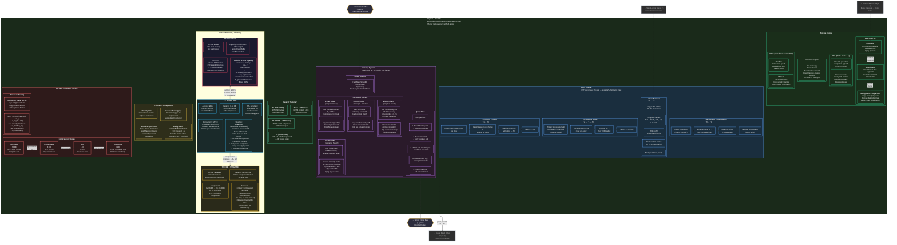

# Layer 5 — VoltDB (Detailed)

> Embedded Rust library managing cognitive memory. Three tiers, five index types, bleed engine, garbage collector, storage engine, and concurrency model.

```mermaid
%%{init: {"flowchart": {"defaultRenderer": "elk"}} }%%
flowchart TB

    subgraph L5["<b>Layer 5 — VoltDB</b><br/><i>Embedded Rust library (not separate process)</i><br/><i>Shared memory space with all layers</i>"]

        %% ═══════════════════════════════════════════════
        %% THREE-TIER MEMORY
        %% ═══════════════════════════════════════════════
        subgraph tiers["<b>Three-Tier Memory Hierarchy</b>"]
            direction TB

            subgraph t0["<b>T0: GPU VRAM</b>"]
                direction TB
                t0_capacity["Capacity: 64 full frames<br/>+ VFN weights<br/>+ Ghost Bleed Buffer<br/>~4 MB frame data"]
                t0_access["Access: <b>Instant</b><br/>GPU-local memory<br/>No bus transfer"]
                t0_contents["Contents:<br/>• Active RAR frames<br/>• VFN weight matrices<br/>• ~1,000 R₀ ghosts<br/>• Attention Q/K/V caches"]
                t0_eviction["<b>Eviction at 80% capacity</b><br/>score = w₁·recency<br/>       + w₂·γ<br/>       + w₃·log(refs)<br/>       + w₄·strand_importance<br/>       − w₅·superseded<br/>Lowest score evicted first<br/>R₀ ghost RETAINED in Bleed Buffer"]
            end

            subgraph t1["<b>T1: System RAM</b>"]
                direction TB
                t1_capacity["Capacity: 8-32 GB<br/>~500K full frames<br/>~32M compressed"]
                t1_access["Access: <b>~2ms</b><br/>Indexed retrieval<br/>via HNSW/B-tree"]
                t1_structure["Structure:<br/><b>LSM-Tree</b><br/>• Memtable (write buffer)<br/>  → Red-black tree, in-RAM<br/>  → Flush at threshold<br/>• Sorted Runs (on-disk format)<br/>  → SSTable-like segments<br/>  → Sorted by frame ID<br/>• Background Compaction<br/>  → Merge overlapping runs<br/>  → Remove tombstones"]
                t1_mvcc["Concurrency: MVCC<br/>crossbeam-epoch RCU<br/>Readers NEVER block<br/>Writers: per-strand mutex"]
                t1_wal["WAL per strand<br/>Write-ahead log<br/>Crash recovery<br/>Sequential append"]
            end

            subgraph t2["<b>T2: RAM + NVMe SSD</b>"]
                direction TB
                t2_capacity["Capacity: 64-160+ GB<br/>Millions compressed frames<br/>~1.1B at max"]
                t2_access["Access: <b>~10-50ms</b><br/>mmap'd archives<br/>Decompression overhead"]
                t2_structure["Structure:<br/>• mmap'd compressed archives<br/>• rkyv zero-copy deserialization<br/>  (no alloc, no copy on read)<br/>• Organized by strand + time<br/>• Bloom filters for membership"]
                t2_compression["Compression:<br/>Full 64KB → R₀+R₁ (8KB)<br/>Or R₀ only (1KB)<br/>LZ4 / zstd block compression"]
            end

            t0 <-->|"eviction at 80%<br/>R₀ ghost retained<br/>in Bleed Buffer"| t1
            t1 <-->|"sleep archival<br/>compress → R₀ only<br/>at 80% T1"| t2
        end

        %% ═══════════════════════════════════════════════
        %% INDEXING
        %% ═══════════════════════════════════════════════
        subgraph indexing["<b>Indexing System</b><br/><i>Total: O(log N), ~2.3ms for 10M frames</i>"]
            direction TB

            subgraph strand_routing["<b>Strand Routing</b>"]
                direction LR
                strand_hashmap["HashMap&lt;StrandId, StrandIndex&gt;<br/>O(1) lookup<br/>Route to per-strand indexes"]
            end

            subgraph per_strand_idx["<b>Per-Strand Indexes</b>"]
                direction LR

                subgraph hnsw_index["<b>HNSW Index</b><br/>(Semantic Search)"]
                    hnsw_config["Cosine similarity metric<br/>M = 16 connections/layer<br/>ef_construction = 200<br/>ef_search = 50<br/>O(log N) per query"]
                    hnsw_use["Use: 'find frames<br/>similar to this R₀'<br/>Nearest-neighbor recall"]
                end

                subgraph btree_index["<b>B-Tree Index</b><br/>(Temporal Range)"]
                    btree_config["Key: timestamp (u64 ns)<br/>Branching factor: 128<br/>O(log N) range query"]
                    btree_use["Use: 'frames between<br/>T₁ and T₂'<br/>Chronological retrieval"]
                end

                subgraph inverted_index["<b>Inverted Index</b><br/>(Concept → Frames)"]
                    inv_config["Key: codebook entry u16<br/>Value: Vec&lt;FrameId&gt;<br/>O(1) per concept lookup"]
                    inv_use["Use: 'all frames<br/>containing concept X'<br/>Exact concept match"]
                end

                subgraph bloom_filters["<b>Bloom Filters</b><br/>(Negative Check)"]
                    bloom_config["O(1) membership test<br/>99.9% accuracy<br/>False positive ≤ 0.1%<br/>NO false negatives"]
                    bloom_use["Use: 'does strand S<br/>contain concept X?'<br/>Skip expensive lookup<br/>if definitely absent"]
                end
            end

            subgraph query_flow["<b>Query Flow</b>"]
                direction TB
                q_input["Query arrives"]
                q_strand["1. Strand Routing O(1)<br/>→ select strand index"]
                q_bloom["2. Bloom Filter O(1)<br/>→ early negative exit"]
                q_index["3. HNSW or B-tree O(log N)<br/>→ candidate frame IDs"]
                q_inv["4. Inverted Index O(1)<br/>→ concept intersection"]
                q_load["5. Frame Load O(1)<br/>→ full frame retrieval"]
                q_input --> q_strand --> q_bloom --> q_index --> q_inv --> q_load
            end

            strand_routing --> per_strand_idx
        end

        %% ═══════════════════════════════════════════════
        %% BLEED ENGINE
        %% ═══════════════════════════════════════════════
        subgraph bleed_engine["<b>Bleed Engine</b><br/><i>CPU background threads — keeps GPU hot cache fresh</i>"]
            direction TB

            subgraph predictive_prefetch["<b>Predictive Prefetch</b><br/>T1 → T0"]
                direction LR
                prefetch_trigger["Trigger: new frame arrives<br/>on Bus"]
                prefetch_hnsw["HNSW query on new frame R₀<br/>against T1 index"]
                prefetch_load["Load top-K nearest<br/>full frames → T0"]
                prefetch_latency["Latency: ~2ms"]
                prefetch_trigger --> prefetch_hnsw --> prefetch_load --> prefetch_latency
            end

            subgraph ondemand_recall["<b>On-Demand Recall</b><br/>T2 → T1 → T0"]
                direction LR
                recall_trigger["Trigger: ghost page fault<br/>(cosine sim > threshold<br/>in Attend phase)"]
                recall_decompress["Decompress from T2<br/>rkyv zero-copy"]
                recall_promote["Promote to T1<br/>then T0 if needed"]
                recall_latency["Latency: ~10-50ms"]
                recall_trigger --> recall_decompress --> recall_promote --> recall_latency
            end

            subgraph bg_consolidation["<b>Background Consolidation</b><br/>T0 → T1"]
                direction LR
                consol_trigger["Trigger: T0 eviction<br/>(at 80% capacity)"]
                consol_write["Write full frame to T1<br/>LSM memtable insert"]
                consol_ghost["Retain R₀ ghost<br/>in Bleed Buffer"]
                consol_latency["Latency: non-blocking<br/>(async write)"]
                consol_trigger --> consol_write --> consol_ghost --> consol_latency
            end

            subgraph sleep_archival["<b>Sleep Archival</b><br/>T1 → T2"]
                direction LR
                archive_trigger["Trigger: T1 at 80%<br/>OR idle sleep cycle"]
                archive_compress["Compress frames:<br/>Full → R₀+R₁ or R₀ only<br/>LZ4/zstd"]
                archive_write["Write to T2<br/>mmap'd archive file"]
                archive_distill["Distill wisdom frames<br/>(50 → 3-5 summaries)"]
                archive_latency["Background, low-priority"]
                archive_trigger --> archive_compress --> archive_write --> archive_distill --> archive_latency
            end
        end

        %% ═══════════════════════════════════════════════
        %% GARBAGE COLLECTION
        %% ═══════════════════════════════════════════════
        subgraph gc["<b>Garbage Collection Pipeline</b>"]
            direction TB

            subgraph gc_stages["<b>Compression Stages</b>"]
                direction LR
                gc_full["<b>Full Frame</b><br/>64 KB<br/>All 16 slots × 4 res<br/>Complete data"]
                gc_compressed["<b>Compressed</b><br/>8 KB<br/>R₀ + R₁ only<br/>Proposition-level"]
                gc_gist["<b>Gist</b><br/>1 KB<br/>R₀ only<br/>Discourse-level"]
                gc_tombstone["<b>Tombstone</b><br/>32 B<br/>Frame ID + death time<br/>Existence proof only"]
                gc_full -->|"age + low refs<br/>+ low γ"| gc_compressed
                gc_compressed -->|"further decay"| gc_gist
                gc_gist -->|"truly obsolete"| gc_tombstone
            end

            subgraph gc_scoring["<b>Retention Scoring</b>"]
                direction TB
                retention_formula["score = w₁·exp(−age/30d)<br/>       + w₂·γ<br/>       + w₃·log(1 + refs)<br/>       + w₄·strand_importance<br/>       + w₅·distilled_flag<br/>       − w₆·contradictions<br/>       − w₇·redundancy"]
                immortal_rules["<b>IMMORTAL (never GC'd):</b><br/>• γ = 1.0 (proven facts)<br/>• High reference count<br/>• User-pinned frames"]
            end
        end

        %% ═══════════════════════════════════════════════
        %% STORAGE ENGINE
        %% ═══════════════════════════════════════════════
        subgraph storage_engine["<b>Storage Engine</b>"]
            direction TB

            subgraph lsm_tree["<b>LSM-Tree (T1)</b>"]
                direction TB
                memtable["<b>Memtable</b><br/>In-memory write buffer<br/>Red-black tree<br/>O(log N) insert"]
                sorted_runs["<b>Sorted Runs</b><br/>Immutable on-disk segments<br/>Sorted by frame ID<br/>SSTable-like"]
                compaction["<b>Background Compaction</b><br/>Merge overlapping runs<br/>Remove deleted entries<br/>Reduce read amplification"]
                memtable -->|"flush at<br/>threshold"| sorted_runs
                sorted_runs -->|"periodic<br/>merge"| compaction
            end

            subgraph mvcc_rcu["<b>MVCC (crossbeam-epoch RCU)</b>"]
                direction LR
                readers["<b>Readers</b><br/>Pin current epoch<br/>Read without locks<br/>NEVER block"]
                writers["<b>Writers</b><br/>Per-strand mutex<br/>Cross-strand = parallel<br/>Epoch-based reclamation"]
            end

            subgraph wal_recovery["<b>WAL (Write-Ahead Log)</b>"]
                direction LR
                wal_per_strand["One WAL per strand<br/>Sequential append<br/>fsync on commit"]
                crash_recovery["Crash recovery:<br/>Replay WAL entries<br/>Rebuild memtable<br/>Consistent state"]
            end

            subgraph serialization["<b>Serialization (rkyv)</b>"]
                direction LR
                rkyv_zero_copy["rkyv zero-copy deserialization<br/>No allocation on read<br/>Direct memory-mapped access<br/>Archived ↔ Live types"]
            end
        end

        %% ═══════════════════════════════════════════════
        %% COHERENCE
        %% ═══════════════════════════════════════════════
        subgraph coherence["<b>Coherence Management</b>"]
            direction TB
            gamma_priority["<b>γ-Priority Wins</b><br/>Contradicting frames:<br/>higher γ frame wins"]
            superseded_tag["<b>Superseded Tagging</b><br/>Old frame tagged as superseded<br/>γ-penalized in retrieval"]
            strand_scoped["<b>Strand-Scoped Truth</b><br/>Active strand determines<br/>which frames retrieved<br/>Context-dependent knowledge"]
            bg_contradiction["<b>Background Contradiction Detector</b><br/>HDC negation: ¬v<br/>Scan for frames where<br/>cosine(v, ¬w) > threshold"]
        end

        %% ═══════════════════════════════════════════════
        %% CAPACITY TABLE
        %% ═══════════════════════════════════════════════
        subgraph capacity["<b>Capacity Summary</b>"]
            direction LR
            cap_t0["<b>T0 (8GB VRAM)</b><br/>125K full frames<br/>~6M tokens equiv"]
            cap_t1["<b>T1 (32GB RAM)</b><br/>500K full / 32M compressed<br/>~1.6B tokens equiv"]
            cap_t2["<b>T2 (128GB + 1TB NVMe)</b><br/>17M full / 1.1B compressed<br/>~58B tokens equiv"]
            cap_total["<b>Total: ~58B tokens</b><br/>GPT-4 context: 128K<br/>~453,000× more"]
        end
    end

    %% ═══════════════════════════════════════════════════
    %% EXTERNAL CONNECTIONS
    %% ═══════════════════════════════════════════════════
    bus_in{{"← Tensor Frame Bus (Layer 2)<br/>Frames for recall/store"}} ==> strand_routing
    bleed_engine ==>|"ghost prefetch<br/>T1→T0"| ghost_out
    ghost_out["→ Ghost Bleed Buffer (Layer 3)<br/>~1000 R₀ refreshed"]
    bus_out{{"→ Tensor Frame Bus (Layer 2)<br/>Recalled frames"}}
    q_load ==> bus_out

    sleep_in["← SleepLearner (Layer 4)<br/>Consolidation requests"]
    sleep_in -.-> sleep_archival

    learning_in["← Instant Learning (Layer 7)<br/>Every inference → stored frame"]
    learning_in -.-> memtable

    %% ═══════════════════════════════════════════════════
    %% STYLING
    %% ═══════════════════════════════════════════════════
    classDef ramStyle fill:#1a2a1a,stroke:#4ecca3,stroke-width:2px,color:#eee
    classDef t0Style fill:#1a1a2e,stroke:#e94560,stroke-width:2px,color:#eee
    classDef t1Style fill:#1a2a2a,stroke:#38bdf8,stroke-width:2px,color:#eee
    classDef t2Style fill:#2a2a1a,stroke:#fbbf24,stroke-width:2px,color:#eee
    classDef idxStyle fill:#2a1a2a,stroke:#c084fc,stroke-width:2px,color:#eee
    classDef bleedStyle fill:#1a2e3e,stroke:#60a5fa,stroke-width:2px,color:#eee
    classDef gcStyle fill:#2e1a1a,stroke:#f87171,stroke-width:2px,color:#eee
    classDef storeStyle fill:#1a2e1a,stroke:#34d399,stroke-width:2px,color:#eee
    classDef coherStyle fill:#2e2e1a,stroke:#fcd34d,stroke-width:2px,color:#eee
    classDef busStyle fill:#2d2d3d,stroke:#f0c040,stroke-width:3px,color:#fff
    classDef extStyle fill:#2e2e2e,stroke:#94a3b8,stroke-width:1px,color:#aaa

    class L5 ramStyle
    class t0,t0_capacity,t0_access,t0_contents,t0_eviction t0Style
    class t1,t1_capacity,t1_access,t1_structure,t1_mvcc,t1_wal t1Style
    class t2,t2_capacity,t2_access,t2_structure,t2_compression t2Style
    class indexing,strand_routing,strand_hashmap,per_strand_idx,query_flow idxStyle
    class hnsw_index,hnsw_config,hnsw_use,btree_index,btree_config,btree_use idxStyle
    class inverted_index,inv_config,inv_use,bloom_filters,bloom_config,bloom_use idxStyle
    class q_input,q_strand,q_bloom,q_index,q_inv,q_load idxStyle
    class bleed_engine,predictive_prefetch,ondemand_recall,bg_consolidation,sleep_archival bleedStyle
    class prefetch_trigger,prefetch_hnsw,prefetch_load,prefetch_latency bleedStyle
    class recall_trigger,recall_decompress,recall_promote,recall_latency bleedStyle
    class consol_trigger,consol_write,consol_ghost,consol_latency bleedStyle
    class archive_trigger,archive_compress,archive_write,archive_distill,archive_latency bleedStyle
    class gc,gc_stages,gc_full,gc_compressed,gc_gist,gc_tombstone,gc_scoring,retention_formula,immortal_rules gcStyle
    class storage_engine,lsm_tree,memtable,sorted_runs,compaction storeStyle
    class mvcc_rcu,readers,writers,wal_recovery,wal_per_strand,crash_recovery storeStyle
    class serialization,rkyv_zero_copy storeStyle
    class coherence,gamma_priority,superseded_tag,strand_scoped,bg_contradiction coherStyle
    class capacity,cap_t0,cap_t1,cap_t2,cap_total ramStyle
    class bus_in,bus_out busStyle
    class ghost_out,sleep_in,learning_in extStyle
```
