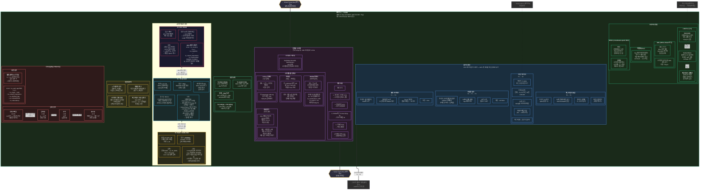

# 레이어 5 — VoltDB (상세)

> 인지 메모리를 관리하는 임베디드 Rust 라이브러리. 3개 티어, 5가지 인덱스 유형, 블리드 엔진, 가비지 컬렉터, 스토리지 엔진, 동시성 모델.

```mermaid
%%{init: {"flowchart": {"defaultRenderer": "elk"}} }%%
flowchart TB

    subgraph L5["<b>레이어 5 — VoltDB</b><br/><i>임베디드 Rust 라이브러리 (별도 프로세스 아님)</i><br/><i>모든 레이어와 공유 메모리 공간</i>"]

        %% ═══════════════════════════════════════════════
        %% 3단계 메모리
        %% ═══════════════════════════════════════════════
        subgraph tiers["<b>3단계 메모리 계층</b>"]
            direction TB

            subgraph t0["<b>T0: GPU VRAM</b>"]
                direction TB
                t0_capacity["용량: 64개 전체 프레임<br/>+ VFN 가중치<br/>+ 고스트 블리드 버퍼<br/>~4 MB 프레임 데이터"]
                t0_access["접근: <b>즉시</b><br/>GPU 로컬 메모리<br/>버스 전송 없음"]
                t0_contents["내용:<br/>• 활성 RAR 프레임<br/>• VFN 가중치 행렬<br/>• ~1,000개 R₀ 고스트<br/>• 어텐션 Q/K/V 캐시"]
                t0_eviction["<b>80% 용량 시 퇴거</b><br/>score = w₁·recency<br/>       + w₂·γ<br/>       + w₃·log(refs)<br/>       + w₄·strand_importance<br/>       − w₅·superseded<br/>최저 점수 우선 퇴거<br/>R₀ 고스트는 블리드 버퍼에 유지"]
            end

            subgraph t1["<b>T1: 시스템 RAM</b>"]
                direction TB
                t1_capacity["용량: 8-32 GB<br/>~500K 전체 프레임<br/>~32M 압축 프레임"]
                t1_access["접근: <b>~2ms</b><br/>HNSW/B-tree를 통한<br/>인덱스 검색"]
                t1_structure["구조:<br/><b>LSM-Tree</b><br/>• Memtable (쓰기 버퍼)<br/>  → 레드-블랙 트리, RAM 내<br/>  → 임계값 시 플러시<br/>• Sorted Runs (디스크 형식)<br/>  → SSTable 유사 세그먼트<br/>  → 프레임 ID로 정렬<br/>• 백그라운드 컴팩션<br/>  → 겹치는 런 병합<br/>  → 툼스톤 제거"]
                t1_mvcc["동시성: MVCC<br/>crossbeam-epoch RCU<br/>리더는 절대 차단 안 됨<br/>라이터: 스트랜드별 뮤텍스"]
                t1_wal["스트랜드별 WAL<br/>Write-Ahead 로그<br/>크래시 복구<br/>순차 추가"]
            end

            subgraph t2["<b>T2: RAM + NVMe SSD</b>"]
                direction TB
                t2_capacity["용량: 64-160+ GB<br/>수백만 압축 프레임<br/>최대 ~1.1B"]
                t2_access["접근: <b>~10-50ms</b><br/>mmap된 아카이브<br/>압축 해제 오버헤드"]
                t2_structure["구조:<br/>• mmap된 압축 아카이브<br/>• rkyv 제로카피 역직렬화<br/>  (읽기 시 할당 없음, 복사 없음)<br/>• 스트랜드 + 시간별 구성<br/>• 멤버십용 블룸 필터"]
                t2_compression["압축:<br/>전체 64KB → R₀+R₁ (8KB)<br/>또는 R₀만 (1KB)<br/>LZ4 / zstd 블록 압축"]
            end

            t0 <-->|"80%에서 퇴거<br/>R₀ 고스트는<br/>블리드 버퍼에 유지"| t1
            t1 <-->|"수면 아카이브<br/>R₀만으로 압축<br/>T1 80% 시"| t2
        end

        %% ═══════════════════════════════════════════════
        %% 인덱싱
        %% ═══════════════════════════════════════════════
        subgraph indexing["<b>인덱싱 시스템</b><br/><i>전체: O(log N), 10M 프레임에 ~2.3ms</i>"]
            direction TB

            subgraph strand_routing["<b>스트랜드 라우팅</b>"]
                direction LR
                strand_hashmap["HashMap&lt;StrandId, StrandIndex&gt;<br/>O(1) 조회<br/>스트랜드별 인덱스로 라우팅"]
            end

            subgraph per_strand_idx["<b>스트랜드별 인덱스</b>"]
                direction LR

                subgraph hnsw_index["<b>HNSW 인덱스</b><br/>(의미적 검색)"]
                    hnsw_config["코사인 유사도 메트릭<br/>M = 16 연결/레이어<br/>ef_construction = 200<br/>ef_search = 50<br/>쿼리당 O(log N)"]
                    hnsw_use["용도: '이 R₀와<br/>유사한 프레임 찾기'<br/>최근접 이웃 회수"]
                end

                subgraph btree_index["<b>B-Tree 인덱스</b><br/>(시간 범위)"]
                    btree_config["키: timestamp (u64 ns)<br/>분기 계수: 128<br/>O(log N) 범위 쿼리"]
                    btree_use["용도: 'T₁과 T₂ 사이의<br/>프레임'<br/>시간순 검색"]
                end

                subgraph inverted_index["<b>역색인</b><br/>(개념 → 프레임)"]
                    inv_config["키: codebook 항목 u16<br/>값: Vec&lt;FrameId&gt;<br/>개념당 O(1) 조회"]
                    inv_use["용도: '개념 X를 포함하는<br/>모든 프레임'<br/>정확한 개념 매칭"]
                end

                subgraph bloom_filters["<b>블룸 필터</b><br/>(부정 검사)"]
                    bloom_config["O(1) 멤버십 테스트<br/>99.9% 정확도<br/>위양성 ≤ 0.1%<br/>위음성 없음"]
                    bloom_use["용도: '스트랜드 S에<br/>개념 X가 있는가?'<br/>확실히 없으면<br/>비용 높은 조회 건너뛰기"]
                end
            end

            subgraph query_flow["<b>쿼리 흐름</b>"]
                direction TB
                q_input["쿼리 도착"]
                q_strand["1. 스트랜드 라우팅 O(1)<br/>→ 스트랜드 인덱스 선택"]
                q_bloom["2. 블룸 필터 O(1)<br/>→ 조기 부정 종료"]
                q_index["3. HNSW 또는 B-tree O(log N)<br/>→ 후보 프레임 ID"]
                q_inv["4. 역색인 O(1)<br/>→ 개념 교집합"]
                q_load["5. 프레임 로드 O(1)<br/>→ 전체 프레임 검색"]
                q_input --> q_strand --> q_bloom --> q_index --> q_inv --> q_load
            end

            strand_routing --> per_strand_idx
        end

        %% ═══════════════════════════════════════════════
        %% 블리드 엔진
        %% ═══════════════════════════════════════════════
        subgraph bleed_engine["<b>블리드 엔진</b><br/><i>CPU 백그라운드 스레드 — GPU 핫 캐시를 최신 상태로 유지</i>"]
            direction TB

            subgraph predictive_prefetch["<b>예측 프리페치</b><br/>T1 → T0"]
                direction LR
                prefetch_trigger["트리거: 새 프레임이<br/>Bus에 도착"]
                prefetch_hnsw["새 프레임 R₀로<br/>T1 인덱스에 HNSW 쿼리"]
                prefetch_load["Top-K 최근접<br/>전체 프레임 → T0 로드"]
                prefetch_latency["지연: ~2ms"]
                prefetch_trigger --> prefetch_hnsw --> prefetch_load --> prefetch_latency
            end

            subgraph ondemand_recall["<b>주문형 회수</b><br/>T2 → T1 → T0"]
                direction LR
                recall_trigger["트리거: 고스트 페이지 폴트<br/>(Attend 단계에서<br/>코사인 유사도 > 임계값)"]
                recall_decompress["T2에서 압축 해제<br/>rkyv 제로카피"]
                recall_promote["T1로 승격<br/>필요 시 T0로"]
                recall_latency["지연: ~10-50ms"]
                recall_trigger --> recall_decompress --> recall_promote --> recall_latency
            end

            subgraph bg_consolidation["<b>백그라운드 통합</b><br/>T0 → T1"]
                direction LR
                consol_trigger["트리거: T0 퇴거<br/>(80% 용량 시)"]
                consol_write["T1에 전체 프레임 쓰기<br/>LSM memtable 삽입"]
                consol_ghost["블리드 버퍼에<br/>R₀ 고스트 유지"]
                consol_latency["지연: 논블로킹<br/>(비동기 쓰기)"]
                consol_trigger --> consol_write --> consol_ghost --> consol_latency
            end

            subgraph sleep_archival["<b>수면 아카이브</b><br/>T1 → T2"]
                direction LR
                archive_trigger["트리거: T1 80%<br/>또는 유휴 수면 주기"]
                archive_compress["프레임 압축:<br/>전체 → R₀+R₁ 또는 R₀만<br/>LZ4/zstd"]
                archive_write["T2에 쓰기<br/>mmap된 아카이브 파일"]
                archive_distill["지혜 프레임 증류<br/>(50 → 3-5개 요약)"]
                archive_latency["백그라운드, 낮은 우선순위"]
                archive_trigger --> archive_compress --> archive_write --> archive_distill --> archive_latency
            end
        end

        %% ═══════════════════════════════════════════════
        %% 가비지 컬렉션
        %% ═══════════════════════════════════════════════
        subgraph gc["<b>가비지 컬렉션 파이프라인</b>"]
            direction TB

            subgraph gc_stages["<b>압축 단계</b>"]
                direction LR
                gc_full["<b>전체 프레임</b><br/>64 KB<br/>16 슬롯 × 4 해상도 전부<br/>완전한 데이터"]
                gc_compressed["<b>압축됨</b><br/>8 KB<br/>R₀ + R₁만<br/>명제 수준"]
                gc_gist["<b>요약</b><br/>1 KB<br/>R₀만<br/>담화 수준"]
                gc_tombstone["<b>툼스톤</b><br/>32 B<br/>프레임 ID + 사망 시간<br/>존재 증명만"]
                gc_full -->|"노화 + 낮은 참조<br/>+ 낮은 γ"| gc_compressed
                gc_compressed -->|"추가 감쇠"| gc_gist
                gc_gist -->|"진정으로 폐기됨"| gc_tombstone
            end

            subgraph gc_scoring["<b>보존 점수</b>"]
                direction TB
                retention_formula["score = w₁·exp(−age/30d)<br/>       + w₂·γ<br/>       + w₃·log(1 + refs)<br/>       + w₄·strand_importance<br/>       + w₅·distilled_flag<br/>       − w₆·contradictions<br/>       − w₇·redundancy"]
                immortal_rules["<b>불멸 (절대 GC 안 됨):</b><br/>• γ = 1.0 (증명된 사실)<br/>• 높은 참조 수<br/>• 사용자 고정 프레임"]
            end
        end

        %% ═══════════════════════════════════════════════
        %% 스토리지 엔진
        %% ═══════════════════════════════════════════════
        subgraph storage_engine["<b>스토리지 엔진</b>"]
            direction TB

            subgraph lsm_tree["<b>LSM-Tree (T1)</b>"]
                direction TB
                memtable["<b>Memtable</b><br/>인메모리 쓰기 버퍼<br/>레드-블랙 트리<br/>O(log N) 삽입"]
                sorted_runs["<b>Sorted Runs</b><br/>불변 디스크 세그먼트<br/>프레임 ID로 정렬<br/>SSTable 유사"]
                compaction["<b>백그라운드 컴팩션</b><br/>겹치는 런 병합<br/>삭제된 항목 제거<br/>읽기 증폭 감소"]
                memtable -->|"임계값 시<br/>플러시"| sorted_runs
                sorted_runs -->|"주기적<br/>병합"| compaction
            end

            subgraph mvcc_rcu["<b>MVCC (crossbeam-epoch RCU)</b>"]
                direction LR
                readers["<b>리더</b><br/>현재 에포크 고정<br/>잠금 없이 읽기<br/>절대 차단 안 됨"]
                writers["<b>라이터</b><br/>스트랜드별 뮤텍스<br/>스트랜드 간 = 병렬<br/>에포크 기반 회수"]
            end

            subgraph wal_recovery["<b>WAL (Write-Ahead 로그)</b>"]
                direction LR
                wal_per_strand["스트랜드당 하나의 WAL<br/>순차 추가<br/>커밋 시 fsync"]
                crash_recovery["크래시 복구:<br/>WAL 항목 재생<br/>Memtable 재구축<br/>일관된 상태"]
            end

            subgraph serialization["<b>직렬화 (rkyv)</b>"]
                direction LR
                rkyv_zero_copy["rkyv 제로카피 역직렬화<br/>읽기 시 할당 없음<br/>직접 메모리 매핑 접근<br/>Archived ↔ Live 타입"]
            end
        end

        %% ═══════════════════════════════════════════════
        %% 일관성
        %% ═══════════════════════════════════════════════
        subgraph coherence["<b>일관성 관리</b>"]
            direction TB
            gamma_priority["<b>γ 우선순위 승리</b><br/>상충하는 프레임:<br/>더 높은 γ 프레임 승리"]
            superseded_tag["<b>대체됨 태그</b><br/>이전 프레임에 대체됨 태그<br/>검색 시 γ 패널티"]
            strand_scoped["<b>스트랜드 범위 진실</b><br/>활성 스트랜드가 검색할<br/>프레임 결정<br/>컨텍스트 의존적 지식"]
            bg_contradiction["<b>백그라운드 모순 감지기</b><br/>HDC 부정: ¬v<br/>cosine(v, ¬w) > 임계값인<br/>프레임 스캔"]
        end

        %% ═══════════════════════════════════════════════
        %% 용량 표
        %% ═══════════════════════════════════════════════
        subgraph capacity["<b>용량 요약</b>"]
            direction LR
            cap_t0["<b>T0 (8GB VRAM)</b><br/>125K 전체 프레임<br/>~6M 토큰 상당"]
            cap_t1["<b>T1 (32GB RAM)</b><br/>500K 전체 / 32M 압축<br/>~1.6B 토큰 상당"]
            cap_t2["<b>T2 (128GB + 1TB NVMe)</b><br/>17M 전체 / 1.1B 압축<br/>~58B 토큰 상당"]
            cap_total["<b>총계: ~58B 토큰</b><br/>GPT-4 컨텍스트: 128K<br/>~453,000배 더 많음"]
        end
    end

    %% ═══════════════════════════════════════════════════
    %% 외부 연결
    %% ═══════════════════════════════════════════════════
    bus_in{{"← Tensor Frame Bus (레이어 2)<br/>회수/저장용 프레임"}} ==> strand_routing
    bleed_engine ==>|"고스트 프리페치<br/>T1→T0"| ghost_out
    ghost_out["→ 고스트 블리드 버퍼 (레이어 3)<br/>~1000개 R₀ 갱신됨"]
    bus_out{{"→ Tensor Frame Bus (레이어 2)<br/>회수된 프레임"}}
    q_load ==> bus_out

    sleep_in["← SleepLearner (레이어 4)<br/>통합 요청"]
    sleep_in -.-> sleep_archival

    learning_in["← 즉시 학습 (레이어 7)<br/>모든 추론 → 저장된 프레임"]
    learning_in -.-> memtable

    %% ═══════════════════════════════════════════════════
    %% 스타일링
    %% ═══════════════════════════════════════════════════
    classDef ramStyle fill:#1a2a1a,stroke:#4ecca3,stroke-width:2px,color:#eee
    classDef t0Style fill:#1a1a2e,stroke:#e94560,stroke-width:2px,color:#eee
    classDef t1Style fill:#1a2a2a,stroke:#38bdf8,stroke-width:2px,color:#eee
    classDef t2Style fill:#2a2a1a,stroke:#fbbf24,stroke-width:2px,color:#eee
    classDef idxStyle fill:#2a1a2a,stroke:#c084fc,stroke-width:2px,color:#eee
    classDef bleedStyle fill:#1a2e3e,stroke:#60a5fa,stroke-width:2px,color:#eee
    classDef gcStyle fill:#2e1a1a,stroke:#f87171,stroke-width:2px,color:#eee
    classDef storeStyle fill:#1a2e1a,stroke:#34d399,stroke-width:2px,color:#eee
    classDef coherStyle fill:#2e2e1a,stroke:#fcd34d,stroke-width:2px,color:#eee
    classDef busStyle fill:#2d2d3d,stroke:#f0c040,stroke-width:3px,color:#fff
    classDef extStyle fill:#2e2e2e,stroke:#94a3b8,stroke-width:1px,color:#aaa

    class L5 ramStyle
    class t0,t0_capacity,t0_access,t0_contents,t0_eviction t0Style
    class t1,t1_capacity,t1_access,t1_structure,t1_mvcc,t1_wal t1Style
    class t2,t2_capacity,t2_access,t2_structure,t2_compression t2Style
    class indexing,strand_routing,strand_hashmap,per_strand_idx,query_flow idxStyle
    class hnsw_index,hnsw_config,hnsw_use,btree_index,btree_config,btree_use idxStyle
    class inverted_index,inv_config,inv_use,bloom_filters,bloom_config,bloom_use idxStyle
    class q_input,q_strand,q_bloom,q_index,q_inv,q_load idxStyle
    class bleed_engine,predictive_prefetch,ondemand_recall,bg_consolidation,sleep_archival bleedStyle
    class prefetch_trigger,prefetch_hnsw,prefetch_load,prefetch_latency bleedStyle
    class recall_trigger,recall_decompress,recall_promote,recall_latency bleedStyle
    class consol_trigger,consol_write,consol_ghost,consol_latency bleedStyle
    class archive_trigger,archive_compress,archive_write,archive_distill,archive_latency bleedStyle
    class gc,gc_stages,gc_full,gc_compressed,gc_gist,gc_tombstone,gc_scoring,retention_formula,immortal_rules gcStyle
    class storage_engine,lsm_tree,memtable,sorted_runs,compaction storeStyle
    class mvcc_rcu,readers,writers,wal_recovery,wal_per_strand,crash_recovery storeStyle
    class serialization,rkyv_zero_copy storeStyle
    class coherence,gamma_priority,superseded_tag,strand_scoped,bg_contradiction coherStyle
    class capacity,cap_t0,cap_t1,cap_t2,cap_total ramStyle
    class bus_in,bus_out busStyle
    class ghost_out,sleep_in,learning_in extStyle
```
