# Layer 6 — Output Action Cores (Detailed)

> Parallel slot decode, all 6 action cores with internal mechanisms, role-ordered assembly, and output formats.

```mermaid
%%{init: {"flowchart": {"defaultRenderer": "elk"}} }%%
flowchart TB

    subgraph L6["<b>Layer 6 — Output Action Cores</b><br/><i>Parallel slot decode: 5-slot output = 1-slot wall-clock</i><br/><i>All slots decoded simultaneously — NOT autoregressive</i>"]

        %% ═══════════════════════════════════════════════
        %% INPUT
        %% ═══════════════════════════════════════════════
        input_frame{{"Input: Verified Output Frame<br/>from Bus (Layer 2)<br/>γ-scored, proof-attached<br/>F ∈ ℝ<sup>[16 × 4 × 256]</sup>"}}

        %% ═══════════════════════════════════════════════
        %% PARALLEL DECODE MECHANISM
        %% ═══════════════════════════════════════════════
        subgraph parallel_decode["<b>Parallel Decode Mechanism</b><br/><i>vs. autoregressive: 500 tokens = 500 serial passes</i>"]
            direction TB

            subgraph slot_decode["<b>Per-Slot Independent Decode</b>"]
                direction LR
                decode_s0["Decode Slot 0<br/>AGENT → text span"]
                decode_s1["Decode Slot 1<br/>PREDICATE → text span"]
                decode_s2["Decode Slot 2<br/>PATIENT → text span"]
                decode_s3["Decode Slot 3<br/>LOCATION → text span"]
                decode_s4["Decode Slot 4<br/>TIME → text span"]
                decode_s5["Decode Slot 5<br/>MANNER → text span"]
                decode_s6["Decode Slot 6<br/>INSTRUMENT → text span"]
                decode_s7["Decode Slot 7<br/>CAUSE → text span"]
                decode_s8["Decode Slot 8<br/>RESULT → text span"]
            end

            subgraph decode_process["<b>Decode Process (per slot)</b>"]
                direction TB
                read_r1["Read slot at R₁<br/>(proposition level)<br/>[256-dim vector]"]
                codebook_lookup["Codebook reverse lookup<br/>Nearest entries → candidate tokens"]
                beam_decode["Beam search / greedy decode<br/>R₂ phrase-level refinement<br/>R₃ token-level detail"]
                span_output["Output: text span<br/>for this semantic role"]
                read_r1 --> codebook_lookup --> beam_decode --> span_output
            end

            subgraph assembly["<b>Role-Ordered Assembly</b>"]
                direction TB
                role_order["Order spans by semantic role:<br/>AGENT + PREDICATE + PATIENT<br/>+ modifiers (MANNER, INSTRUMENT)<br/>+ adjuncts (LOCATION, TIME, CAUSE, RESULT)"]
                connectives["Insert discourse connectives:<br/>Based on R₀ discourse frame<br/>Conjunctions, punctuation,<br/>paragraph breaks"]
                final_text["Assembled natural language<br/>Coherent multi-sentence output"]
                role_order --> connectives --> final_text
            end
        end

        %% ═══════════════════════════════════════════════
        %% TEXT OUTPUT CORE
        %% ═══════════════════════════════════════════════
        subgraph text_core["<b>TextOutput Core</b>"]
            direction TB

            subgraph text_decode["<b>Decode Pipeline</b>"]
                direction TB
                text_slot_decode["Per-slot parallel decode<br/>R₁ → text spans<br/>All slots simultaneously"]
                text_role_assemble["Role-ordered assembly<br/>AGENT PREDICATE PATIENT...<br/>+ discourse connectives"]
                text_proof_annotate["Proof annotation:<br/>Inline γ scores<br/>Step references<br/>Source frame IDs"]
                text_format["Format: plain text / markdown<br/>with optional proof sidebar"]
                text_slot_decode --> text_role_assemble --> text_proof_annotate --> text_format
            end

            text_output(["Output: Natural Language<br/>+ proof annotations<br/>→ User / Chat UI"])
        end

        %% ═══════════════════════════════════════════════
        %% SPEECH OUTPUT CORE
        %% ═══════════════════════════════════════════════
        subgraph speech_core["<b>SpeechOutput Core</b>"]
            direction TB

            subgraph speech_pipeline["<b>TTS Pipeline</b>"]
                direction TB
                speech_text_in["Input: assembled text<br/>from TextOutput path"]
                speech_ssml["SSML Generation:<br/>Emphasis from γ scores<br/>Prosody from MANNER slot<br/>Pacing from R₀ discourse"]
                speech_tts["TTS Engine:<br/>Neural vocoder<br/>Voice selection<br/>Sample rate: 22050Hz+"]
                speech_buffer["Audio buffer:<br/>PCM / WAV / Opus<br/>Streaming output"]
                speech_text_in --> speech_ssml --> speech_tts --> speech_buffer
            end

            speech_output(["Output: Audio Stream<br/>→ Speaker / WebSocket"])
        end

        %% ═══════════════════════════════════════════════
        %% IMAGE OUTPUT CORE
        %% ═══════════════════════════════════════════════
        subgraph image_core["<b>ImageOutput Core</b>"]
            direction TB

            subgraph image_pipeline["<b>Image Generation Pipeline</b>"]
                direction TB
                image_patient["PATIENT slot → subject<br/>What to generate<br/>(e.g., 'mountain landscape')"]
                image_manner["MANNER slot → style<br/>How it should look<br/>(e.g., 'watercolor', 'photorealistic')"]
                image_location["LOCATION slot → setting<br/>Background context"]
                image_instrument["INSTRUMENT slot → medium<br/>Additional constraints"]
                image_conditioning["Conditioning vector:<br/>Combine slot embeddings<br/>→ diffusion model prompt"]
                image_diffusion["Diffusion Model:<br/>Latent diffusion<br/>Iterative denoising<br/>Resolution: configurable"]
                image_render["Rendered image:<br/>PNG / JPEG<br/>With provenance metadata"]
                image_patient --> image_conditioning
                image_manner --> image_conditioning
                image_location --> image_conditioning
                image_instrument --> image_conditioning
                image_conditioning --> image_diffusion --> image_render
            end

            image_output(["Output: Generated Image<br/>→ Display / File"])
        end

        %% ═══════════════════════════════════════════════
        %% MOTOR OUTPUT CORE
        %% ═══════════════════════════════════════════════
        subgraph motor_core["<b>MotorOutput Core</b>"]
            direction TB

            subgraph motor_pipeline["<b>Motor Command Pipeline</b>"]
                direction TB
                motor_action["PREDICATE slot → action type<br/>(grasp, move, rotate, press)"]
                motor_instrument["INSTRUMENT slot → effector<br/>(arm, gripper, wheel, servo)"]
                motor_patient["PATIENT slot → target object<br/>(location, dimensions)"]
                motor_manner["MANNER slot → parameters<br/>(speed, force, precision)"]
                motor_plan["Motion planning:<br/>Trajectory generation<br/>Collision avoidance<br/>Kinematics solver"]
                motor_primitives["Motor primitives:<br/>Position × Velocity × Force<br/>Timestamped command sequence"]
                motor_safety["Safety check:<br/>Force limits<br/>Workspace boundaries<br/>Emergency stop threshold"]
                motor_action --> motor_plan
                motor_instrument --> motor_plan
                motor_patient --> motor_plan
                motor_manner --> motor_plan
                motor_plan --> motor_primitives --> motor_safety
            end

            motor_output(["Output: Motor Commands<br/>→ Actuators / Robot API"])
        end

        %% ═══════════════════════════════════════════════
        %% N8N OUTPUT CORE
        %% ═══════════════════════════════════════════════
        subgraph n8n_core["<b>n8nOutput Core</b>"]
            direction TB

            subgraph n8n_pipeline["<b>Webhook Dispatch Pipeline</b>"]
                direction TB
                n8n_predicate["PREDICATE slot → action<br/>(send_email, create_ticket,<br/>update_record, trigger_flow)"]
                n8n_patient["PATIENT slot → payload<br/>Data to send"]
                n8n_instrument["INSTRUMENT slot → target<br/>Which n8n workflow / webhook"]
                n8n_serialize["Serialize to JSON:<br/>{ action, payload, target,<br/>  gamma, proof_ref, timestamp }"]
                n8n_http["HTTP POST to webhook:<br/>n8n endpoint URL<br/>Headers: auth token<br/>Content-Type: application/json"]
                n8n_response["Handle response:<br/>Success → log + confirm<br/>Failure → retry / report"]
                n8n_predicate --> n8n_serialize
                n8n_patient --> n8n_serialize
                n8n_instrument --> n8n_serialize
                n8n_serialize --> n8n_http --> n8n_response
            end

            n8n_output(["Output: Webhook Call<br/>→ n8n / External Service"])
        end

        %% ═══════════════════════════════════════════════
        %% LEDGER OUTPUT CORE
        %% ═══════════════════════════════════════════════
        subgraph ledger_core["<b>LedgerOutput Core</b>"]
            direction TB

            subgraph ledger_pipeline["<b>P2P Publishing Pipeline</b>"]
                direction TB
                ledger_frame_in["Input: verified frame<br/>to publish to Commons"]
                ledger_sign["Ed25519 Sign:<br/>Sign frame hash<br/>with instance keypair"]
                ledger_merkle["Merkle Append:<br/>Add to local log<br/>Update root hash"]
                ledger_zk["ZK Proof (optional):<br/>Prove frame properties<br/>without revealing content"]
                ledger_gossip["P2P Gossip Publish:<br/>libp2p pub/sub<br/>Topic: strand namespace"]
                ledger_ipfs["IPFS Pin (if module):<br/>Content-address<br/>Generate CID"]
                ledger_frame_in --> ledger_sign --> ledger_merkle --> ledger_zk --> ledger_gossip
                ledger_merkle --> ledger_ipfs
            end

            ledger_output(["Output: Signed Frame<br/>→ P2P Network / IPFS"])
        end
    end

    %% ═══════════════════════════════════════════════════
    %% FLOW
    %% ═══════════════════════════════════════════════════
    input_frame ==> parallel_decode

    subgraph core_dispatch["<b>Core Dispatch</b><br/>(based on frame intent + output modality)"]
        direction LR
        to_text["Text requested"]
        to_speech["Speech requested"]
        to_image["Image requested"]
        to_motor["Motor requested"]
        to_n8n["Webhook requested"]
        to_ledger["Publish requested"]
    end

    parallel_decode --> core_dispatch
    to_text --> text_core
    to_speech --> speech_core
    to_image --> image_core
    to_motor --> motor_core
    to_n8n --> n8n_core
    to_ledger --> ledger_core

    %% Output to External World
    text_output -->|"natural language"| external["→ Layer 0: External World"]
    speech_output -->|"audio stream"| external
    image_output -->|"image file"| external
    motor_output -->|"control signals"| external
    n8n_output -->|"webhook"| external
    ledger_output -->|"P2P broadcast"| external

    %% Trait interface
    trait_iface["<b>ActionCore Trait (Layer 10)</b><br/>fn decode(TensorFrame) → Output<br/>fn supported_outputs() → Vec&lt;OutputModality&gt;"]
    trait_iface -.->|"all cores implement"| text_core
    trait_iface -.->|"implements"| speech_core
    trait_iface -.->|"implements"| image_core
    trait_iface -.->|"implements"| motor_core
    trait_iface -.->|"implements"| n8n_core
    trait_iface -.->|"implements"| ledger_core

    %% ═══════════════════════════════════════════════════
    %% STYLING
    %% ═══════════════════════════════════════════════════
    classDef ioStyle fill:#2a1a2e,stroke:#a855f7,stroke-width:2px,color:#eee
    classDef textStyle fill:#1a2e2a,stroke:#34d399,stroke-width:2px,color:#eee
    classDef speechStyle fill:#2e2a1a,stroke:#fbbf24,stroke-width:2px,color:#eee
    classDef imageStyle fill:#1a1a2e,stroke:#818cf8,stroke-width:2px,color:#eee
    classDef motorStyle fill:#2e1a1a,stroke:#f87171,stroke-width:2px,color:#eee
    classDef n8nStyle fill:#1a2e3e,stroke:#60a5fa,stroke-width:2px,color:#eee
    classDef ledgerStyle fill:#2e2e1a,stroke:#fcd34d,stroke-width:2px,color:#eee
    classDef busStyle fill:#2d2d3d,stroke:#f0c040,stroke-width:3px,color:#fff
    classDef traitStyle fill:#2e2a1a,stroke:#fbbf24,stroke-width:2px,color:#eee
    classDef extStyle fill:#2e2e2e,stroke:#94a3b8,stroke-width:1px,color:#aaa

    class input_frame busStyle
    class parallel_decode,slot_decode,decode_s0,decode_s1,decode_s2,decode_s3,decode_s4,decode_s5,decode_s6,decode_s7,decode_s8 ioStyle
    class decode_process,read_r1,codebook_lookup,beam_decode,span_output,assembly,role_order,connectives,final_text ioStyle
    class text_core,text_decode,text_slot_decode,text_role_assemble,text_proof_annotate,text_format,text_output textStyle
    class speech_core,speech_pipeline,speech_text_in,speech_ssml,speech_tts,speech_buffer,speech_output speechStyle
    class image_core,image_pipeline,image_patient,image_manner,image_location,image_instrument,image_conditioning,image_diffusion,image_render,image_output imageStyle
    class motor_core,motor_pipeline,motor_action,motor_instrument,motor_patient,motor_manner,motor_plan,motor_primitives,motor_safety,motor_output motorStyle
    class n8n_core,n8n_pipeline,n8n_predicate,n8n_patient,n8n_instrument,n8n_serialize,n8n_http,n8n_response,n8n_output n8nStyle
    class ledger_core,ledger_pipeline,ledger_frame_in,ledger_sign,ledger_merkle,ledger_zk,ledger_gossip,ledger_ipfs,ledger_output ledgerStyle
    class core_dispatch,to_text,to_speech,to_image,to_motor,to_n8n,to_ledger ioStyle
    class trait_iface traitStyle
    class external extStyle
```

## Parallel Decode vs. Autoregressive Comparison

| Property | Volt XA (Parallel Decode) | Transformer (Autoregressive) |
|---|---|---|
| Tokens per pass | All slots simultaneously | 1 token per forward pass |
| 500-token output | 1 parallel decode pass | 500 serial forward passes |
| Bottleneck | Longest single slot | Total sequence length |
| Proof integration | Inline per-slot | Post-hoc only |
| Multi-modal | Different cores in parallel | Separate model calls |
