# 레이어 6 — 출력 액션 코어 (상세)

> 병렬 슬롯 디코드, 내부 메커니즘을 갖춘 6개 액션 코어 전체, 역할 순서 조립, 출력 형식.

```mermaid
%%{init: {"flowchart": {"defaultRenderer": "elk"}} }%%
flowchart TB

    subgraph L6["<b>레이어 6 — 출력 액션 코어</b><br/><i>병렬 슬롯 디코드: 5-슬롯 출력 = 1-슬롯 벽시계 시간</i><br/><i>모든 슬롯이 동시에 디코드됨 — 자기회귀 방식이 아님</i>"]

        %% ═══════════════════════════════════════════════
        %% 입력
        %% ═══════════════════════════════════════════════
        input_frame{{"입력: 검증된 출력 프레임<br/>Bus(레이어 2)로부터<br/>γ-점수 부여, 증명 첨부<br/>F ∈ ℝ<sup>[16 × 4 × 256]</sup>"}}

        %% ═══════════════════════════════════════════════
        %% 병렬 디코드 메커니즘
        %% ═══════════════════════════════════════════════
        subgraph parallel_decode["<b>병렬 디코드 메커니즘</b><br/><i>자기회귀 대비: 500 토큰 = 500 직렬 패스</i>"]
            direction TB

            subgraph slot_decode["<b>슬롯별 독립 디코드</b>"]
                direction LR
                decode_s0["슬롯 0 디코드<br/>AGENT → 텍스트 스팬"]
                decode_s1["슬롯 1 디코드<br/>PREDICATE → 텍스트 스팬"]
                decode_s2["슬롯 2 디코드<br/>PATIENT → 텍스트 스팬"]
                decode_s3["슬롯 3 디코드<br/>LOCATION → 텍스트 스팬"]
                decode_s4["슬롯 4 디코드<br/>TIME → 텍스트 스팬"]
                decode_s5["슬롯 5 디코드<br/>MANNER → 텍스트 스팬"]
                decode_s6["슬롯 6 디코드<br/>INSTRUMENT → 텍스트 스팬"]
                decode_s7["슬롯 7 디코드<br/>CAUSE → 텍스트 스팬"]
                decode_s8["슬롯 8 디코드<br/>RESULT → 텍스트 스팬"]
            end

            subgraph decode_process["<b>디코드 프로세스 (슬롯별)</b>"]
                direction TB
                read_r1["R₁에서 슬롯 읽기<br/>(명제 수준)<br/>[256차원 벡터]"]
                codebook_lookup["코드북 역방향 조회<br/>가장 가까운 항목 → 후보 토큰"]
                beam_decode["빔 검색 / 탐욕 디코드<br/>R₂ 구문 수준 정제<br/>R₃ 토큰 수준 세부사항"]
                span_output["출력: 텍스트 스팬<br/>이 의미 역할에 대한"]
                read_r1 --> codebook_lookup --> beam_decode --> span_output
            end

            subgraph assembly["<b>역할 순서 조립</b>"]
                direction TB
                role_order["의미 역할별 스팬 정렬:<br/>AGENT + PREDICATE + PATIENT<br/>+ 수식어 (MANNER, INSTRUMENT)<br/>+ 부가어 (LOCATION, TIME, CAUSE, RESULT)"]
                connectives["담화 접속사 삽입:<br/>R₀ 담화 프레임 기반<br/>접속사, 구두점,<br/>단락 구분"]
                final_text["조립된 자연어<br/>일관된 다중 문장 출력"]
                role_order --> connectives --> final_text
            end
        end

        %% ═══════════════════════════════════════════════
        %% 텍스트 출력 코어
        %% ═══════════════════════════════════════════════
        subgraph text_core["<b>TextOutput 코어</b>"]
            direction TB

            subgraph text_decode["<b>디코드 파이프라인</b>"]
                direction TB
                text_slot_decode["슬롯별 병렬 디코드<br/>R₁ → 텍스트 스팬<br/>모든 슬롯 동시 처리"]
                text_role_assemble["역할 순서 조립<br/>AGENT PREDICATE PATIENT...<br/>+ 담화 접속사"]
                text_proof_annotate["증명 주석:<br/>인라인 γ 점수<br/>단계 참조<br/>소스 프레임 ID"]
                text_format["형식: 일반 텍스트 / 마크다운<br/>선택적 증명 사이드바 포함"]
                text_slot_decode --> text_role_assemble --> text_proof_annotate --> text_format
            end

            text_output(["출력: 자연어<br/>+ 증명 주석<br/>→ 사용자 / 채팅 UI"])
        end

        %% ═══════════════════════════════════════════════
        %% 음성 출력 코어
        %% ═══════════════════════════════════════════════
        subgraph speech_core["<b>SpeechOutput 코어</b>"]
            direction TB

            subgraph speech_pipeline["<b>TTS 파이프라인</b>"]
                direction TB
                speech_text_in["입력: 조립된 텍스트<br/>TextOutput 경로에서"]
                speech_ssml["SSML 생성:<br/>γ 점수에 따른 강조<br/>MANNER 슬롯에 따른 운율<br/>R₀ 담화에 따른 속도"]
                speech_tts["TTS 엔진:<br/>신경망 보코더<br/>음성 선택<br/>샘플 레이트: 22050Hz+"]
                speech_buffer["오디오 버퍼:<br/>PCM / WAV / Opus<br/>스트리밍 출력"]
                speech_text_in --> speech_ssml --> speech_tts --> speech_buffer
            end

            speech_output(["출력: 오디오 스트림<br/>→ 스피커 / WebSocket"])
        end

        %% ═══════════════════════════════════════════════
        %% 이미지 출력 코어
        %% ═══════════════════════════════════════════════
        subgraph image_core["<b>ImageOutput 코어</b>"]
            direction TB

            subgraph image_pipeline["<b>이미지 생성 파이프라인</b>"]
                direction TB
                image_patient["PATIENT 슬롯 → 주제<br/>생성 대상<br/>(예: '산 풍경')"]
                image_manner["MANNER 슬롯 → 스타일<br/>외형 표현 방식<br/>(예: '수채화', '사실적')"]
                image_location["LOCATION 슬롯 → 배경<br/>배경 맥락"]
                image_instrument["INSTRUMENT 슬롯 → 매체<br/>추가 제약 조건"]
                image_conditioning["컨디셔닝 벡터:<br/>슬롯 임베딩 결합<br/>→ 확산 모델 프롬프트"]
                image_diffusion["확산 모델:<br/>잠재 확산<br/>반복적 노이즈 제거<br/>해상도: 설정 가능"]
                image_render["렌더링된 이미지:<br/>PNG / JPEG<br/>출처 메타데이터 포함"]
                image_patient --> image_conditioning
                image_manner --> image_conditioning
                image_location --> image_conditioning
                image_instrument --> image_conditioning
                image_conditioning --> image_diffusion --> image_render
            end

            image_output(["출력: 생성된 이미지<br/>→ 디스플레이 / 파일"])
        end

        %% ═══════════════════════════════════════════════
        %% 모터 출력 코어
        %% ═══════════════════════════════════════════════
        subgraph motor_core["<b>MotorOutput 코어</b>"]
            direction TB

            subgraph motor_pipeline["<b>모터 명령 파이프라인</b>"]
                direction TB
                motor_action["PREDICATE 슬롯 → 동작 유형<br/>(잡기, 이동, 회전, 누르기)"]
                motor_instrument["INSTRUMENT 슬롯 → 작동 장치<br/>(팔, 그리퍼, 바퀴, 서보)"]
                motor_patient["PATIENT 슬롯 → 대상 객체<br/>(위치, 치수)"]
                motor_manner["MANNER 슬롯 → 매개변수<br/>(속도, 힘, 정밀도)"]
                motor_plan["동작 계획:<br/>궤적 생성<br/>충돌 회피<br/>역기구학 솔버"]
                motor_primitives["모터 프리미티브:<br/>위치 × 속도 × 힘<br/>타임스탬프 명령 시퀀스"]
                motor_safety["안전 검사:<br/>힘 제한<br/>작업 공간 경계<br/>비상 정지 임계값"]
                motor_action --> motor_plan
                motor_instrument --> motor_plan
                motor_patient --> motor_plan
                motor_manner --> motor_plan
                motor_plan --> motor_primitives --> motor_safety
            end

            motor_output(["출력: 모터 명령<br/>→ 액추에이터 / 로봇 API"])
        end

        %% ═══════════════════════════════════════════════
        %% n8n 출력 코어
        %% ═══════════════════════════════════════════════
        subgraph n8n_core["<b>n8nOutput 코어</b>"]
            direction TB

            subgraph n8n_pipeline["<b>웹훅 디스패치 파이프라인</b>"]
                direction TB
                n8n_predicate["PREDICATE 슬롯 → 동작<br/>(이메일 전송, 티켓 생성,<br/>레코드 갱신, 플로우 트리거)"]
                n8n_patient["PATIENT 슬롯 → 페이로드<br/>전송할 데이터"]
                n8n_instrument["INSTRUMENT 슬롯 → 대상<br/>대상 n8n 워크플로우 / 웹훅"]
                n8n_serialize["JSON 직렬화:<br/>{ action, payload, target,<br/>  gamma, proof_ref, timestamp }"]
                n8n_http["웹훅 HTTP POST:<br/>n8n 엔드포인트 URL<br/>헤더: 인증 토큰<br/>Content-Type: application/json"]
                n8n_response["응답 처리:<br/>성공 → 로그 + 확인<br/>실패 → 재시도 / 보고"]
                n8n_predicate --> n8n_serialize
                n8n_patient --> n8n_serialize
                n8n_instrument --> n8n_serialize
                n8n_serialize --> n8n_http --> n8n_response
            end

            n8n_output(["출력: 웹훅 호출<br/>→ n8n / 외부 서비스"])
        end

        %% ═══════════════════════════════════════════════
        %% 원장 출력 코어
        %% ═══════════════════════════════════════════════
        subgraph ledger_core["<b>LedgerOutput 코어</b>"]
            direction TB

            subgraph ledger_pipeline["<b>P2P 게시 파이프라인</b>"]
                direction TB
                ledger_frame_in["입력: 검증된 프레임<br/>Commons에 게시할"]
                ledger_sign["Ed25519 서명:<br/>프레임 해시 서명<br/>인스턴스 키페어 사용"]
                ledger_merkle["Merkle 추가:<br/>로컬 로그에 추가<br/>루트 해시 갱신"]
                ledger_zk["ZK 증명 (선택):<br/>내용 공개 없이<br/>프레임 속성 증명"]
                ledger_gossip["P2P 가십 게시:<br/>libp2p pub/sub<br/>토픽: 스트랜드 네임스페이스"]
                ledger_ipfs["IPFS 핀 (모듈인 경우):<br/>콘텐츠 주소 지정<br/>CID 생성"]
                ledger_frame_in --> ledger_sign --> ledger_merkle --> ledger_zk --> ledger_gossip
                ledger_merkle --> ledger_ipfs
            end

            ledger_output(["출력: 서명된 프레임<br/>→ P2P 네트워크 / IPFS"])
        end
    end

    %% ═══════════════════════════════════════════════════
    %% 흐름
    %% ═══════════════════════════════════════════════════
    input_frame ==> parallel_decode

    subgraph core_dispatch["<b>코어 디스패치</b><br/>(프레임 의도 + 출력 모달리티 기반)"]
        direction LR
        to_text["텍스트 요청됨"]
        to_speech["음성 요청됨"]
        to_image["이미지 요청됨"]
        to_motor["모터 요청됨"]
        to_n8n["웹훅 요청됨"]
        to_ledger["게시 요청됨"]
    end

    parallel_decode --> core_dispatch
    to_text --> text_core
    to_speech --> speech_core
    to_image --> image_core
    to_motor --> motor_core
    to_n8n --> n8n_core
    to_ledger --> ledger_core

    %% 외부 세계로 출력
    text_output -->|"자연어"| external["→ 레이어 0: 외부 세계"]
    speech_output -->|"오디오 스트림"| external
    image_output -->|"이미지 파일"| external
    motor_output -->|"제어 신호"| external
    n8n_output -->|"웹훅"| external
    ledger_output -->|"P2P 브로드캐스트"| external

    %% Trait 인터페이스
    trait_iface["<b>ActionCore Trait (레이어 10)</b><br/>fn decode(TensorFrame) → Output<br/>fn supported_outputs() → Vec&lt;OutputModality&gt;"]
    trait_iface -.->|"모든 코어가 구현"| text_core
    trait_iface -.->|"구현"| speech_core
    trait_iface -.->|"구현"| image_core
    trait_iface -.->|"구현"| motor_core
    trait_iface -.->|"구현"| n8n_core
    trait_iface -.->|"구현"| ledger_core

    %% ═══════════════════════════════════════════════════
    %% 스타일링
    %% ═══════════════════════════════════════════════════
    classDef ioStyle fill:#2a1a2e,stroke:#a855f7,stroke-width:2px,color:#eee
    classDef textStyle fill:#1a2e2a,stroke:#34d399,stroke-width:2px,color:#eee
    classDef speechStyle fill:#2e2a1a,stroke:#fbbf24,stroke-width:2px,color:#eee
    classDef imageStyle fill:#1a1a2e,stroke:#818cf8,stroke-width:2px,color:#eee
    classDef motorStyle fill:#2e1a1a,stroke:#f87171,stroke-width:2px,color:#eee
    classDef n8nStyle fill:#1a2e3e,stroke:#60a5fa,stroke-width:2px,color:#eee
    classDef ledgerStyle fill:#2e2e1a,stroke:#fcd34d,stroke-width:2px,color:#eee
    classDef busStyle fill:#2d2d3d,stroke:#f0c040,stroke-width:3px,color:#fff
    classDef traitStyle fill:#2e2a1a,stroke:#fbbf24,stroke-width:2px,color:#eee
    classDef extStyle fill:#2e2e2e,stroke:#94a3b8,stroke-width:1px,color:#aaa

    class input_frame busStyle
    class parallel_decode,slot_decode,decode_s0,decode_s1,decode_s2,decode_s3,decode_s4,decode_s5,decode_s6,decode_s7,decode_s8 ioStyle
    class decode_process,read_r1,codebook_lookup,beam_decode,span_output,assembly,role_order,connectives,final_text ioStyle
    class text_core,text_decode,text_slot_decode,text_role_assemble,text_proof_annotate,text_format,text_output textStyle
    class speech_core,speech_pipeline,speech_text_in,speech_ssml,speech_tts,speech_buffer,speech_output speechStyle
    class image_core,image_pipeline,image_patient,image_manner,image_location,image_instrument,image_conditioning,image_diffusion,image_render,image_output imageStyle
    class motor_core,motor_pipeline,motor_action,motor_instrument,motor_patient,motor_manner,motor_plan,motor_primitives,motor_safety,motor_output motorStyle
    class n8n_core,n8n_pipeline,n8n_predicate,n8n_patient,n8n_instrument,n8n_serialize,n8n_http,n8n_response,n8n_output n8nStyle
    class ledger_core,ledger_pipeline,ledger_frame_in,ledger_sign,ledger_merkle,ledger_zk,ledger_gossip,ledger_ipfs,ledger_output ledgerStyle
    class core_dispatch,to_text,to_speech,to_image,to_motor,to_n8n,to_ledger ioStyle
    class trait_iface traitStyle
    class external extStyle
```

## 병렬 디코드 vs. 자기회귀 비교

| 속성 | Volt XA (병렬 디코드) | Transformer (자기회귀) |
|---|---|---|
| 패스당 토큰 수 | 모든 슬롯 동시 처리 | 순방향 패스당 1 토큰 |
| 500-토큰 출력 | 1회 병렬 디코드 패스 | 500회 직렬 순방향 패스 |
| 병목 지점 | 가장 긴 단일 슬롯 | 전체 시퀀스 길이 |
| 증명 통합 | 슬롯별 인라인 | 사후 처리만 가능 |
| 다중 모달 | 서로 다른 코어가 병렬 처리 | 별도 모델 호출 필요 |
