# Layer 7 — Continual Learning (Detailed)

> Inference IS learning. Three timescales: instant, sleep consolidation, and developmental growth. Full internal flows.

```mermaid
%%{init: {"flowchart": {"defaultRenderer": "elk"}} }%%
flowchart TB

    subgraph L7["<b>Layer 7 — Continual Learning</b><br/><i>Inference IS learning — no train/inference distinction</i><br/><i>Every inference → stored frame → future context</i>"]

        %% ═══════════════════════════════════════════════
        %% INSTANT LEARNING
        %% ═══════════════════════════════════════════════
        subgraph instant["<b>Instant Learning</b><br/><i>Timescale: milliseconds to minutes</i>"]
            direction TB

            subgraph instant_trigger["<b>Trigger</b>"]
                direction LR
                every_inference["Every single inference<br/>produces a Tensor Frame"]
                every_frame["Every frame is a<br/>learning event"]
            end

            subgraph instant_process["<b>Process</b>"]
                direction TB
                frame_created["Frame created by<br/>RAR convergence (Layer 3)<br/>+ verification (Layer 4)"]
                ram_write["Write to T1 (System RAM)<br/>LSM memtable insert<br/>O(log N)"]
                strand_assign["Assign to strand<br/>Based on R₀ topic gist<br/>HNSW nearest strand"]
                index_update["Update indexes:<br/>• HNSW (semantic)<br/>• B-tree (temporal)<br/>• Inverted (concept)<br/>• Bloom filter"]
                ghost_update["Update Ghost Bleed Buffer<br/>if frame R₀ is novel enough<br/>Cosine distance > threshold"]
                frame_created --> ram_write --> strand_assign --> index_update --> ghost_update
            end

            subgraph instant_properties["<b>Properties</b>"]
                direction LR
                zero_forgetting["<b>Zero forgetting</b><br/>Frames never overwritten<br/>Only GC'd by age/relevance"]
                instant_effect["<b>Instant effect</b><br/>Frame immediately retrievable<br/>by next query"]
                no_weight_change["<b>No weight changes</b><br/>VFN weights untouched<br/>Pure data accumulation"]
            end
        end

        %% ═══════════════════════════════════════════════
        %% SLEEP CONSOLIDATION
        %% ═══════════════════════════════════════════════
        subgraph sleep["<b>Sleep Consolidation</b><br/><i>Timescale: hours, during idle periods</i>"]
            direction TB

            subgraph sleep_trigger["<b>Trigger Conditions</b>"]
                direction LR
                idle_detect["System idle detected<br/>(no queries for N minutes)"]
                t1_threshold["T1 at 80% capacity<br/>Archival needed"]
                scheduled["Scheduled consolidation<br/>(configurable interval)"]
            end

            subgraph sleep_phase1["<b>Phase 1: Cluster</b>"]
                direction TB
                select_strand["Select strand for<br/>consolidation"]
                hnsw_cluster["HNSW neighborhood clustering<br/>Group semantically similar frames<br/>Within recent time window"]
                identify_groups["Identify frame groups:<br/>Clusters of 20-100 frames<br/>High mutual cosine sim"]
                select_strand --> hnsw_cluster --> identify_groups
            end

            subgraph sleep_phase2["<b>Phase 2: Distill</b>"]
                direction TB
                take_cluster["Take cluster of ~50 frames"]
                compute_centroid["Compute centroid:<br/>Weighted average of R₀s<br/>Weight = γ × recency"]
                extract_wisdom["Extract wisdom frame:<br/>Centroid as R₀<br/>Most common R₁ patterns<br/>Highest-γ R₂ details"]
                output_wisdom["Output: 3-5 wisdom frames<br/>from original ~50<br/>High-γ summaries"]
                take_cluster --> compute_centroid --> extract_wisdom --> output_wisdom
            end

            subgraph sleep_phase3["<b>Phase 3: Forward-Forward VFN Update</b>"]
                direction TB
                ff_concept["<b>Forward-Forward Algorithm</b><br/>No backpropagation needed<br/>One layer at a time<br/>~1× inference VRAM"]
                ff_positive["<b>Positive pass:</b><br/>Wisdom frames as 'good' data<br/>Goodness = Σ(activation²)<br/>Push goodness UP"]
                ff_negative["<b>Negative pass:</b><br/>Corrupted/contradicted frames<br/>Push goodness DOWN"]
                ff_layer_update["<b>Per-layer weight update:</b><br/>Layer k frozen while<br/>updating layer k+1<br/>Sequential, memory-efficient"]
                ff_concept --> ff_positive --> ff_negative --> ff_layer_update
            end

            subgraph sleep_phase4["<b>Phase 4: Energy Landscape Reshape</b>"]
                direction TB
                new_attractors["<b>New attractors form</b><br/>VFN weights now create<br/>energy minima for new concepts<br/>Learned from wisdom frames"]
                flatten_unused["<b>Unused attractors flatten</b><br/>Concepts with no recent frames<br/>Energy basins become shallow<br/>Still accessible but less magnetic"]
                landscape_result["<b>Result:</b><br/>Energy landscape reflects<br/>accumulated experience<br/>Future RAR converges faster<br/>for learned concepts"]
                new_attractors --> landscape_result
                flatten_unused --> landscape_result
            end

            subgraph sleep_phase5["<b>Phase 5: Archival</b>"]
                direction TB
                compress_original["Compress original frames:<br/>Full 64KB → R₀+R₁ (8KB)<br/>or R₀ only (1KB)"]
                move_t2["Move to T2 (NVMe)<br/>mmap'd compressed archive"]
                retain_wisdom["Retain wisdom frames<br/>in T1 at full resolution<br/>High-γ, immortal"]
                free_t1["Free T1 space<br/>for new instant writes"]
                compress_original --> move_t2 --> retain_wisdom --> free_t1
            end

            sleep_trigger --> sleep_phase1
            sleep_phase1 --> sleep_phase2
            sleep_phase2 --> sleep_phase3
            sleep_phase3 --> sleep_phase4
            sleep_phase4 --> sleep_phase5
        end

        %% ═══════════════════════════════════════════════
        %% DEVELOPMENTAL GROWTH
        %% ═══════════════════════════════════════════════
        subgraph developmental["<b>Developmental Growth</b><br/><i>Timescale: days to months</i>"]
            direction TB

            subgraph strand_graduation["<b>Strand Graduation</b>"]
                direction TB
                topic_monitor["Monitor topic clusters<br/>across strands"]
                frequency_check["Detect high-frequency topics<br/>that span multiple strands<br/>or dominate a strand"]
                promote_strand["<b>Promote to dedicated strand</b><br/>Topic cluster → own StrandId<br/>Dedicated indexes<br/>Own capability vector"]
                register_strand["Register with Intent Router<br/>New capability vector<br/>Auto-discovered"]
                topic_monitor --> frequency_check --> promote_strand --> register_strand
            end

            subgraph module_hotplug["<b>Module Hot-Plug</b>"]
                direction TB
                trait_introspect["Trait introspection:<br/>Scan for new crates<br/>implementing HardStrand,<br/>Translator, or ActionCore"]
                load_module["Dynamic loading:<br/>Load new module at runtime<br/>No recompilation needed"]
                register_cap["Register capability vector<br/>with Intent Router"]
                test_module["Integration test:<br/>Verify trait compliance<br/>Sandbox execution check"]
                trait_introspect --> load_module --> register_cap --> test_module
            end

            subgraph capability_expansion["<b>Capability Expansion</b>"]
                direction LR
                new_translators["New Translators<br/>Community crates<br/>New input modalities"]
                new_strands["New Hard Strands<br/>Community crates<br/>New computation types"]
                new_cores["New Action Cores<br/>Community crates<br/>New output modalities"]
            end

            strand_graduation --> capability_expansion
            module_hotplug --> capability_expansion
        end
    end

    %% ═══════════════════════════════════════════════════
    %% CONNECTIONS TO OTHER LAYERS
    %% ═══════════════════════════════════════════════════

    %% Instant learning inputs
    bus_in{{"← Tensor Frame Bus (Layer 2)<br/>Every inference frame"}}
    bus_in ==>|"every frame<br/>is a learning event"| instant

    %% Instant → VoltDB
    instant ==>|"RAM strand writes<br/>T1 memtable insert"| voltdb_out
    voltdb_out["→ VoltDB T1 (Layer 5)<br/>Immediate storage"]

    %% Sleep → VFN
    sleep ==>|"Forward-Forward<br/>weight updates"| vfn_out
    vfn_out["→ VFN weights (Layer 3)<br/>Energy landscape reshaped"]

    %% Sleep → VoltDB
    sleep ==>|"T1 → T2 archival<br/>Wisdom frames retained"| voltdb_archive
    voltdb_archive["→ VoltDB T2 (Layer 5)<br/>Compressed archives"]

    %% Developmental → Intent Router
    developmental ==>|"new capability vectors<br/>strand graduation"| router_out
    router_out["→ Intent Router (Layer 4)<br/>New strand registration"]

    %% Developmental → VoltDB
    developmental ==>|"new strand<br/>indexes created"| voltdb_strand
    voltdb_strand["→ VoltDB (Layer 5)<br/>New strand partition"]

    %% SleepLearner coordination
    sleep_coord["← SleepLearner strand (Layer 4)<br/>Coordinates consolidation"]
    sleep_coord -.-> sleep

    %% ═══════════════════════════════════════════════════
    %% STYLING
    %% ═══════════════════════════════════════════════════
    classDef learnStyle fill:#1a2a2e,stroke:#38bdf8,stroke-width:2px,color:#eee
    classDef instantStyle fill:#1a3e1a,stroke:#4ecca3,stroke-width:2px,color:#eee
    classDef sleepStyle fill:#2e1a2e,stroke:#c084fc,stroke-width:2px,color:#eee
    classDef devStyle fill:#2e2a1a,stroke:#fbbf24,stroke-width:2px,color:#eee
    classDef busStyle fill:#2d2d3d,stroke:#f0c040,stroke-width:3px,color:#fff
    classDef extStyle fill:#2e2e2e,stroke:#94a3b8,stroke-width:1px,color:#aaa

    class L7 learnStyle
    class instant,instant_trigger,every_inference,every_frame,instant_process instantStyle
    class frame_created,ram_write,strand_assign,index_update,ghost_update instantStyle
    class instant_properties,zero_forgetting,instant_effect,no_weight_change instantStyle
    class sleep,sleep_trigger,idle_detect,t1_threshold,scheduled sleepStyle
    class sleep_phase1,select_strand,hnsw_cluster,identify_groups sleepStyle
    class sleep_phase2,take_cluster,compute_centroid,extract_wisdom,output_wisdom sleepStyle
    class sleep_phase3,ff_concept,ff_positive,ff_negative,ff_layer_update sleepStyle
    class sleep_phase4,new_attractors,flatten_unused,landscape_result sleepStyle
    class sleep_phase5,compress_original,move_t2,retain_wisdom,free_t1 sleepStyle
    class developmental,strand_graduation,topic_monitor,frequency_check,promote_strand,register_strand devStyle
    class module_hotplug,trait_introspect,load_module,register_cap,test_module devStyle
    class capability_expansion,new_translators,new_strands,new_cores devStyle
    class bus_in busStyle
    class voltdb_out,vfn_out,voltdb_archive,router_out,voltdb_strand,sleep_coord extStyle
```

## Learning Timescale Summary

| Phase | Timescale | Trigger | Action | Weight Change? | VRAM Cost |
|---|---|---|---|---|---|
| Instant | ms | Every inference | RAM write + index | No | 0 |
| Sleep Cluster | hours (idle) | Idle / T1 80% | HNSW neighborhood | No | 0 |
| Sleep Distill | hours (idle) | After clustering | 50→3-5 wisdom | No | 0 |
| Sleep FF Update | hours (idle) | After distill | VFN layer-by-layer | Yes | ~1× inference |
| Sleep Archival | hours (idle) | After FF | T1→T2 compress | No | 0 |
| Strand Graduation | days-months | Topic frequency | New strand created | No | 0 |
| Module Hot-Plug | on discovery | New crate detected | Load + register | No | Varies |
