# 레이어 7 — 지속적 학습 (상세)

> 추론이 곧 학습이다. 세 가지 시간 척도: 즉시, 수면 통합, 발달적 성장. 전체 내부 흐름.

```mermaid
%%{init: {"flowchart": {"defaultRenderer": "elk"}} }%%
flowchart TB

    subgraph L7["<b>레이어 7 — 지속적 학습</b><br/><i>추론이 곧 학습 — 훈련/추론 구분 없음</i><br/><i>모든 추론 → 저장된 프레임 → 미래 컨텍스트</i>"]

        %% ═══════════════════════════════════════════════
        %% 즉시 학습
        %% ═══════════════════════════════════════════════
        subgraph instant["<b>즉시 학습</b><br/><i>시간 척도: 밀리초에서 분 단위</i>"]
            direction TB

            subgraph instant_trigger["<b>트리거</b>"]
                direction LR
                every_inference["모든 단일 추론이<br/>Tensor Frame을 생성"]
                every_frame["모든 프레임은<br/>학습 이벤트"]
            end

            subgraph instant_process["<b>프로세스</b>"]
                direction TB
                frame_created["RAR 수렴(레이어 3)<br/>+ 검증(레이어 4)에 의해<br/>프레임 생성"]
                ram_write["T1(시스템 RAM)에 쓰기<br/>LSM memtable 삽입<br/>O(log N)"]
                strand_assign["스트랜드에 할당<br/>R₀ 주제 요지 기반<br/>HNSW 최근접 스트랜드"]
                index_update["인덱스 갱신:<br/>• HNSW (의미론적)<br/>• B-tree (시간적)<br/>• 역인덱스 (개념)<br/>• Bloom 필터"]
                ghost_update["Ghost Bleed Buffer 갱신<br/>프레임 R₀가 충분히 새로운 경우<br/>코사인 거리 > 임계값"]
                frame_created --> ram_write --> strand_assign --> index_update --> ghost_update
            end

            subgraph instant_properties["<b>속성</b>"]
                direction LR
                zero_forgetting["<b>망각 제로</b><br/>프레임은 절대 덮어쓰지 않음<br/>나이/관련성에 의한 GC만 수행"]
                instant_effect["<b>즉시 효과</b><br/>프레임이 다음 쿼리에서<br/>즉시 검색 가능"]
                no_weight_change["<b>가중치 변경 없음</b><br/>VFN 가중치 변경하지 않음<br/>순수 데이터 축적"]
            end
        end

        %% ═══════════════════════════════════════════════
        %% 수면 통합
        %% ═══════════════════════════════════════════════
        subgraph sleep["<b>수면 통합</b><br/><i>시간 척도: 시간 단위, 유휴 기간 중</i>"]
            direction TB

            subgraph sleep_trigger["<b>트리거 조건</b>"]
                direction LR
                idle_detect["시스템 유휴 감지<br/>(N분간 쿼리 없음)"]
                t1_threshold["T1 용량 80% 도달<br/>아카이빙 필요"]
                scheduled["예약된 통합<br/>(설정 가능한 간격)"]
            end

            subgraph sleep_phase1["<b>1단계: 클러스터링</b>"]
                direction TB
                select_strand["통합할 스트랜드<br/>선택"]
                hnsw_cluster["HNSW 이웃 클러스터링<br/>의미론적으로 유사한 프레임 그룹화<br/>최근 시간 윈도우 내"]
                identify_groups["프레임 그룹 식별:<br/>20-100개 프레임 클러스터<br/>높은 상호 코사인 유사도"]
                select_strand --> hnsw_cluster --> identify_groups
            end

            subgraph sleep_phase2["<b>2단계: 증류</b>"]
                direction TB
                take_cluster["~50개 프레임 클러스터 취득"]
                compute_centroid["중심점 계산:<br/>R₀의 가중 평균<br/>가중치 = γ × 최신성"]
                extract_wisdom["지혜 프레임 추출:<br/>중심점을 R₀로<br/>가장 빈번한 R₁ 패턴<br/>최고 γ R₂ 세부사항"]
                output_wisdom["출력: 원래 ~50개에서<br/>3-5개 지혜 프레임<br/>고-γ 요약"]
                take_cluster --> compute_centroid --> extract_wisdom --> output_wisdom
            end

            subgraph sleep_phase3["<b>3단계: Forward-Forward VFN 갱신</b>"]
                direction TB
                ff_concept["<b>Forward-Forward 알고리즘</b><br/>역전파 불필요<br/>한 번에 한 레이어씩<br/>~1× 추론 VRAM"]
                ff_positive["<b>양성 패스:</b><br/>지혜 프레임을 '양호' 데이터로<br/>적합도 = Σ(activation²)<br/>적합도를 올림"]
                ff_negative["<b>음성 패스:</b><br/>손상/모순된 프레임<br/>적합도를 내림"]
                ff_layer_update["<b>레이어별 가중치 갱신:</b><br/>레이어 k+1 갱신 중<br/>레이어 k 동결<br/>순차적, 메모리 효율적"]
                ff_concept --> ff_positive --> ff_negative --> ff_layer_update
            end

            subgraph sleep_phase4["<b>4단계: 에너지 지형 재형성</b>"]
                direction TB
                new_attractors["<b>새로운 끌개 형성</b><br/>VFN 가중치가 이제<br/>새로운 개념에 대한 에너지 최솟값 생성<br/>지혜 프레임으로부터 학습"]
                flatten_unused["<b>미사용 끌개 평탄화</b><br/>최근 프레임이 없는 개념<br/>에너지 분지가 얕아짐<br/>접근은 가능하지만 자력이 약해짐"]
                landscape_result["<b>결과:</b><br/>에너지 지형이<br/>축적된 경험을 반영<br/>학습된 개념에 대해<br/>향후 RAR이 더 빠르게 수렴"]
                new_attractors --> landscape_result
                flatten_unused --> landscape_result
            end

            subgraph sleep_phase5["<b>5단계: 아카이빙</b>"]
                direction TB
                compress_original["원본 프레임 압축:<br/>전체 64KB → R₀+R₁ (8KB)<br/>또는 R₀만 (1KB)"]
                move_t2["T2(NVMe)로 이동<br/>mmap된 압축 아카이브"]
                retain_wisdom["지혜 프레임 유지<br/>T1에 전체 해상도로<br/>고-γ, 영구 보존"]
                free_t1["T1 공간 해제<br/>새로운 즉시 쓰기를 위해"]
                compress_original --> move_t2 --> retain_wisdom --> free_t1
            end

            sleep_trigger --> sleep_phase1
            sleep_phase1 --> sleep_phase2
            sleep_phase2 --> sleep_phase3
            sleep_phase3 --> sleep_phase4
            sleep_phase4 --> sleep_phase5
        end

        %% ═══════════════════════════════════════════════
        %% 발달적 성장
        %% ═══════════════════════════════════════════════
        subgraph developmental["<b>발달적 성장</b><br/><i>시간 척도: 일에서 월 단위</i>"]
            direction TB

            subgraph strand_graduation["<b>스트랜드 졸업</b>"]
                direction TB
                topic_monitor["스트랜드 전반의<br/>주제 클러스터 모니터링"]
                frequency_check["다중 스트랜드에 걸치거나<br/>하나의 스트랜드를 지배하는<br/>고빈도 주제 감지"]
                promote_strand["<b>전용 스트랜드로 승격</b><br/>주제 클러스터 → 자체 StrandId<br/>전용 인덱스<br/>자체 능력 벡터"]
                register_strand["Intent Router에 등록<br/>새로운 능력 벡터<br/>자동 발견"]
                topic_monitor --> frequency_check --> promote_strand --> register_strand
            end

            subgraph module_hotplug["<b>모듈 핫플러그</b>"]
                direction TB
                trait_introspect["Trait 내성 검사:<br/>HardStrand,<br/>Translator, 또는 ActionCore를<br/>구현하는 새 크레이트 스캔"]
                load_module["동적 로딩:<br/>런타임에 새 모듈 로드<br/>재컴파일 불필요"]
                register_cap["Intent Router에<br/>능력 벡터 등록"]
                test_module["통합 테스트:<br/>Trait 준수 검증<br/>샌드박스 실행 확인"]
                trait_introspect --> load_module --> register_cap --> test_module
            end

            subgraph capability_expansion["<b>능력 확장</b>"]
                direction LR
                new_translators["새로운 Translator<br/>커뮤니티 크레이트<br/>새로운 입력 모달리티"]
                new_strands["새로운 Hard Strand<br/>커뮤니티 크레이트<br/>새로운 연산 유형"]
                new_cores["새로운 Action Core<br/>커뮤니티 크레이트<br/>새로운 출력 모달리티"]
            end

            strand_graduation --> capability_expansion
            module_hotplug --> capability_expansion
        end
    end

    %% ═══════════════════════════════════════════════════
    %% 다른 레이어와의 연결
    %% ═══════════════════════════════════════════════════

    %% 즉시 학습 입력
    bus_in{{"← Tensor Frame Bus (레이어 2)<br/>모든 추론 프레임"}}
    bus_in ==>|"모든 프레임이<br/>학습 이벤트"| instant

    %% 즉시 → VoltDB
    instant ==>|"RAM 스트랜드 쓰기<br/>T1 memtable 삽입"| voltdb_out
    voltdb_out["→ VoltDB T1 (레이어 5)<br/>즉시 저장"]

    %% 수면 → VFN
    sleep ==>|"Forward-Forward<br/>가중치 갱신"| vfn_out
    vfn_out["→ VFN 가중치 (레이어 3)<br/>에너지 지형 재형성"]

    %% 수면 → VoltDB
    sleep ==>|"T1 → T2 아카이빙<br/>지혜 프레임 유지"| voltdb_archive
    voltdb_archive["→ VoltDB T2 (레이어 5)<br/>압축 아카이브"]

    %% 발달적 → Intent Router
    developmental ==>|"새로운 능력 벡터<br/>스트랜드 졸업"| router_out
    router_out["→ Intent Router (레이어 4)<br/>새로운 스트랜드 등록"]

    %% 발달적 → VoltDB
    developmental ==>|"새로운 스트랜드<br/>인덱스 생성"| voltdb_strand
    voltdb_strand["→ VoltDB (레이어 5)<br/>새로운 스트랜드 파티션"]

    %% SleepLearner 조율
    sleep_coord["← SleepLearner 스트랜드 (레이어 4)<br/>통합 조율"]
    sleep_coord -.-> sleep

    %% ═══════════════════════════════════════════════════
    %% 스타일링
    %% ═══════════════════════════════════════════════════
    classDef learnStyle fill:#1a2a2e,stroke:#38bdf8,stroke-width:2px,color:#eee
    classDef instantStyle fill:#1a3e1a,stroke:#4ecca3,stroke-width:2px,color:#eee
    classDef sleepStyle fill:#2e1a2e,stroke:#c084fc,stroke-width:2px,color:#eee
    classDef devStyle fill:#2e2a1a,stroke:#fbbf24,stroke-width:2px,color:#eee
    classDef busStyle fill:#2d2d3d,stroke:#f0c040,stroke-width:3px,color:#fff
    classDef extStyle fill:#2e2e2e,stroke:#94a3b8,stroke-width:1px,color:#aaa

    class L7 learnStyle
    class instant,instant_trigger,every_inference,every_frame,instant_process instantStyle
    class frame_created,ram_write,strand_assign,index_update,ghost_update instantStyle
    class instant_properties,zero_forgetting,instant_effect,no_weight_change instantStyle
    class sleep,sleep_trigger,idle_detect,t1_threshold,scheduled sleepStyle
    class sleep_phase1,select_strand,hnsw_cluster,identify_groups sleepStyle
    class sleep_phase2,take_cluster,compute_centroid,extract_wisdom,output_wisdom sleepStyle
    class sleep_phase3,ff_concept,ff_positive,ff_negative,ff_layer_update sleepStyle
    class sleep_phase4,new_attractors,flatten_unused,landscape_result sleepStyle
    class sleep_phase5,compress_original,move_t2,retain_wisdom,free_t1 sleepStyle
    class developmental,strand_graduation,topic_monitor,frequency_check,promote_strand,register_strand devStyle
    class module_hotplug,trait_introspect,load_module,register_cap,test_module devStyle
    class capability_expansion,new_translators,new_strands,new_cores devStyle
    class bus_in busStyle
    class voltdb_out,vfn_out,voltdb_archive,router_out,voltdb_strand,sleep_coord extStyle
```

## 학습 시간 척도 요약

| 단계 | 시간 척도 | 트리거 | 동작 | 가중치 변경? | VRAM 비용 |
|---|---|---|---|---|---|
| 즉시 | ms | 모든 추론 | RAM 쓰기 + 인덱스 | 아니오 | 0 |
| 수면 클러스터링 | 시간 (유휴) | 유휴 / T1 80% | HNSW 이웃 | 아니오 | 0 |
| 수면 증류 | 시간 (유휴) | 클러스터링 후 | 50→3-5 지혜 | 아니오 | 0 |
| 수면 FF 갱신 | 시간 (유휴) | 증류 후 | VFN 레이어별 | 예 | ~1× 추론 |
| 수면 아카이빙 | 시간 (유휴) | FF 후 | T1→T2 압축 | 아니오 | 0 |
| 스트랜드 졸업 | 일-월 | 주제 빈도 | 새로운 스트랜드 생성 | 아니오 | 0 |
| 모듈 핫플러그 | 발견 시 | 새 크레이트 감지 | 로드 + 등록 | 아니오 | 가변적 |
