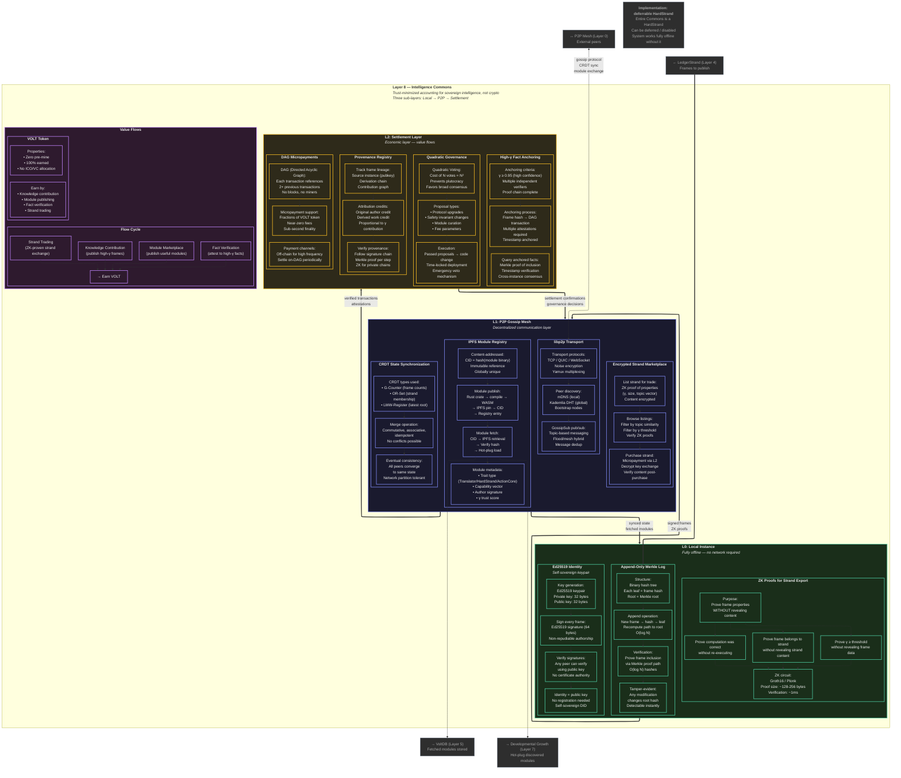

# Layer 8 — Intelligence Commons (Detailed)

> Post-blockchain ledger for sovereign intelligence. Three sub-layers: local, P2P gossip, and settlement. Value flows and governance.

```mermaid
%%{init: {"flowchart": {"defaultRenderer": "elk"}} }%%
flowchart TB

    subgraph L8["<b>Layer 8 — Intelligence Commons</b><br/><i>Trust-minimized accounting for sovereign intelligence, not crypto</i><br/><i>Three sub-layers: Local → P2P → Settlement</i>"]

        %% ═══════════════════════════════════════════════
        %% L0: LOCAL INSTANCE
        %% ═══════════════════════════════════════════════
        subgraph commons_l0["<b>L0: Local Instance</b><br/><i>Fully offline — no network required</i>"]
            direction TB

            subgraph merkle_log["<b>Append-Only Merkle Log</b>"]
                direction TB
                merkle_structure["Structure:<br/>Binary hash tree<br/>Each leaf = frame hash<br/>Root = Merkle root"]
                merkle_append_op["Append operation:<br/>New frame → hash → leaf<br/>Recompute path to root<br/>O(log N)"]
                merkle_verify["Verification:<br/>Prove frame inclusion<br/>via Merkle proof path<br/>O(log N) hashes"]
                merkle_tamper["Tamper-evident:<br/>Any modification<br/>changes root hash<br/>Detectable instantly"]
                merkle_structure --> merkle_append_op --> merkle_verify --> merkle_tamper
            end

            subgraph identity["<b>Ed25519 Identity</b><br/><i>Self-sovereign keypair</i>"]
                direction TB
                keypair_gen["Key generation:<br/>Ed25519 keypair<br/>Private key: 32 bytes<br/>Public key: 32 bytes"]
                sign_frames["Sign every frame:<br/>Ed25519 signature (64 bytes)<br/>Non-repudiable authorship"]
                verify_sig["Verify signatures:<br/>Any peer can verify<br/>using public key<br/>No certificate authority"]
                did_identity["Identity = public key<br/>No registration needed<br/>Self-sovereign DID"]
                keypair_gen --> sign_frames --> verify_sig --> did_identity
            end

            subgraph zk_proofs["<b>ZK Proofs for Strand Export</b>"]
                direction TB
                zk_purpose["Purpose:<br/>Prove frame properties<br/>WITHOUT revealing content"]
                zk_prove_gamma["Prove γ ≥ threshold<br/>without revealing frame data"]
                zk_prove_strand["Prove frame belongs to strand<br/>without revealing strand content"]
                zk_prove_compute["Prove computation was correct<br/>without re-executing"]
                zk_circuit["ZK circuit:<br/>Groth16 / Plonk<br/>Proof size: ~128-256 bytes<br/>Verification: ~1ms"]
                zk_purpose --> zk_prove_gamma
                zk_purpose --> zk_prove_strand
                zk_purpose --> zk_prove_compute
                zk_prove_gamma --> zk_circuit
                zk_prove_strand --> zk_circuit
                zk_prove_compute --> zk_circuit
            end
        end

        %% ═══════════════════════════════════════════════
        %% L1: P2P GOSSIP MESH
        %% ═══════════════════════════════════════════════
        subgraph commons_l1["<b>L1: P2P Gossip Mesh</b><br/><i>Decentralized communication layer</i>"]
            direction TB

            subgraph libp2p_layer["<b>libp2p Transport</b>"]
                direction TB
                transport["Transport protocols:<br/>TCP / QUIC / WebSocket<br/>Noise encryption<br/>Yamux multiplexing"]
                discovery["Peer discovery:<br/>mDNS (local)<br/>Kademlia DHT (global)<br/>Bootstrap nodes"]
                pubsub["GossipSub pub/sub:<br/>Topic-based messaging<br/>Flood/mesh hybrid<br/>Message dedup"]
                transport --> discovery --> pubsub
            end

            subgraph crdt_sync["<b>CRDT State Synchronization</b>"]
                direction TB
                crdt_type["CRDT types used:<br/>• G-Counter (frame counts)<br/>• OR-Set (strand membership)<br/>• LWW-Register (latest root)"]
                crdt_merge["Merge operation:<br/>Commutative, associative,<br/>idempotent<br/>No conflicts possible"]
                crdt_eventual["Eventual consistency:<br/>All peers converge<br/>to same state<br/>Network partition tolerant"]
                crdt_type --> crdt_merge --> crdt_eventual
            end

            subgraph ipfs_registry["<b>IPFS Module Registry</b>"]
                direction TB
                cid_address["Content-addressed:<br/>CID = hash(module binary)<br/>Immutable reference<br/>Globally unique"]
                module_publish["Module publish:<br/>Rust crate → compile → WASM<br/>→ IPFS pin → CID<br/>→ Registry entry"]
                module_fetch["Module fetch:<br/>CID → IPFS retrieval<br/>→ Verify hash<br/>→ Hot-plug load"]
                module_meta["Module metadata:<br/>• Trait type (Translator/HardStrand/ActionCore)<br/>• Capability vector<br/>• Author signature<br/>• γ trust score"]
                cid_address --> module_publish --> module_fetch --> module_meta
            end

            subgraph strand_marketplace["<b>Encrypted Strand Marketplace</b>"]
                direction TB
                strand_listing["List strand for trade:<br/>ZK proof of properties<br/>(γ, size, topic vector)<br/>Content encrypted"]
                strand_browse["Browse listings:<br/>Filter by topic similarity<br/>Filter by γ threshold<br/>Verify ZK proofs"]
                strand_purchase["Purchase strand:<br/>Micropayment via L2<br/>Decrypt key exchange<br/>Verify content post-purchase"]
                strand_listing --> strand_browse --> strand_purchase
            end
        end

        %% ═══════════════════════════════════════════════
        %% L2: SETTLEMENT
        %% ═══════════════════════════════════════════════
        subgraph commons_l2["<b>L2: Settlement Layer</b><br/><i>Economic layer — value flows</i>"]
            direction TB

            subgraph dag_micropayments["<b>DAG Micropayments</b>"]
                direction TB
                dag_structure["DAG (Directed Acyclic Graph):<br/>Each transaction references<br/>2+ previous transactions<br/>No blocks, no miners"]
                dag_micro["Micropayment support:<br/>Fractions of VOLT token<br/>Near-zero fees<br/>Sub-second finality"]
                dag_channels["Payment channels:<br/>Off-chain for high frequency<br/>Settle on-DAG periodically"]
                dag_structure --> dag_micro --> dag_channels
            end

            subgraph fact_anchoring["<b>High-γ Fact Anchoring</b>"]
                direction TB
                anchor_criteria["Anchoring criteria:<br/>γ ≥ 0.95 (high confidence)<br/>Multiple independent verifiers<br/>Proof chain complete"]
                anchor_process["Anchoring process:<br/>Frame hash → DAG transaction<br/>Multiple attestations required<br/>Timestamp anchored"]
                anchor_query["Query anchored facts:<br/>Merkle proof of inclusion<br/>Timestamp verification<br/>Cross-instance consensus"]
                anchor_criteria --> anchor_process --> anchor_query
            end

            subgraph provenance["<b>Provenance Registry</b>"]
                direction TB
                prov_track["Track frame lineage:<br/>Source instance (pubkey)<br/>Derivation chain<br/>Contribution graph"]
                prov_credit["Attribution credits:<br/>Original author credit<br/>Derived work credit<br/>Proportional to γ contribution"]
                prov_verify["Verify provenance:<br/>Follow signature chain<br/>Merkle proof per step<br/>ZK for private chains"]
                prov_track --> prov_credit --> prov_verify
            end

            subgraph governance["<b>Quadratic Governance</b>"]
                direction TB
                qv_concept["Quadratic Voting:<br/>Cost of N votes = N²<br/>Prevents plutocracy<br/>Favors broad consensus"]
                qv_proposals["Proposal types:<br/>• Protocol upgrades<br/>• Safety invariant changes<br/>• Module curation<br/>• Fee parameters"]
                qv_execute["Execution:<br/>Passed proposals → code change<br/>Time-locked deployment<br/>Emergency veto mechanism"]
                qv_concept --> qv_proposals --> qv_execute
            end
        end

        %% ═══════════════════════════════════════════════
        %% VALUE FLOWS
        %% ═══════════════════════════════════════════════
        subgraph value_flows["<b>Value Flows</b>"]
            direction TB

            subgraph volt_token["<b>VOLT Token</b>"]
                direction LR
                token_props["Properties:<br/>• Zero pre-mine<br/>• 100% earned<br/>• No ICO/VC allocation"]
                token_earn["Earn by:<br/>• Knowledge contribution<br/>• Module publishing<br/>• Fact verification<br/>• Strand trading"]
            end

            subgraph flow_diagram["<b>Flow Cycle</b>"]
                direction TB
                flow_contribute["Knowledge Contribution<br/>(publish high-γ frames)"]
                flow_marketplace["Module Marketplace<br/>(publish useful modules)"]
                flow_verification["Fact Verification<br/>(attest to high-γ facts)"]
                flow_trading["Strand Trading<br/>(ZK-proven strand exchange)"]
                flow_earn["→ Earn VOLT"]
                flow_contribute --> flow_earn
                flow_marketplace --> flow_earn
                flow_verification --> flow_earn
                flow_trading --> flow_earn
            end
        end

        %% ═══════════════════════════════════════════════
        %% SUB-LAYER FLOW
        %% ═══════════════════════════════════════════════
        commons_l0 ==>|"signed frames<br/>ZK proofs"| commons_l1
        commons_l1 ==>|"verified transactions<br/>attestations"| commons_l2
        commons_l2 ==>|"settlement confirmations<br/>governance decisions"| commons_l1
        commons_l1 ==>|"synced state<br/>fetched modules"| commons_l0
    end

    %% ═══════════════════════════════════════════════════
    %% EXTERNAL CONNECTIONS
    %% ═══════════════════════════════════════════════════

    %% LedgerStrand (Layer 4)
    ledger_in["← LedgerStrand (Layer 4)<br/>Frames to publish"]
    ledger_in ==> merkle_log

    %% P2P External (Layer 0)
    p2p_ext["↔ P2P Mesh (Layer 0)<br/>External peers"]
    p2p_ext <-->|"gossip protocol<br/>CRDT sync<br/>module exchange"| libp2p_layer

    %% VoltDB (Layer 5) — fetched modules stored
    voltdb_modules["→ VoltDB (Layer 5)<br/>Fetched modules stored"]
    module_fetch --> voltdb_modules

    %% Developmental (Layer 7) — new modules
    dev_growth["→ Developmental Growth (Layer 7)<br/>Hot-plug discovered modules"]
    module_fetch --> dev_growth

    %% Implementation note
    impl_note["<b>Implementation: deferrable HardStrand</b><br/>Entire Commons is a HardStrand<br/>Can be deferred / disabled<br/>System works fully offline without it"]

    %% ═══════════════════════════════════════════════════
    %% STYLING
    %% ═══════════════════════════════════════════════════
    classDef l0Style fill:#1a2e1a,stroke:#4ecca3,stroke-width:2px,color:#eee
    classDef l1Style fill:#1a1a2e,stroke:#818cf8,stroke-width:2px,color:#eee
    classDef l2Style fill:#2e2a1a,stroke:#fbbf24,stroke-width:2px,color:#eee
    classDef valueStyle fill:#2e1a2e,stroke:#c084fc,stroke-width:2px,color:#eee
    classDef extStyle fill:#2e2e2e,stroke:#94a3b8,stroke-width:1px,color:#aaa

    class commons_l0,merkle_log,merkle_structure,merkle_append_op,merkle_verify,merkle_tamper l0Style
    class identity,keypair_gen,sign_frames,verify_sig,did_identity l0Style
    class zk_proofs,zk_purpose,zk_prove_gamma,zk_prove_strand,zk_prove_compute,zk_circuit l0Style
    class commons_l1,libp2p_layer,transport,discovery,pubsub l1Style
    class crdt_sync,crdt_type,crdt_merge,crdt_eventual l1Style
    class ipfs_registry,cid_address,module_publish,module_fetch,module_meta l1Style
    class strand_marketplace,strand_listing,strand_browse,strand_purchase l1Style
    class commons_l2,dag_micropayments,dag_structure,dag_micro,dag_channels l2Style
    class fact_anchoring,anchor_criteria,anchor_process,anchor_query l2Style
    class provenance,prov_track,prov_credit,prov_verify l2Style
    class governance,qv_concept,qv_proposals,qv_execute l2Style
    class value_flows,volt_token,token_props,token_earn,flow_diagram valueStyle
    class flow_contribute,flow_marketplace,flow_verification,flow_trading,flow_earn valueStyle
    class ledger_in,p2p_ext,voltdb_modules,dev_growth,impl_note extStyle
```
