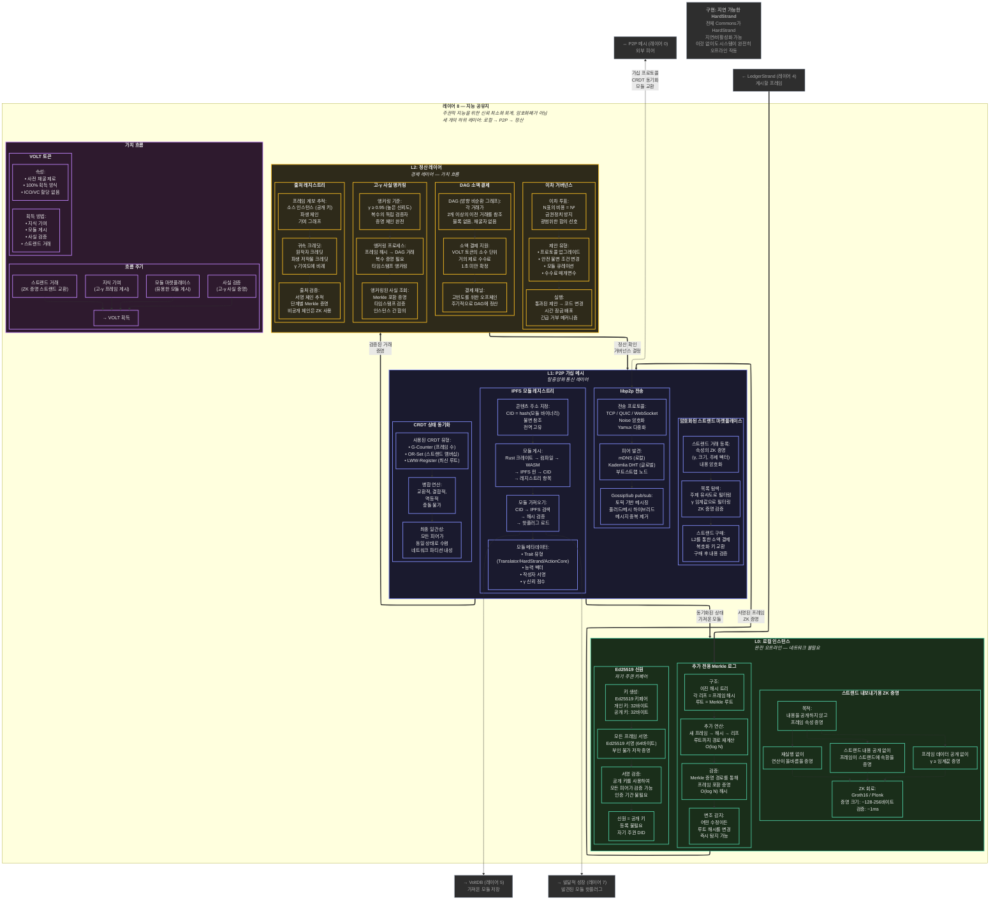

# 레이어 8 — 지능 공유지 (상세)

> 주권적 지능을 위한 포스트-블록체인 원장. 세 개의 하위 레이어: 로컬, P2P 가십, 정산. 가치 흐름과 거버넌스.

```mermaid
%%{init: {"flowchart": {"defaultRenderer": "elk"}} }%%
flowchart TB

    subgraph L8["<b>레이어 8 — 지능 공유지</b><br/><i>주권적 지능을 위한 신뢰 최소화 회계, 암호화폐가 아님</i><br/><i>세 개의 하위 레이어: 로컬 → P2P → 정산</i>"]

        %% ═══════════════════════════════════════════════
        %% L0: 로컬 인스턴스
        %% ═══════════════════════════════════════════════
        subgraph commons_l0["<b>L0: 로컬 인스턴스</b><br/><i>완전 오프라인 — 네트워크 불필요</i>"]
            direction TB

            subgraph merkle_log["<b>추가 전용 Merkle 로그</b>"]
                direction TB
                merkle_structure["구조:<br/>이진 해시 트리<br/>각 리프 = 프레임 해시<br/>루트 = Merkle 루트"]
                merkle_append_op["추가 연산:<br/>새 프레임 → 해시 → 리프<br/>루트까지 경로 재계산<br/>O(log N)"]
                merkle_verify["검증:<br/>Merkle 증명 경로를 통해<br/>프레임 포함 증명<br/>O(log N) 해시"]
                merkle_tamper["변조 감지:<br/>어떤 수정이든<br/>루트 해시를 변경<br/>즉시 탐지 가능"]
                merkle_structure --> merkle_append_op --> merkle_verify --> merkle_tamper
            end

            subgraph identity["<b>Ed25519 신원</b><br/><i>자기 주권 키페어</i>"]
                direction TB
                keypair_gen["키 생성:<br/>Ed25519 키페어<br/>개인 키: 32바이트<br/>공개 키: 32바이트"]
                sign_frames["모든 프레임 서명:<br/>Ed25519 서명 (64바이트)<br/>부인 불가 저작 증명"]
                verify_sig["서명 검증:<br/>공개 키를 사용하여<br/>모든 피어가 검증 가능<br/>인증 기관 불필요"]
                did_identity["신원 = 공개 키<br/>등록 불필요<br/>자기 주권 DID"]
                keypair_gen --> sign_frames --> verify_sig --> did_identity
            end

            subgraph zk_proofs["<b>스트랜드 내보내기용 ZK 증명</b>"]
                direction TB
                zk_purpose["목적:<br/>내용을 공개하지 않고<br/>프레임 속성 증명"]
                zk_prove_gamma["프레임 데이터 공개 없이<br/>γ ≥ 임계값 증명"]
                zk_prove_strand["스트랜드 내용 공개 없이<br/>프레임이 스트랜드에 속함을 증명"]
                zk_prove_compute["재실행 없이<br/>연산이 올바름을 증명"]
                zk_circuit["ZK 회로:<br/>Groth16 / Plonk<br/>증명 크기: ~128-256바이트<br/>검증: ~1ms"]
                zk_purpose --> zk_prove_gamma
                zk_purpose --> zk_prove_strand
                zk_purpose --> zk_prove_compute
                zk_prove_gamma --> zk_circuit
                zk_prove_strand --> zk_circuit
                zk_prove_compute --> zk_circuit
            end
        end

        %% ═══════════════════════════════════════════════
        %% L1: P2P 가십 메시
        %% ═══════════════════════════════════════════════
        subgraph commons_l1["<b>L1: P2P 가십 메시</b><br/><i>탈중앙화 통신 레이어</i>"]
            direction TB

            subgraph libp2p_layer["<b>libp2p 전송</b>"]
                direction TB
                transport["전송 프로토콜:<br/>TCP / QUIC / WebSocket<br/>Noise 암호화<br/>Yamux 다중화"]
                discovery["피어 발견:<br/>mDNS (로컬)<br/>Kademlia DHT (글로벌)<br/>부트스트랩 노드"]
                pubsub["GossipSub pub/sub:<br/>토픽 기반 메시징<br/>플러드/메시 하이브리드<br/>메시지 중복 제거"]
                transport --> discovery --> pubsub
            end

            subgraph crdt_sync["<b>CRDT 상태 동기화</b>"]
                direction TB
                crdt_type["사용된 CRDT 유형:<br/>• G-Counter (프레임 수)<br/>• OR-Set (스트랜드 멤버십)<br/>• LWW-Register (최신 루트)"]
                crdt_merge["병합 연산:<br/>교환적, 결합적,<br/>멱등적<br/>충돌 불가"]
                crdt_eventual["최종 일관성:<br/>모든 피어가<br/>동일 상태로 수렴<br/>네트워크 파티션 내성"]
                crdt_type --> crdt_merge --> crdt_eventual
            end

            subgraph ipfs_registry["<b>IPFS 모듈 레지스트리</b>"]
                direction TB
                cid_address["콘텐츠 주소 지정:<br/>CID = hash(모듈 바이너리)<br/>불변 참조<br/>전역 고유"]
                module_publish["모듈 게시:<br/>Rust 크레이트 → 컴파일 → WASM<br/>→ IPFS 핀 → CID<br/>→ 레지스트리 항목"]
                module_fetch["모듈 가져오기:<br/>CID → IPFS 검색<br/>→ 해시 검증<br/>→ 핫플러그 로드"]
                module_meta["모듈 메타데이터:<br/>• Trait 유형 (Translator/HardStrand/ActionCore)<br/>• 능력 벡터<br/>• 작성자 서명<br/>• γ 신뢰 점수"]
                cid_address --> module_publish --> module_fetch --> module_meta
            end

            subgraph strand_marketplace["<b>암호화된 스트랜드 마켓플레이스</b>"]
                direction TB
                strand_listing["스트랜드 거래 등록:<br/>속성의 ZK 증명<br/>(γ, 크기, 주제 벡터)<br/>내용 암호화"]
                strand_browse["목록 탐색:<br/>주제 유사도로 필터링<br/>γ 임계값으로 필터링<br/>ZK 증명 검증"]
                strand_purchase["스트랜드 구매:<br/>L2를 통한 소액 결제<br/>복호화 키 교환<br/>구매 후 내용 검증"]
                strand_listing --> strand_browse --> strand_purchase
            end
        end

        %% ═══════════════════════════════════════════════
        %% L2: 정산
        %% ═══════════════════════════════════════════════
        subgraph commons_l2["<b>L2: 정산 레이어</b><br/><i>경제 레이어 — 가치 흐름</i>"]
            direction TB

            subgraph dag_micropayments["<b>DAG 소액 결제</b>"]
                direction TB
                dag_structure["DAG (방향 비순환 그래프):<br/>각 거래가<br/>2개 이상의 이전 거래를 참조<br/>블록 없음, 채굴자 없음"]
                dag_micro["소액 결제 지원:<br/>VOLT 토큰의 소수 단위<br/>거의 제로 수수료<br/>1초 미만 확정"]
                dag_channels["결제 채널:<br/>고빈도를 위한 오프체인<br/>주기적으로 DAG에 정산"]
                dag_structure --> dag_micro --> dag_channels
            end

            subgraph fact_anchoring["<b>고-γ 사실 앵커링</b>"]
                direction TB
                anchor_criteria["앵커링 기준:<br/>γ ≥ 0.95 (높은 신뢰도)<br/>복수의 독립 검증자<br/>증명 체인 완전"]
                anchor_process["앵커링 프로세스:<br/>프레임 해시 → DAG 거래<br/>복수 증명 필요<br/>타임스탬프 앵커링"]
                anchor_query["앵커링된 사실 조회:<br/>Merkle 포함 증명<br/>타임스탬프 검증<br/>인스턴스 간 합의"]
                anchor_criteria --> anchor_process --> anchor_query
            end

            subgraph provenance["<b>출처 레지스트리</b>"]
                direction TB
                prov_track["프레임 계보 추적:<br/>소스 인스턴스 (공개 키)<br/>파생 체인<br/>기여 그래프"]
                prov_credit["귀속 크레딧:<br/>원작자 크레딧<br/>파생 저작물 크레딧<br/>γ 기여도에 비례"]
                prov_verify["출처 검증:<br/>서명 체인 추적<br/>단계별 Merkle 증명<br/>비공개 체인은 ZK 사용"]
                prov_track --> prov_credit --> prov_verify
            end

            subgraph governance["<b>이차 거버넌스</b>"]
                direction TB
                qv_concept["이차 투표:<br/>N표의 비용 = N²<br/>금권정치 방지<br/>광범위한 합의 선호"]
                qv_proposals["제안 유형:<br/>• 프로토콜 업그레이드<br/>• 안전 불변 조건 변경<br/>• 모듈 큐레이션<br/>• 수수료 매개변수"]
                qv_execute["실행:<br/>통과된 제안 → 코드 변경<br/>시간 잠금 배포<br/>긴급 거부 메커니즘"]
                qv_concept --> qv_proposals --> qv_execute
            end
        end

        %% ═══════════════════════════════════════════════
        %% 가치 흐름
        %% ═══════════════════════════════════════════════
        subgraph value_flows["<b>가치 흐름</b>"]
            direction TB

            subgraph volt_token["<b>VOLT 토큰</b>"]
                direction LR
                token_props["속성:<br/>• 사전 채굴 제로<br/>• 100% 획득 방식<br/>• ICO/VC 할당 없음"]
                token_earn["획득 방법:<br/>• 지식 기여<br/>• 모듈 게시<br/>• 사실 검증<br/>• 스트랜드 거래"]
            end

            subgraph flow_diagram["<b>흐름 주기</b>"]
                direction TB
                flow_contribute["지식 기여<br/>(고-γ 프레임 게시)"]
                flow_marketplace["모듈 마켓플레이스<br/>(유용한 모듈 게시)"]
                flow_verification["사실 검증<br/>(고-γ 사실 증명)"]
                flow_trading["스트랜드 거래<br/>(ZK 증명 스트랜드 교환)"]
                flow_earn["→ VOLT 획득"]
                flow_contribute --> flow_earn
                flow_marketplace --> flow_earn
                flow_verification --> flow_earn
                flow_trading --> flow_earn
            end
        end

        %% ═══════════════════════════════════════════════
        %% 하위 레이어 흐름
        %% ═══════════════════════════════════════════════
        commons_l0 ==>|"서명된 프레임<br/>ZK 증명"| commons_l1
        commons_l1 ==>|"검증된 거래<br/>증명"| commons_l2
        commons_l2 ==>|"정산 확인<br/>거버넌스 결정"| commons_l1
        commons_l1 ==>|"동기화된 상태<br/>가져온 모듈"| commons_l0
    end

    %% ═══════════════════════════════════════════════════
    %% 외부 연결
    %% ═══════════════════════════════════════════════════

    %% LedgerStrand (레이어 4)
    ledger_in["← LedgerStrand (레이어 4)<br/>게시할 프레임"]
    ledger_in ==> merkle_log

    %% P2P 외부 (레이어 0)
    p2p_ext["↔ P2P 메시 (레이어 0)<br/>외부 피어"]
    p2p_ext <-->|"가십 프로토콜<br/>CRDT 동기화<br/>모듈 교환"| libp2p_layer

    %% VoltDB (레이어 5) — 가져온 모듈 저장
    voltdb_modules["→ VoltDB (레이어 5)<br/>가져온 모듈 저장"]
    module_fetch --> voltdb_modules

    %% 발달적 성장 (레이어 7) — 새 모듈
    dev_growth["→ 발달적 성장 (레이어 7)<br/>발견된 모듈 핫플러그"]
    module_fetch --> dev_growth

    %% 구현 참고
    impl_note["<b>구현: 지연 가능한 HardStrand</b><br/>전체 Commons가 HardStrand<br/>지연/비활성화 가능<br/>이것 없이도 시스템이 완전히 오프라인 작동"]

    %% ═══════════════════════════════════════════════════
    %% 스타일링
    %% ═══════════════════════════════════════════════════
    classDef l0Style fill:#1a2e1a,stroke:#4ecca3,stroke-width:2px,color:#eee
    classDef l1Style fill:#1a1a2e,stroke:#818cf8,stroke-width:2px,color:#eee
    classDef l2Style fill:#2e2a1a,stroke:#fbbf24,stroke-width:2px,color:#eee
    classDef valueStyle fill:#2e1a2e,stroke:#c084fc,stroke-width:2px,color:#eee
    classDef extStyle fill:#2e2e2e,stroke:#94a3b8,stroke-width:1px,color:#aaa

    class commons_l0,merkle_log,merkle_structure,merkle_append_op,merkle_verify,merkle_tamper l0Style
    class identity,keypair_gen,sign_frames,verify_sig,did_identity l0Style
    class zk_proofs,zk_purpose,zk_prove_gamma,zk_prove_strand,zk_prove_compute,zk_circuit l0Style
    class commons_l1,libp2p_layer,transport,discovery,pubsub l1Style
    class crdt_sync,crdt_type,crdt_merge,crdt_eventual l1Style
    class ipfs_registry,cid_address,module_publish,module_fetch,module_meta l1Style
    class strand_marketplace,strand_listing,strand_browse,strand_purchase l1Style
    class commons_l2,dag_micropayments,dag_structure,dag_micro,dag_channels l2Style
    class fact_anchoring,anchor_criteria,anchor_process,anchor_query l2Style
    class provenance,prov_track,prov_credit,prov_verify l2Style
    class governance,qv_concept,qv_proposals,qv_execute l2Style
    class value_flows,volt_token,token_props,token_earn,flow_diagram valueStyle
    class flow_contribute,flow_marketplace,flow_verification,flow_trading,flow_earn valueStyle
    class ledger_in,p2p_ext,voltdb_modules,dev_growth,impl_note extStyle
```
