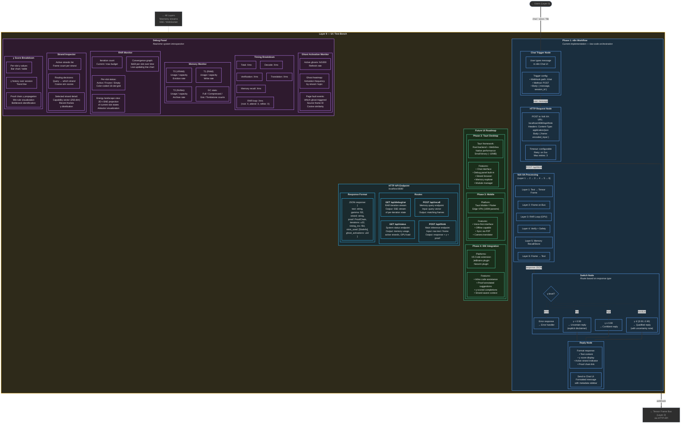

# Layer 9 — UI / Test Bench (Detailed)

> User interface and debugging infrastructure. n8n workflow, debug panel internals, and future UI roadmap.

```mermaid
%%{init: {"flowchart": {"defaultRenderer": "elk"}} }%%
flowchart TB

    subgraph L9["<b>Layer 9 — UI / Test Bench</b>"]

        %% ═══════════════════════════════════════════════
        %% PHASE 1: N8N WORKFLOW
        %% ═══════════════════════════════════════════════
        subgraph n8n_phase["<b>Phase 1: n8n Workflow</b><br/><i>Current implementation — low-code orchestration</i>"]
            direction TB

            subgraph n8n_trigger["<b>Chat Trigger Node</b>"]
                direction TB
                chat_input["User types message<br/>in n8n Chat UI"]
                trigger_config["Trigger config:<br/>• Webhook path: /chat<br/>• Method: POST<br/>• Body: { message, session_id }"]
                chat_input --> trigger_config
            end

            subgraph n8n_http["<b>HTTP Request Node</b>"]
                direction TB
                http_config["POST to Volt XA:<br/>URL: localhost:8080/api/think<br/>Headers: Content-Type: application/json<br/>Body: { frame: encoded_input }"]
                http_timeout["Timeout: configurable<br/>Retry: on 5xx<br/>Max retries: 3"]
                http_config --> http_timeout
            end

            subgraph n8n_processing["<b>Volt XA Processing</b><br/>(Layer 1 → 2 → 3 → 4 → 5 → 6)"]
                direction TB
                translate["Layer 1: Text → Tensor Frame"]
                bus_send["Layer 2: Frame on Bus"]
                rar_process["Layer 3: RAR Loop (GPU)"]
                verify["Layer 4: Verify + Safety"]
                recall["Layer 5: Memory Recall/Store"]
                decode["Layer 6: Frame → Text"]
                translate --> bus_send --> rar_process --> verify --> recall --> decode
            end

            subgraph n8n_switch["<b>Switch Node</b><br/><i>Route based on response type</i>"]
                direction TB
                check_gamma{"γ level?"}
                high_gamma["γ ≥ 0.90<br/>→ Confident reply"]
                medium_gamma["γ ∈ [0.50, 0.90)<br/>→ Qualified reply<br/>(with uncertainty note)"]
                low_gamma["γ < 0.50<br/>→ Uncertain reply<br/>(explicit disclaimer)"]
                error_path["Error response<br/>→ Error handler"]
                check_gamma -->|"high"| high_gamma
                check_gamma -->|"medium"| medium_gamma
                check_gamma -->|"low"| low_gamma
                check_gamma -->|"error"| error_path
            end

            subgraph n8n_reply["<b>Reply Node</b>"]
                direction TB
                format_response["Format response:<br/>• Text content<br/>• γ score display<br/>• Active strand indicator<br/>• Proof chain link"]
                send_chat["Send to Chat UI:<br/>Formatted message<br/>with metadata sidebar"]
                format_response --> send_chat
            end

            n8n_trigger ==>|"user message"| n8n_http
            n8n_http ==>|"POST /api/think"| n8n_processing
            n8n_processing ==>|"response JSON"| n8n_switch
            high_gamma ==> n8n_reply
            medium_gamma ==> n8n_reply
            low_gamma ==> n8n_reply
        end

        %% ═══════════════════════════════════════════════
        %% API ENDPOINT
        %% ═══════════════════════════════════════════════
        subgraph api_endpoint["<b>HTTP API Endpoint</b><br/><i>localhost:8080</i>"]
            direction TB

            subgraph api_routes["<b>Routes</b>"]
                direction LR
                route_think["<b>POST /api/think</b><br/>Main inference endpoint<br/>Input: raw text / frame<br/>Output: response + γ + proof"]
                route_recall["<b>POST /api/recall</b><br/>Memory query endpoint<br/>Input: query vector<br/>Output: matching frames"]
                route_status["<b>GET /api/status</b><br/>System status endpoint<br/>Output: memory usage,<br/>active strands, GPU load"]
                route_debug["<b>GET /api/debug/rar</b><br/>RAR iteration stream<br/>Output: SSE stream<br/>of per-iteration state"]
            end

            subgraph api_response["<b>Response Format</b>"]
                direction TB
                resp_format["JSON response:<br/>{<br/>  text: string,<br/>  gamma: f32,<br/>  strand: string,<br/>  proof: ProofChain,<br/>  iterations: u32,<br/>  timing_ms: f64,<br/>  slots_used: [SlotInfo],<br/>  ghost_activations: u32<br/>}"]
            end
        end

        %% ═══════════════════════════════════════════════
        %% DEBUG PANEL
        %% ═══════════════════════════════════════════════
        subgraph debug_panel["<b>Debug Panel</b><br/><i>Real-time system introspection</i>"]
            direction TB

            subgraph debug_rar["<b>RAR Monitor</b>"]
                direction LR
                rar_iter_count["Iteration count<br/>Current / max budget"]
                rar_slot_status["Per-slot status:<br/>Active / Frozen / Empty<br/>Color-coded 16-slot grid"]
                rar_convergence["Convergence graph:<br/>‖ΔS‖ per slot over time<br/>Live-updating line chart"]
                rar_energy["Energy landscape view:<br/>2D t-SNE projection<br/>of current slot states<br/>Attractor visualization"]
            end

            subgraph debug_ghost["<b>Ghost Activation Monitor</b>"]
                direction LR
                ghost_count["Active ghosts: N/1000<br/>Refresh rate"]
                ghost_activations["Page fault events:<br/>Which ghost triggered<br/>Source frame ID<br/>Cosine similarity"]
                ghost_heatmap["Ghost heatmap:<br/>Activation frequency<br/>by strand / topic"]
            end

            subgraph debug_timing["<b>Timing Breakdown</b>"]
                direction LR
                timing_translate["Translation: Xms"]
                timing_rar["RAR loop: Xms<br/>(root: X, attend: X, refine: X)"]
                timing_verify["Verification: Xms"]
                timing_recall["Memory recall: Xms"]
                timing_decode["Decode: Xms"]
                timing_total["Total: Xms"]
            end

            subgraph debug_gamma["<b>γ Score Breakdown</b>"]
                direction LR
                gamma_per_slot_dbg["Per-slot γ values<br/>Bar chart / table"]
                gamma_chain_dbg["Proof chain γ propagation<br/>Min-rule visualization<br/>Bottleneck identification"]
                gamma_history["γ history over session<br/>Trend line"]
            end

            subgraph debug_memory["<b>Memory Monitor</b>"]
                direction LR
                mem_t0["T0 (VRAM):<br/>Usage / capacity<br/>Eviction rate"]
                mem_t1["T1 (RAM):<br/>Usage / capacity<br/>Write rate"]
                mem_t2["T2 (NVMe):<br/>Usage / capacity<br/>Archive rate"]
                mem_gc["GC stats:<br/>Full / Compressed /<br/>Gist / Tombstone counts"]
            end

            subgraph debug_strands["<b>Strand Inspector</b>"]
                direction LR
                strand_list["Active strands list<br/>Frame count per strand"]
                strand_detail["Selected strand detail:<br/>Capability vector (256-dim)<br/>Recent frames<br/>γ distribution"]
                strand_routing_dbg["Routing decisions:<br/>Query → which strand<br/>Cosine sim scores"]
            end
        end

        %% ═══════════════════════════════════════════════
        %% FUTURE UI
        %% ═══════════════════════════════════════════════
        subgraph future_ui["<b>Future UI Roadmap</b>"]
            direction TB

            subgraph tauri_desktop["<b>Phase 2: Tauri Desktop</b>"]
                direction LR
                tauri_tech["Tauri framework:<br/>Rust backend + WebView<br/>Native performance<br/>Small binary (~10MB)"]
                tauri_features["Features:<br/>• Chat interface<br/>• Debug panel built-in<br/>• Strand browser<br/>• Memory explorer<br/>• Module manager"]
            end

            subgraph mobile_app["<b>Phase 3: Mobile</b>"]
                direction LR
                mobile_tech["Platform:<br/>Tauri Mobile / Flutter<br/>Edge VFN (100M params)"]
                mobile_features["Features:<br/>• Voice-first interface<br/>• Offline capable<br/>• Sync via P2P<br/>• Camera translator"]
            end

            subgraph ide_integration["<b>Phase 4: IDE Integration</b>"]
                direction LR
                ide_tech["Platforms:<br/>VS Code extension<br/>JetBrains plugin<br/>Neovim plugin"]
                ide_features["Features:<br/>• Inline code assistance<br/>• Proof-annotated suggestions<br/>• γ-scored completions<br/>• Strand-aware context"]
            end

            tauri_desktop --> mobile_app --> ide_integration
        end
    end

    %% ═══════════════════════════════════════════════════
    %% CONNECTIONS
    %% ═══════════════════════════════════════════════════
    users_in(["← Users (Layer 0)"])
    users_in ==>|"chat / voice / file"| n8n_trigger

    bus_conn["↔ Tensor Frame Bus (Layer 2)<br/>via HTTP API"]
    n8n_http ==>|"webhook"| bus_conn

    debug_source["← All Layers<br/>Telemetry streams<br/>SSE / WebSocket"]
    debug_source -.-> debug_panel

    %% ═══════════════════════════════════════════════════
    %% STYLING
    %% ═══════════════════════════════════════════════════
    classDef uiStyle fill:#2e2a1a,stroke:#fbbf24,stroke-width:2px,color:#eee
    classDef n8nStyle fill:#1a2e3e,stroke:#60a5fa,stroke-width:2px,color:#eee
    classDef apiStyle fill:#1a2a2e,stroke:#38bdf8,stroke-width:2px,color:#eee
    classDef debugStyle fill:#2e1a2e,stroke:#c084fc,stroke-width:2px,color:#eee
    classDef futureStyle fill:#1a2e1a,stroke:#4ecca3,stroke-width:2px,color:#eee
    classDef extStyle fill:#2e2e2e,stroke:#94a3b8,stroke-width:1px,color:#aaa

    class L9 uiStyle
    class n8n_phase,n8n_trigger,chat_input,trigger_config n8nStyle
    class n8n_http,http_config,http_timeout n8nStyle
    class n8n_processing,translate,bus_send,rar_process,verify,recall,decode n8nStyle
    class n8n_switch,check_gamma,high_gamma,medium_gamma,low_gamma,error_path n8nStyle
    class n8n_reply,format_response,send_chat n8nStyle
    class api_endpoint,api_routes,route_think,route_recall,route_status,route_debug apiStyle
    class api_response,resp_format apiStyle
    class debug_panel debugStyle
    class debug_rar,rar_iter_count,rar_slot_status,rar_convergence,rar_energy debugStyle
    class debug_ghost,ghost_count,ghost_activations,ghost_heatmap debugStyle
    class debug_timing,timing_translate,timing_rar,timing_verify,timing_recall,timing_decode,timing_total debugStyle
    class debug_gamma,gamma_per_slot_dbg,gamma_chain_dbg,gamma_history debugStyle
    class debug_memory,mem_t0,mem_t1,mem_t2,mem_gc debugStyle
    class debug_strands,strand_list,strand_detail,strand_routing_dbg debugStyle
    class future_ui,tauri_desktop,tauri_tech,tauri_features futureStyle
    class mobile_app,mobile_tech,mobile_features futureStyle
    class ide_integration,ide_tech,ide_features futureStyle
    class users_in,bus_conn,debug_source extStyle
```
