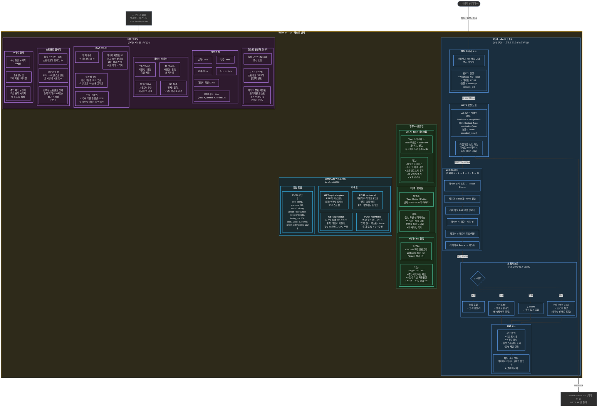

# 레이어 9 — UI / 테스트 벤치 (상세)

> 사용자 인터페이스 및 디버깅 인프라. n8n 워크플로, 디버그 패널 내부 구조, 향후 UI 로드맵.

```mermaid
%%{init: {"flowchart": {"defaultRenderer": "elk"}} }%%
flowchart TB

    subgraph L9["<b>레이어 9 — UI / 테스트 벤치</b>"]

        %% ═══════════════════════════════════════════════
        %% 1단계: N8N 워크플로
        %% ═══════════════════════════════════════════════
        subgraph n8n_phase["<b>1단계: n8n 워크플로</b><br/><i>현재 구현 — 로우코드 오케스트레이션</i>"]
            direction TB

            subgraph n8n_trigger["<b>채팅 트리거 노드</b>"]
                direction TB
                chat_input["사용자가 n8n 채팅 UI에<br/>메시지 입력"]
                trigger_config["트리거 설정:<br/>• Webhook 경로: /chat<br/>• 메서드: POST<br/>• 본문: { message, session_id }"]
                chat_input --> trigger_config
            end

            subgraph n8n_http["<b>HTTP 요청 노드</b>"]
                direction TB
                http_config["Volt XA로 POST:<br/>URL: localhost:8080/api/think<br/>헤더: Content-Type: application/json<br/>본문: { frame: encoded_input }"]
                http_timeout["타임아웃: 설정 가능<br/>재시도: 5xx 에러 시<br/>최대 재시도: 3회"]
                http_config --> http_timeout
            end

            subgraph n8n_processing["<b>Volt XA 처리</b><br/>(레이어 1 → 2 → 3 → 4 → 5 → 6)"]
                direction TB
                translate["레이어 1: 텍스트 → Tensor Frame"]
                bus_send["레이어 2: Bus에 Frame 전송"]
                rar_process["레이어 3: RAR 루프 (GPU)"]
                verify["레이어 4: 검증 + 안전성"]
                recall["레이어 5: 메모리 회상/저장"]
                decode["레이어 6: Frame → 텍스트"]
                translate --> bus_send --> rar_process --> verify --> recall --> decode
            end

            subgraph n8n_switch["<b>스위치 노드</b><br/><i>응답 유형에 따라 라우팅</i>"]
                direction TB
                check_gamma{"γ 수준?"}
                high_gamma["γ ≥ 0.90<br/>→ 확신 있는 응답"]
                medium_gamma["γ ∈ [0.50, 0.90)<br/>→ 조건부 응답<br/>(불확실성 메모 포함)"]
                low_gamma["γ < 0.50<br/>→ 불확실한 응답<br/>(명시적 면책 조항)"]
                error_path["오류 응답<br/>→ 오류 핸들러"]
                check_gamma -->|"높음"| high_gamma
                check_gamma -->|"중간"| medium_gamma
                check_gamma -->|"낮음"| low_gamma
                check_gamma -->|"오류"| error_path
            end

            subgraph n8n_reply["<b>응답 노드</b>"]
                direction TB
                format_response["응답 포맷:<br/>• 텍스트 내용<br/>• γ 점수 표시<br/>• 활성 스트랜드 표시<br/>• 증명 체인 링크"]
                send_chat["채팅 UI로 전송:<br/>메타데이터 사이드바가 포함된<br/>포맷된 메시지"]
                format_response --> send_chat
            end

            n8n_trigger ==>|"사용자 메시지"| n8n_http
            n8n_http ==>|"POST /api/think"| n8n_processing
            n8n_processing ==>|"응답 JSON"| n8n_switch
            high_gamma ==> n8n_reply
            medium_gamma ==> n8n_reply
            low_gamma ==> n8n_reply
        end

        %% ═══════════════════════════════════════════════
        %% API 엔드포인트
        %% ═══════════════════════════════════════════════
        subgraph api_endpoint["<b>HTTP API 엔드포인트</b><br/><i>localhost:8080</i>"]
            direction TB

            subgraph api_routes["<b>라우트</b>"]
                direction LR
                route_think["<b>POST /api/think</b><br/>메인 추론 엔드포인트<br/>입력: 원시 텍스트 / frame<br/>출력: 응답 + γ + 증명"]
                route_recall["<b>POST /api/recall</b><br/>메모리 쿼리 엔드포인트<br/>입력: 쿼리 벡터<br/>출력: 매칭되는 프레임"]
                route_status["<b>GET /api/status</b><br/>시스템 상태 엔드포인트<br/>출력: 메모리 사용량,<br/>활성 스트랜드, GPU 부하"]
                route_debug["<b>GET /api/debug/rar</b><br/>RAR 반복 스트림<br/>출력: 반복당 상태의<br/>SSE 스트림"]
            end

            subgraph api_response["<b>응답 포맷</b>"]
                direction TB
                resp_format["JSON 응답:<br/>{<br/>  text: string,<br/>  gamma: f32,<br/>  strand: string,<br/>  proof: ProofChain,<br/>  iterations: u32,<br/>  timing_ms: f64,<br/>  slots_used: [SlotInfo],<br/>  ghost_activations: u32<br/>}"]
            end
        end

        %% ═══════════════════════════════════════════════
        %% 디버그 패널
        %% ═══════════════════════════════════════════════
        subgraph debug_panel["<b>디버그 패널</b><br/><i>실시간 시스템 내부 검사</i>"]
            direction TB

            subgraph debug_rar["<b>RAR 모니터</b>"]
                direction LR
                rar_iter_count["반복 횟수<br/>현재 / 최대 예산"]
                rar_slot_status["슬롯별 상태:<br/>활성 / 동결 / 비어있음<br/>색상 코드 16-슬롯 그리드"]
                rar_convergence["수렴 그래프:<br/>시간에 따른 슬롯별 ‖ΔS‖<br/>실시간 업데이트 라인 차트"]
                rar_energy["에너지 지형도 뷰:<br/>현재 슬롯 상태의<br/>2D t-SNE 투영<br/>어트랙터 시각화"]
            end

            subgraph debug_ghost["<b>고스트 활성화 모니터</b>"]
                direction LR
                ghost_count["활성 고스트: N/1000<br/>갱신 빈도"]
                ghost_activations["페이지 폴트 이벤트:<br/>트리거된 고스트<br/>소스 프레임 ID<br/>코사인 유사도"]
                ghost_heatmap["고스트 히트맵:<br/>스트랜드 / 주제별<br/>활성화 빈도"]
            end

            subgraph debug_timing["<b>시간 분석</b>"]
                direction LR
                timing_translate["번역: Xms"]
                timing_rar["RAR 루프: Xms<br/>(root: X, attend: X, refine: X)"]
                timing_verify["검증: Xms"]
                timing_recall["메모리 회상: Xms"]
                timing_decode["디코드: Xms"]
                timing_total["합계: Xms"]
            end

            subgraph debug_gamma["<b>γ 점수 분석</b>"]
                direction LR
                gamma_per_slot_dbg["슬롯별 γ 값<br/>막대 차트 / 테이블"]
                gamma_chain_dbg["증명 체인 γ 전파<br/>최소 규칙 시각화<br/>병목 지점 식별"]
                gamma_history["세션 동안 γ 이력<br/>추세선"]
            end

            subgraph debug_memory["<b>메모리 모니터</b>"]
                direction LR
                mem_t0["T0 (VRAM):<br/>사용량 / 용량<br/>축출 비율"]
                mem_t1["T1 (RAM):<br/>사용량 / 용량<br/>쓰기 비율"]
                mem_t2["T2 (NVMe):<br/>사용량 / 용량<br/>아카이브 비율"]
                mem_gc["GC 통계:<br/>전체 / 압축 /<br/>요약 / 삭제 표시 수"]
            end

            subgraph debug_strands["<b>스트랜드 검사기</b>"]
                direction LR
                strand_list["활성 스트랜드 목록<br/>스트랜드별 프레임 수"]
                strand_detail["선택된 스트랜드 상세:<br/>능력 벡터 (256차원)<br/>최근 프레임<br/>γ 분포"]
                strand_routing_dbg["라우팅 결정:<br/>쿼리 → 어떤 스트랜드<br/>코사인 유사도 점수"]
            end
        end

        %% ═══════════════════════════════════════════════
        %% 향후 UI
        %% ═══════════════════════════════════════════════
        subgraph future_ui["<b>향후 UI 로드맵</b>"]
            direction TB

            subgraph tauri_desktop["<b>2단계: Tauri 데스크톱</b>"]
                direction LR
                tauri_tech["Tauri 프레임워크:<br/>Rust 백엔드 + WebView<br/>네이티브 성능<br/>작은 바이너리 (~10MB)"]
                tauri_features["기능:<br/>• 채팅 인터페이스<br/>• 디버그 패널 내장<br/>• 스트랜드 브라우저<br/>• 메모리 탐색기<br/>• 모듈 관리자"]
            end

            subgraph mobile_app["<b>3단계: 모바일</b>"]
                direction LR
                mobile_tech["플랫폼:<br/>Tauri Mobile / Flutter<br/>엣지 VFN (100M 파라미터)"]
                mobile_features["기능:<br/>• 음성 우선 인터페이스<br/>• 오프라인 사용 가능<br/>• P2P를 통한 동기화<br/>• 카메라 번역기"]
            end

            subgraph ide_integration["<b>4단계: IDE 통합</b>"]
                direction LR
                ide_tech["플랫폼:<br/>VS Code 확장 프로그램<br/>JetBrains 플러그인<br/>Neovim 플러그인"]
                ide_features["기능:<br/>• 인라인 코드 보조<br/>• 증명이 첨부된 제안<br/>• γ 점수 기반 자동완성<br/>• 스트랜드 인식 컨텍스트"]
            end

            tauri_desktop --> mobile_app --> ide_integration
        end
    end

    %% ═══════════════════════════════════════════════════
    %% 연결
    %% ═══════════════════════════════════════════════════
    users_in(["← 사용자 (레이어 0)"])
    users_in ==>|"채팅 / 음성 / 파일"| n8n_trigger

    bus_conn["↔ Tensor Frame Bus (레이어 2)<br/>HTTP API를 통해"]
    n8n_http ==>|"webhook"| bus_conn

    debug_source["← 모든 레이어<br/>텔레메트리 스트림<br/>SSE / WebSocket"]
    debug_source -.-> debug_panel

    %% ═══════════════════════════════════════════════════
    %% 스타일링
    %% ═══════════════════════════════════════════════════
    classDef uiStyle fill:#2e2a1a,stroke:#fbbf24,stroke-width:2px,color:#eee
    classDef n8nStyle fill:#1a2e3e,stroke:#60a5fa,stroke-width:2px,color:#eee
    classDef apiStyle fill:#1a2a2e,stroke:#38bdf8,stroke-width:2px,color:#eee
    classDef debugStyle fill:#2e1a2e,stroke:#c084fc,stroke-width:2px,color:#eee
    classDef futureStyle fill:#1a2e1a,stroke:#4ecca3,stroke-width:2px,color:#eee
    classDef extStyle fill:#2e2e2e,stroke:#94a3b8,stroke-width:1px,color:#aaa

    class L9 uiStyle
    class n8n_phase,n8n_trigger,chat_input,trigger_config n8nStyle
    class n8n_http,http_config,http_timeout n8nStyle
    class n8n_processing,translate,bus_send,rar_process,verify,recall,decode n8nStyle
    class n8n_switch,check_gamma,high_gamma,medium_gamma,low_gamma,error_path n8nStyle
    class n8n_reply,format_response,send_chat n8nStyle
    class api_endpoint,api_routes,route_think,route_recall,route_status,route_debug apiStyle
    class api_response,resp_format apiStyle
    class debug_panel debugStyle
    class debug_rar,rar_iter_count,rar_slot_status,rar_convergence,rar_energy debugStyle
    class debug_ghost,ghost_count,ghost_activations,ghost_heatmap debugStyle
    class debug_timing,timing_translate,timing_rar,timing_verify,timing_recall,timing_decode,timing_total debugStyle
    class debug_gamma,gamma_per_slot_dbg,gamma_chain_dbg,gamma_history debugStyle
    class debug_memory,mem_t0,mem_t1,mem_t2,mem_gc debugStyle
    class debug_strands,strand_list,strand_detail,strand_routing_dbg debugStyle
    class future_ui,tauri_desktop,tauri_tech,tauri_features futureStyle
    class mobile_app,mobile_tech,mobile_features futureStyle
    class ide_integration,ide_tech,ide_features futureStyle
    class users_in,bus_conn,debug_source extStyle
```
